# anti_aesthetics:clarity_and_focus

*Started: 2026-05-07T18:30:44.812646*

## Task

```
main_type: anti_aesthetics, sub_type: clarity_and_focus - {"intentional_blur": "Deliberate softening of the image through motion during exposure, shallow depth of field, or soft focus techniques, creating a dreamlike or dynamic impression rather than technical failure.", "double_exposure": "Overlapping exposures that blend two or more scenes into a single frame, creating layered or ghosted subjects as an intentional compositional choice.", "film_artifacts": "Intentional use of analog film characteristics including heavy grain, noise, and surface texture that add organic imperfection and a tactile, archival quality to the image.", "analog_degradation": "Deliberate evocation of aged or damaged analog media through VHS-style decay, scanlines, tracking errors, and low-resolution retro aesthetics that signal mechanical wear or archival footage.", "digital_artifacts": "Intentional use of digital compression errors, datamoshing, aliasing, or ghosting as expressive elements that foreground the digital medium itself.", "bad_or_no_details": "Images that lack fine detail or render subjects with smeared, mushy, or absent textures, where surfaces, features, and small structures dissolve into ambiguity rather than resolving into clear form."}
```

### 🔧 `ToolSearch`

```json
{
  "query": "select:mcp__dataset-curation__init,mcp__dataset-curation__log_actions,mcp__dataset-curation__search,mcp__dataset-curation__sample,mcp__dataset-curation__commit,mcp__dataset-curation__status,mcp__dataset-curation__undo_commit,mcp__dataset-curation__sample_from_committed",
  "max_results": 10
}
```

### 🔧 `mcp__dataset-curation__init`

```json
{}
```

**Result:**

Initialization complete in 164.11s. rows=269419, embedding_dim=4096.

> **Agent Log:** Plan for anti_aesthetics/clarity_and_focus curation:

Sub-elements to cover (with possible expansions):
1. intentional_blur: motion blur, shallow DOF as art, soft focus dreamy, long exposure light trails, defocused street photography, ICM (intentional camera movement), zoom blur
2. double_exposure: overlapping portrait+landscape, ghostly multi-exposure, in-camera double exposure, layered analog
3. film_artifacts: heavy 35mm grain, halation, light leaks, dust/scratches, expired film color shifts, analog texture
4. analog_degradation: VHS tape decay, tracking errors, scanlines, CRT distortion, glitchy old TV, magnetic tape damage
5. digital_artifacts: datamoshing, JPEG compression artifacts, pixel sorting, aliasing, ghosting
6. bad_or_no_details: smeared low-detail surfaces, mushy textures, dissolving features, washed out fine detail

Strategy: Start broad searches per sub-element, sample to calibrate threshold, then commit. Aim for ~30-60 images per sub-element, total ~200-400. Use negative prompts mainly for watermarks/text/empty frames. This is anti-aesthetic curation so low aesthetic scores are expected/desired. Will use threshold ~0.25-0.35 generally.

**Result:**

Logged.

### 🔧 `mcp__dataset-curation__search`

```json
{
  "query": "motion blur photograph long exposure subject in motion",
  "dataset": "photos",
  "negative_prompts": "[\"watermark text logo signature\", \"empty white frame blank\", \"screenshot user interface\"]",
  "negative_threshold": "0.3",
  "t": "10"
}
```

**Result:**

Grid image saved at: /home/wg25r/anti_aesthetics_agent/tmp/grid_1.jpg
Use the Read tool to view it.
Showing top 10 results for 'motion blur photograph long exposure subject in motion' in photos.
Top-10 scores: [0.5255, 0.5222, 0.5185, 0.5171, 0.5119, 0.5038, 0.5018, 0.5016, 0.5011, 0.4959]
Similarity distribution: counts=[520, 22537, 101070, 92061, 28990, 6937, 2044, 748, 208, 35], bins=[-0.078, -0.018, 0.043, 0.103, 0.163, 0.224, 0.284, 0.344, 0.405, 0.465, 0.526]

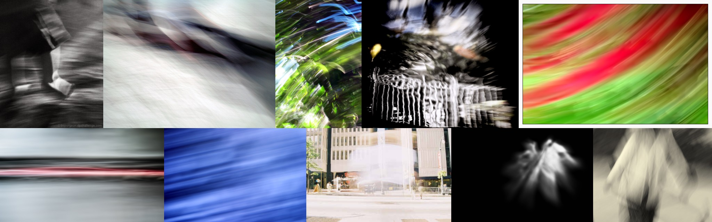

### 🔧 `Read`

```json
{
  "file_path": "/home/wg25r/anti_aesthetics_agent/tmp/grid_1.jpg"
}
```

### 🔧 `mcp__dataset-curation__sample`

```json
{
  "query": "motion blur photograph long exposure subject in motion",
  "dataset": "photos",
  "min_threshold": "0.38",
  "max_threshold": "0.42",
  "count": "8",
  "negative_prompts": "[\"watermark text logo signature\", \"empty white frame blank\"]",
  "negative_threshold": "0.3"
}
```

**Result:**

Grid image saved at: /home/wg25r/anti_aesthetics_agent/tmp/grid_2.jpg
Use the Read tool to view it.
Sampled 8 from 280 candidates.

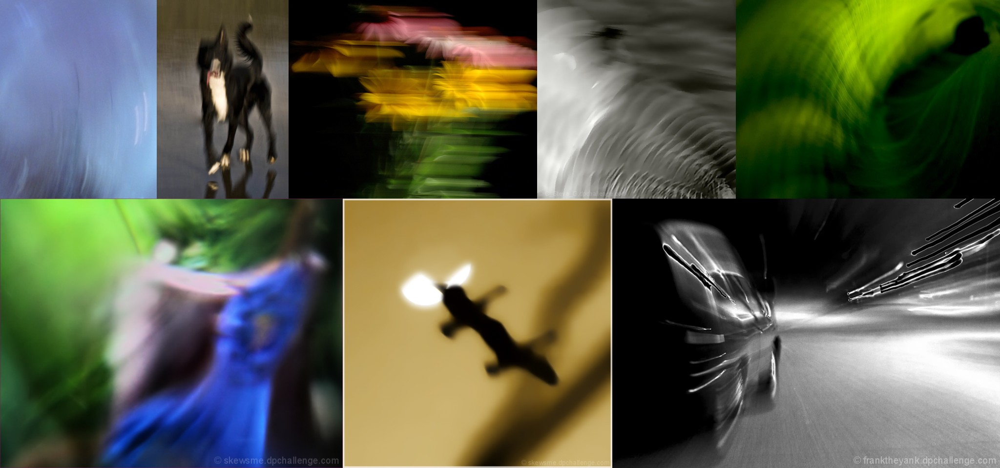

### 🔧 `Read`

```json
{
  "file_path": "/home/wg25r/anti_aesthetics_agent/tmp/grid_2.jpg"
}
```

> **Agent Log:** Sample at 0.38-0.42 shows: blurred dog, abstract motion streaks of yellow/red, ripples, blurred figure in blue dress, silhouette of bird/insect shadow, car with motion streaks. All clearly intentional motion blur. Good quality threshold. Will commit at 0.38.

**Result:**

Logged.

### 🔧 `mcp__dataset-curation__commit`

```json
{
  "query": "motion blur photograph long exposure subject in motion",
  "dataset": "photos",
  "threshold": "0.38",
  "negative_prompts": "[\"watermark text logo signature\", \"empty white frame blank\"]",
  "negative_threshold": "0.3",
  "message": "anti-aesthetic / clarity_and_focus / intentional_blur: motion blur, long exposure subject motion - artistic streaks and dynamic blur"
}
```

**Result:**

Committed with ID: 49556fff, message: anti-aesthetic / clarity_and_focus / intentional_blur: motion blur, long exposure subject motion - artistic streaks and dynamic blur with 453 images.

### 🔧 `mcp__dataset-curation__search`

```json
{
  "query": "intentional camera movement ICM abstract blurred photography painterly",
  "dataset": "photos",
  "negative_prompts": "[\"watermark signature text\", \"blank empty frame\"]",
  "negative_threshold": "0.3",
  "t": "10"
}
```

**Result:**

Grid image saved at: /home/wg25r/anti_aesthetics_agent/tmp/grid_3.jpg
Use the Read tool to view it.
Showing top 10 results for 'intentional camera movement ICM abstract blurred photography painterly' in photos.
Top-10 scores: [0.5457, 0.5197, 0.5062, 0.4993, 0.4940, 0.4920, 0.4916, 0.4881, 0.4866, 0.4847]
Similarity distribution: counts=[1334, 43025, 120631, 67971, 17116, 3620, 1041, 350, 60, 10], bins=[-0.080, -0.017, 0.045, 0.108, 0.170, 0.233, 0.295, 0.358, 0.421, 0.483, 0.546]


### 🔧 `mcp__dataset-curation__search`

```json
{
  "query": "soft focus dreamy out of focus defocused portrait",
  "dataset": "photos",
  "negative_prompts": "[\"watermark signature text\", \"blank white empty\"]",
  "negative_threshold": "0.3",
  "t": "10"
}
```

**Result:**

Grid image saved at: /home/wg25r/anti_aesthetics_agent/tmp/grid_4.jpg
Use the Read tool to view it.
Showing top 10 results for 'soft focus dreamy out of focus defocused portrait' in photos.
Top-10 scores: [0.5034, 0.5005, 0.4991, 0.4979, 0.4973, 0.4936, 0.4905, 0.4888, 0.4802, 0.4695]
Similarity distribution: counts=[404, 20551, 98065, 87030, 35525, 10564, 2378, 518, 135, 24], bins=[-0.090, -0.031, 0.028, 0.088, 0.147, 0.206, 0.266, 0.325, 0.385, 0.444, 0.503]


### 🔧 `ToolSearch`

```json
{
  "query": "select:TodoWrite,Read",
  "max_results": 2
}
```

### 🔧 `TodoWrite`

```json
{
  "todos": [
    {
      "content": "Curate intentional_blur (motion blur, ICM, soft focus)",
      "status": "in_progress",
      "activeForm": "Curating intentional_blur"
    },
    {
      "content": "Curate double_exposure",
      "status": "pending",
      "activeForm": "Curating double_exposure"
    },
    {
      "content": "Curate film_artifacts (grain, halation, light leaks)",
      "status": "pending",
      "activeForm": "Curating film_artifacts"
    },
    {
      "content": "Curate analog_degradation (VHS, scanlines, CRT)",
      "status": "pending",
      "activeForm": "Curating analog_degradation"
    },
    {
      "content": "Curate digital_artifacts (datamoshing, JPEG, glitch)",
      "status": "pending",
      "activeForm": "Curating digital_artifacts"
    },
    {
      "content": "Curate bad_or_no_details (smeared, mushy textures)",
      "status": "pending",
      "activeForm": "Curating bad_or_no_details"
    },
    {
      "content": "Final status check and balance review",
      "status": "pending",
      "activeForm": "Reviewing final dataset"
    }
  ]
}
```

### 🔧 `Read`

```json
{
  "file_path": "/home/wg25r/anti_aesthetics_agent/tmp/grid_3.jpg"
}
```

### 🔧 `Read`

```json
{
  "file_path": "/home/wg25r/anti_aesthetics_agent/tmp/grid_4.jpg"
}
```

### 🔧 `mcp__dataset-curation__commit`

```json
{
  "query": "intentional camera movement ICM abstract blurred photography painterly",
  "dataset": "photos",
  "threshold": "0.4",
  "negative_prompts": "[\"watermark signature text\", \"blank empty frame\"]",
  "negative_threshold": "0.3",
  "message": "anti-aesthetic / clarity_and_focus / intentional_blur: ICM intentional camera movement, painterly abstract blur"
}
```

**Result:**

Committed with ID: e7c8a3b2, message: anti-aesthetic / clarity_and_focus / intentional_blur: ICM intentional camera movement, painterly abstract blur with 145 images.

### 🔧 `mcp__dataset-curation__commit`

```json
{
  "query": "soft focus dreamy out of focus defocused portrait",
  "dataset": "photos",
  "threshold": "0.42",
  "negative_prompts": "[\"watermark signature text\", \"blank white empty\", \"sharp clear in-focus crisp detail\"]",
  "negative_threshold": "0.32",
  "message": "anti-aesthetic / clarity_and_focus / intentional_blur: soft focus dreamy defocused portraits"
}
```

### 🔧 `mcp__dataset-curation__search`

```json
{
  "query": "double exposure photograph overlapping ghostly silhouette portrait",
  "dataset": "photos",
  "negative_prompts": "[\"watermark signature text\", \"blank empty\"]",
  "negative_threshold": "0.3",
  "t": "10"
}
```

**Result:**

Committed with ID: 6edce575, message: anti-aesthetic / clarity_and_focus / intentional_blur: soft focus dreamy defocused portraits with 37 images.

**Result:**

Grid image saved at: /home/wg25r/anti_aesthetics_agent/tmp/grid_5.jpg
Use the Read tool to view it.
Showing top 10 results for 'double exposure photograph overlapping ghostly silhouette portrait' in photos.
Top-10 scores: [0.5056, 0.5022, 0.4945, 0.4890, 0.4844, 0.4780, 0.4641, 0.4604, 0.4571, 0.4544]
Similarity distribution: counts=[773, 21860, 88573, 89075, 40244, 11521, 2549, 590, 117, 14], bins=[-0.111, -0.049, 0.012, 0.074, 0.136, 0.197, 0.259, 0.321, 0.382, 0.444, 0.506]

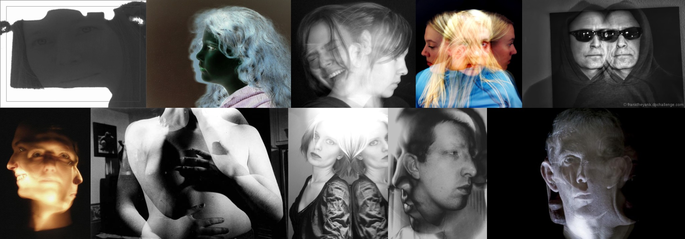

### 🔧 `Read`

```json
{
  "file_path": "/home/wg25r/anti_aesthetics_agent/tmp/grid_5.jpg"
}
```

### 🔧 `mcp__dataset-curation__sample`

```json
{
  "query": "double exposure photograph overlapping ghostly silhouette portrait",
  "dataset": "photos",
  "min_threshold": "0.36",
  "max_threshold": "0.42",
  "count": "8",
  "negative_prompts": "[\"watermark signature text\", \"blank empty\"]",
  "negative_threshold": "0.3"
}
```

**Result:**

Grid image saved at: /home/wg25r/anti_aesthetics_agent/tmp/grid_6.jpg
Use the Read tool to view it.
Sampled 8 from 222 candidates.

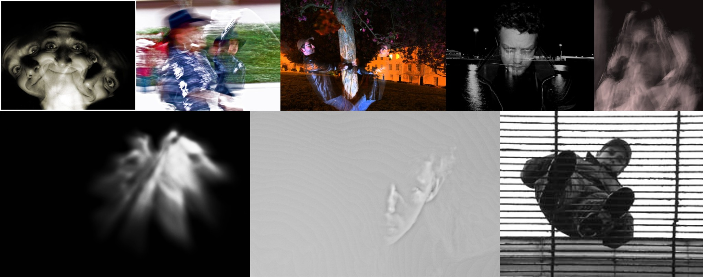

### 🔧 `Read`

```json
{
  "file_path": "/home/wg25r/anti_aesthetics_agent/tmp/grid_6.jpg"
}
```

> **Agent Log:** Double exposure sample at 0.36-0.42: distorted face composite, blurred cowboy duplicate, person climbing tree night scene, person at lake bridge night, ghostly figure, abstract white smoke, low-relief face emerging from texture, person on blinds. Some are double exposure-ish, some just dark/blurry. Will commit at 0.4.

**Result:**

Logged.

### 🔧 `mcp__dataset-curation__commit`

```json
{
  "query": "double exposure photograph overlapping ghostly silhouette portrait",
  "dataset": "photos",
  "threshold": "0.4",
  "negative_prompts": "[\"watermark signature text\", \"blank empty\"]",
  "negative_threshold": "0.3",
  "message": "anti-aesthetic / clarity_and_focus / double_exposure: ghostly overlapping portraits, multi-exposure"
}
```

**Result:**

Committed with ID: e538b4bd, message: anti-aesthetic / clarity_and_focus / double_exposure: ghostly overlapping portraits, multi-exposure with 71 images.

### 🔧 `mcp__dataset-curation__search`

```json
{
  "query": "multiple exposure layered scenes blended frames analog film",
  "dataset": "photos",
  "negative_prompts": "[\"watermark signature text\", \"blank empty\"]",
  "negative_threshold": "0.3",
  "t": "10"
}
```

**Result:**

Grid image saved at: /home/wg25r/anti_aesthetics_agent/tmp/grid_7.jpg
Use the Read tool to view it.
Showing top 10 results for 'multiple exposure layered scenes blended frames analog film' in photos.
Top-10 scores: [0.4098, 0.4068, 0.4007, 0.3926, 0.3922, 0.3920, 0.3896, 0.3885, 0.3875, 0.3815]
Similarity distribution: counts=[272, 10585, 60147, 97934, 60626, 19454, 4816, 1168, 273, 41], bins=[-0.106, -0.055, -0.003, 0.048, 0.100, 0.152, 0.203, 0.255, 0.307, 0.358, 0.410]

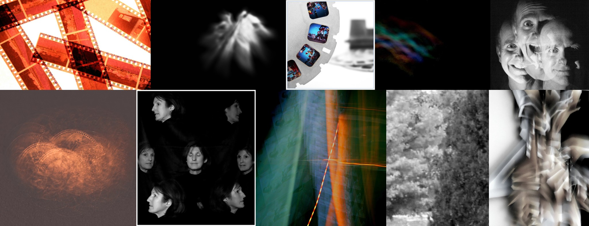

### 🔧 `TodoWrite`

```json
{
  "todos": [
    {
      "content": "Curate intentional_blur (motion blur, ICM, soft focus)",
      "status": "completed",
      "activeForm": "Curating intentional_blur"
    },
    {
      "content": "Curate double_exposure",
      "status": "in_progress",
      "activeForm": "Curating double_exposure"
    },
    {
      "content": "Curate film_artifacts (grain, halation, light leaks)",
      "status": "pending",
      "activeForm": "Curating film_artifacts"
    },
    {
      "content": "Curate analog_degradation (VHS, scanlines, CRT)",
      "status": "pending",
      "activeForm": "Curating analog_degradation"
    },
    {
      "content": "Curate digital_artifacts (datamoshing, JPEG, glitch)",
      "status": "pending",
      "activeForm": "Curating digital_artifacts"
    },
    {
      "content": "Curate bad_or_no_details (smeared, mushy textures)",
      "status": "pending",
      "activeForm": "Curating bad_or_no_details"
    },
    {
      "content": "Final status check and balance review",
      "status": "pending",
      "activeForm": "Reviewing final dataset"
    }
  ]
}
```

### 🔧 `Read`

```json
{
  "file_path": "/home/wg25r/anti_aesthetics_agent/tmp/grid_7.jpg"
}
```

### 🔧 `mcp__dataset-curation__commit`

```json
{
  "query": "multiple exposure layered scenes blended frames analog film",
  "dataset": "photos",
  "threshold": "0.34",
  "negative_prompts": "[\"watermark signature text\", \"blank empty\"]",
  "negative_threshold": "0.3",
  "message": "anti-aesthetic / clarity_and_focus / double_exposure: multiple exposure layered scenes"
}
```

**Result:**

Committed with ID: db320845, message: anti-aesthetic / clarity_and_focus / double_exposure: multiple exposure layered scenes with 91 images.

### 🔧 `mcp__dataset-curation__search`

```json
{
  "query": "heavy 35mm film grain noise texture analog photography",
  "dataset": "photos",
  "negative_prompts": "[\"watermark signature text\", \"blank empty\"]",
  "negative_threshold": "0.3",
  "t": "10"
}
```

### 🔧 `mcp__dataset-curation__search`

```json
{
  "query": "light leak halation orange red film overexposed analog",
  "dataset": "photos",
  "negative_prompts": "[\"watermark signature text\", \"blank empty\"]",
  "negative_threshold": "0.3",
  "t": "10"
}
```

**Result:**

Grid image saved at: /home/wg25r/anti_aesthetics_agent/tmp/grid_8.jpg
Use the Read tool to view it.
Showing top 10 results for 'heavy 35mm film grain noise texture analog photography' in photos.
Top-10 scores: [0.4667, 0.4651, 0.4465, 0.4439, 0.4276, 0.4261, 0.4211, 0.4181, 0.4136, 0.4129]
Similarity distribution: counts=[221, 11166, 72240, 97913, 54072, 15800, 3205, 616, 72, 11], bins=[-0.109, -0.051, 0.006, 0.064, 0.122, 0.179, 0.237, 0.294, 0.352, 0.409, 0.467]

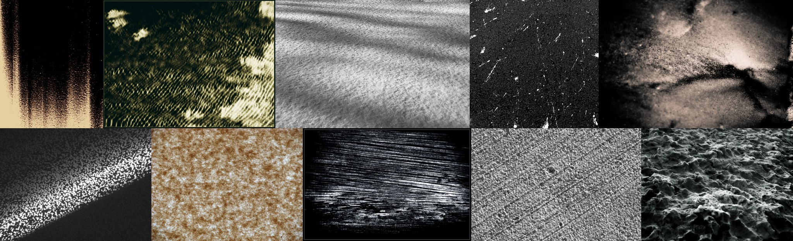

**Result:**

Grid image saved at: /home/wg25r/anti_aesthetics_agent/tmp/grid_9.jpg
Use the Read tool to view it.
Showing top 10 results for 'light leak halation orange red film overexposed analog' in photos.
Top-10 scores: [0.6098, 0.5746, 0.5487, 0.5330, 0.5283, 0.5249, 0.5131, 0.5116, 0.5103, 0.5068]
Similarity distribution: counts=[186, 16134, 97282, 93205, 36098, 10019, 1983, 357, 49, 3], bins=[-0.134, -0.060, 0.015, 0.089, 0.163, 0.238, 0.312, 0.387, 0.461, 0.535, 0.610]

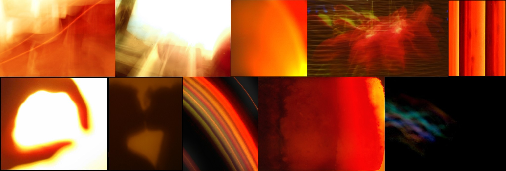

### 🔧 `Read`

```json
{
  "file_path": "/home/wg25r/anti_aesthetics_agent/tmp/grid_8.jpg"
}
```

### 🔧 `Read`

```json
{
  "file_path": "/home/wg25r/anti_aesthetics_agent/tmp/grid_9.jpg"
}
```

### 🔧 `mcp__dataset-curation__commit`

```json
{
  "query": "heavy 35mm film grain noise texture analog photography",
  "dataset": "photos",
  "threshold": "0.38",
  "negative_prompts": "[\"watermark signature text\", \"blank empty\"]",
  "negative_threshold": "0.3",
  "message": "anti-aesthetic / clarity_and_focus / film_artifacts: heavy 35mm grain, noise textures, gritty analog"
}
```

**Result:**

Committed with ID: 46aeca04, message: anti-aesthetic / clarity_and_focus / film_artifacts: heavy 35mm grain, noise textures, gritty analog with 33 images.

### 🔧 `mcp__dataset-curation__commit`

```json
{
  "query": "light leak halation orange red film overexposed analog",
  "dataset": "photos",
  "threshold": "0.42",
  "negative_prompts": "[\"watermark signature text\", \"blank empty white\"]",
  "negative_threshold": "0.3",
  "message": "anti-aesthetic / clarity_and_focus / film_artifacts: light leaks, halation, overexposed film"
}
```

### 🔧 `mcp__dataset-curation__search`

```json
{
  "query": "scratched dusty old photograph damaged film emulsion",
  "dataset": "photos",
  "negative_prompts": "[\"watermark signature\", \"blank empty\"]",
  "negative_threshold": "0.3",
  "t": "10"
}
```

### 🔧 `mcp__dataset-curation__search`

```json
{
  "query": "expired film color shift faded vintage snapshot",
  "dataset": "photos",
  "negative_prompts": "[\"watermark signature\", \"blank empty\"]",
  "negative_threshold": "0.3",
  "t": "10"
}
```

**Result:**

Committed with ID: 30733dfe, message: anti-aesthetic / clarity_and_focus / film_artifacts: light leaks, halation, overexposed film with 182 images.

**Result:**

Grid image saved at: /home/wg25r/anti_aesthetics_agent/tmp/grid_10.jpg
Use the Read tool to view it.
Showing top 10 results for 'scratched dusty old photograph damaged film emulsion' in photos.
Top-10 scores: [0.5196, 0.5030, 0.4793, 0.4754, 0.4750, 0.4734, 0.4712, 0.4694, 0.4669, 0.4586]
Similarity distribution: counts=[643, 23210, 83308, 82994, 46575, 14719, 3165, 595, 89, 10], bins=[-0.098, -0.036, 0.025, 0.087, 0.149, 0.211, 0.273, 0.334, 0.396, 0.458, 0.520]

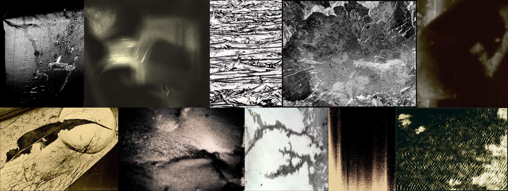

**Result:**

Grid image saved at: /home/wg25r/anti_aesthetics_agent/tmp/grid_11.jpg
Use the Read tool to view it.
Showing top 10 results for 'expired film color shift faded vintage snapshot' in photos.
Top-10 scores: [0.4145, 0.4077, 0.4053, 0.3952, 0.3943, 0.3859, 0.3835, 0.3806, 0.3749, 0.3733]
Similarity distribution: counts=[226, 7940, 54852, 97712, 66370, 22579, 4654, 824, 132, 19], bins=[-0.095, -0.044, 0.007, 0.058, 0.109, 0.160, 0.211, 0.262, 0.313, 0.364, 0.414]

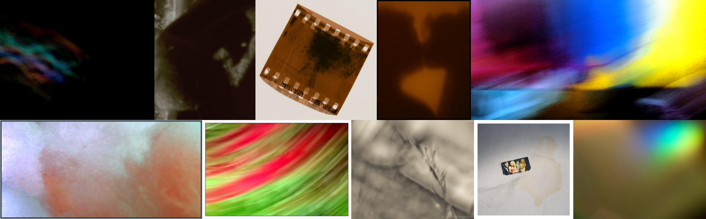

### 🔧 `TodoWrite`

```json
{
  "todos": [
    {
      "content": "Curate intentional_blur (motion blur, ICM, soft focus)",
      "status": "completed",
      "activeForm": "Curating intentional_blur"
    },
    {
      "content": "Curate double_exposure",
      "status": "completed",
      "activeForm": "Curating double_exposure"
    },
    {
      "content": "Curate film_artifacts (grain, halation, light leaks, scratches)",
      "status": "in_progress",
      "activeForm": "Curating film_artifacts"
    },
    {
      "content": "Curate analog_degradation (VHS, scanlines, CRT)",
      "status": "pending",
      "activeForm": "Curating analog_degradation"
    },
    {
      "content": "Curate digital_artifacts (datamoshing, JPEG, glitch)",
      "status": "pending",
      "activeForm": "Curating digital_artifacts"
    },
    {
      "content": "Curate bad_or_no_details (smeared, mushy textures)",
      "status": "pending",
      "activeForm": "Curating bad_or_no_details"
    },
    {
      "content": "Final status check and balance review",
      "status": "pending",
      "activeForm": "Reviewing final dataset"
    }
  ]
}
```

### 🔧 `Read`

```json
{
  "file_path": "/home/wg25r/anti_aesthetics_agent/tmp/grid_10.jpg"
}
```

### 🔧 `Read`

```json
{
  "file_path": "/home/wg25r/anti_aesthetics_agent/tmp/grid_11.jpg"
}
```

### 🔧 `mcp__dataset-curation__commit`

```json
{
  "query": "scratched dusty old photograph damaged film emulsion",
  "dataset": "photos",
  "threshold": "0.42",
  "negative_prompts": "[\"watermark signature\", \"blank empty\"]",
  "negative_threshold": "0.3",
  "message": "anti-aesthetic / clarity_and_focus / film_artifacts: scratched, dusty, damaged emulsion textures"
}
```

**Result:**

Committed with ID: 843d0233, message: anti-aesthetic / clarity_and_focus / film_artifacts: scratched, dusty, damaged emulsion textures with 39 images.

### 🔧 `mcp__dataset-curation__commit`

```json
{
  "query": "expired film color shift faded vintage snapshot",
  "dataset": "photos",
  "threshold": "0.34",
  "negative_prompts": "[\"watermark signature\", \"blank empty white\"]",
  "negative_threshold": "0.3",
  "message": "anti-aesthetic / clarity_and_focus / film_artifacts: expired film color shifts, faded vintage snapshots"
}
```

### 🔧 `mcp__dataset-curation__search`

```json
{
  "query": "VHS tape distortion glitch tracking error scanlines",
  "dataset": "photos",
  "negative_prompts": "[\"watermark signature\", \"blank empty\"]",
  "negative_threshold": "0.3",
  "t": "10"
}
```

### 🔧 `mcp__dataset-curation__search`

```json
{
  "query": "CRT television static screen flicker old TV monitor",
  "dataset": "photos",
  "negative_prompts": "[\"watermark signature\", \"blank empty\"]",
  "negative_threshold": "0.3",
  "t": "10"
}
```

**Result:**

Committed with ID: 99abbffb, message: anti-aesthetic / clarity_and_focus / film_artifacts: expired film color shifts, faded vintage snapshots with 47 images.

**Result:**

Grid image saved at: /home/wg25r/anti_aesthetics_agent/tmp/grid_12.jpg
Use the Read tool to view it.
Showing top 10 results for 'VHS tape distortion glitch tracking error scanlines' in photos.
Top-10 scores: [0.4518, 0.4453, 0.4404, 0.4291, 0.4281, 0.3988, 0.3823, 0.3763, 0.3759, 0.3755]
Similarity distribution: counts=[562, 28737, 109459, 83366, 26042, 5663, 1211, 220, 42, 6], bins=[-0.108, -0.052, 0.004, 0.060, 0.116, 0.172, 0.228, 0.284, 0.340, 0.396, 0.452]

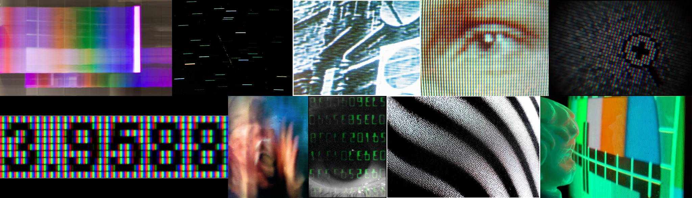

**Result:**

Grid image saved at: /home/wg25r/anti_aesthetics_agent/tmp/grid_13.jpg
Use the Read tool to view it.
Showing top 10 results for 'CRT television static screen flicker old TV monitor' in photos.
Top-10 scores: [0.6226, 0.5554, 0.5086, 0.5070, 0.4880, 0.4841, 0.4674, 0.4409, 0.4384, 0.4376]
Similarity distribution: counts=[1639, 61121, 125227, 57334, 8956, 895, 113, 17, 4, 2], bins=[-0.114, -0.040, 0.033, 0.107, 0.181, 0.254, 0.328, 0.402, 0.475, 0.549, 0.623]

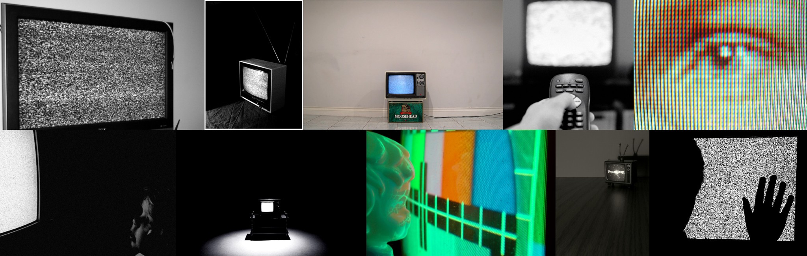

### 🔧 `Read`

```json
{
  "file_path": "/home/wg25r/anti_aesthetics_agent/tmp/grid_12.jpg"
}
```

### 🔧 `Read`

```json
{
  "file_path": "/home/wg25r/anti_aesthetics_agent/tmp/grid_13.jpg"
}
```

### 🔧 `mcp__dataset-curation__commit`

```json
{
  "query": "VHS tape distortion glitch tracking error scanlines",
  "dataset": "photos",
  "threshold": "0.36",
  "negative_prompts": "[\"watermark signature\", \"blank empty\"]",
  "negative_threshold": "0.3",
  "message": "anti-aesthetic / clarity_and_focus / analog_degradation: VHS scanlines, tracking errors, pixel grid distortion"
}
```

**Result:**

Committed with ID: fe12cb42, message: anti-aesthetic / clarity_and_focus / analog_degradation: VHS scanlines, tracking errors, pixel grid distortion with 16 images.

### 🔧 `mcp__dataset-curation__commit`

```json
{
  "query": "CRT television static screen flicker old TV monitor",
  "dataset": "photos",
  "threshold": "0.42",
  "negative_prompts": "[\"watermark signature\", \"blank empty\"]",
  "negative_threshold": "0.3",
  "message": "anti-aesthetic / clarity_and_focus / analog_degradation: CRT television static and old TV monitors"
}
```

### 🔧 `mcp__dataset-curation__search`

```json
{
  "query": "low resolution pixelated retro 8bit lo-fi degraded image",
  "dataset": "photos",
  "negative_prompts": "[\"watermark signature\", \"blank empty\"]",
  "negative_threshold": "0.3",
  "t": "10"
}
```

### 🔧 `mcp__dataset-curation__search`

```json
{
  "query": "datamoshing glitch art digital corruption pixel sorting",
  "dataset": "photos",
  "negative_prompts": "[\"watermark signature\", \"blank empty\"]",
  "negative_threshold": "0.3",
  "t": "10"
}
```

**Result:**

Committed with ID: 5475d947, message: anti-aesthetic / clarity_and_focus / analog_degradation: CRT television static and old TV monitors with 17 images.

**Result:**

Grid image saved at: /home/wg25r/anti_aesthetics_agent/tmp/grid_14.jpg
Use the Read tool to view it.
Showing top 10 results for 'low resolution pixelated retro 8bit lo-fi degraded image' in photos.
Top-10 scores: [0.3885, 0.3825, 0.3761, 0.3759, 0.3681, 0.3593, 0.3372, 0.3267, 0.3233, 0.3218]
Similarity distribution: counts=[407, 15323, 82002, 100601, 45373, 9836, 1444, 278, 38, 6], bins=[-0.098, -0.049, -0.000, 0.048, 0.097, 0.145, 0.194, 0.243, 0.291, 0.340, 0.389]

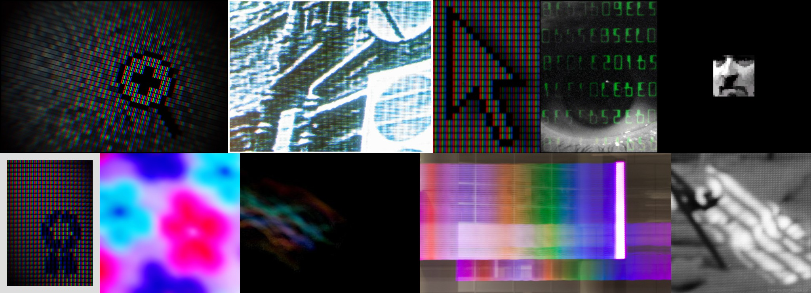

**Result:**

Grid image saved at: /home/wg25r/anti_aesthetics_agent/tmp/grid_15.jpg
Use the Read tool to view it.
Showing top 10 results for 'datamoshing glitch art digital corruption pixel sorting' in photos.
Top-10 scores: [0.3881, 0.3821, 0.3701, 0.3664, 0.3646, 0.3599, 0.3562, 0.3556, 0.3516, 0.3494]
Similarity distribution: counts=[356, 14490, 81918, 99398, 44044, 11642, 2728, 615, 104, 13], bins=[-0.101, -0.052, -0.003, 0.046, 0.095, 0.143, 0.192, 0.241, 0.290, 0.339, 0.388]

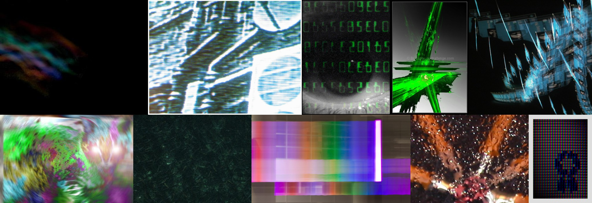

### 🔧 `TodoWrite`

```json
{
  "todos": [
    {
      "content": "Curate intentional_blur (motion blur, ICM, soft focus)",
      "status": "completed",
      "activeForm": "Curating intentional_blur"
    },
    {
      "content": "Curate double_exposure",
      "status": "completed",
      "activeForm": "Curating double_exposure"
    },
    {
      "content": "Curate film_artifacts (grain, halation, light leaks, scratches)",
      "status": "completed",
      "activeForm": "Curating film_artifacts"
    },
    {
      "content": "Curate analog_degradation (VHS, scanlines, CRT)",
      "status": "in_progress",
      "activeForm": "Curating analog_degradation"
    },
    {
      "content": "Curate digital_artifacts (datamoshing, JPEG, glitch)",
      "status": "pending",
      "activeForm": "Curating digital_artifacts"
    },
    {
      "content": "Curate bad_or_no_details (smeared, mushy textures)",
      "status": "pending",
      "activeForm": "Curating bad_or_no_details"
    },
    {
      "content": "Final status check and balance review",
      "status": "pending",
      "activeForm": "Reviewing final dataset"
    }
  ]
}
```

### 🔧 `Read`

```json
{
  "file_path": "/home/wg25r/anti_aesthetics_agent/tmp/grid_14.jpg"
}
```

### 🔧 `Read`

```json
{
  "file_path": "/home/wg25r/anti_aesthetics_agent/tmp/grid_15.jpg"
}
```

### 🔧 `mcp__dataset-curation__commit`

```json
{
  "query": "low resolution pixelated retro 8bit lo-fi degraded image",
  "dataset": "photos",
  "threshold": "0.32",
  "negative_prompts": "[\"watermark signature\", \"blank empty\"]",
  "negative_threshold": "0.3",
  "message": "anti-aesthetic / clarity_and_focus / analog_degradation: pixelated retro lo-fi imagery"
}
```

**Result:**

Committed with ID: ccd0d7b1, message: anti-aesthetic / clarity_and_focus / analog_degradation: pixelated retro lo-fi imagery with 10 images.

### 🔧 `mcp__dataset-curation__commit`

```json
{
  "query": "datamoshing glitch art digital corruption pixel sorting",
  "dataset": "photos",
  "threshold": "0.32",
  "negative_prompts": "[\"watermark signature\", \"blank empty\"]",
  "negative_threshold": "0.3",
  "message": "anti-aesthetic / clarity_and_focus / digital_artifacts: datamoshing, glitch art, pixel sorting"
}
```

### 🔧 `mcp__dataset-curation__search`

```json
{
  "query": "JPEG compression artifacts blocky pixelated banding",
  "dataset": "photos",
  "negative_prompts": "[\"watermark signature\", \"blank empty\"]",
  "negative_threshold": "0.3",
  "t": "10"
}
```

### 🔧 `mcp__dataset-curation__search`

```json
{
  "query": "chromatic aberration RGB color split fringe digital",
  "dataset": "photos",
  "negative_prompts": "[\"watermark signature\", \"blank empty\"]",
  "negative_threshold": "0.3",
  "t": "10"
}
```

