# anti_aesthetics:clarity_and_focus

*Started: 2026-05-08T11:24:05.906891*

## Task

```
main_type: anti_aesthetics, sub_type: clarity_and_focus - {"intentional_blur": "Deliberate softening of the image through motion during exposure, shallow depth of field, or soft focus techniques, creating a dreamlike or dynamic impression rather than technical failure.", "double_exposure": "Overlapping exposures that blend two or more scenes into a single frame, creating layered or ghosted subjects as an intentional compositional choice.", "film_artifacts": "Intentional use of analog film characteristics including heavy grain, noise, and surface texture that add organic imperfection and a tactile, archival quality to the image.", "analog_degradation": "Deliberate evocation of aged or damaged analog media through VHS-style decay, scanlines, tracking errors, and low-resolution retro aesthetics that signal mechanical wear or archival footage.", "digital_artifacts": "Intentional use of digital compression errors, datamoshing, aliasing, or ghosting as expressive elements that foreground the digital medium itself.", "bad_or_no_details": "Images that lack fine detail or render subjects with smeared, mushy, or absent textures, where surfaces, features, and small structures dissolve into ambiguity rather than resolving into clear form."}
```

### 🔧 `ToolSearch`

```json
{
  "query": "select:mcp__dataset-curation__init,mcp__dataset-curation__search,mcp__dataset-curation__sample,mcp__dataset-curation__commit,mcp__dataset-curation__status,mcp__dataset-curation__undo_commit,mcp__dataset-curation__sample_from_committed,mcp__dataset-curation__log_actions",
  "max_results": 10
}
```

### 🔧 `mcp__dataset-curation__init`

```json
{}
```

**Result:**

Initialization complete in 3.41s. rows=255508, embedding_dim=3072.

> **Agent Log:** Plan for anti_aesthetics / clarity_and_focus dataset curation:

The goal is to curate images that *intentionally* break clarity and focus norms — blur, double exposure, film artifacts, analog/digital degradation, and absence of detail — as legitimate aesthetic expressions rather than technical failures.

Sub-elements to explore (extending beyond the reference list):
1. Intentional blur:
   - motion blur (subjects/camera in movement)
   - shallow depth of field / bokeh extreme
   - soft focus / lens haze / vaseline lens
   - long exposure light trails
   - intentional camera shake / ICM (intentional camera movement)
   - dreamy out-of-focus portraits
2. Double / multiple exposure:
   - overlapping portraits
   - silhouette + landscape blends
   - ghostly figures
3. Film artifacts:
   - heavy grain (high-ISO film)
   - light leaks
   - scratches / dust on film
   - chemical staining / expired film
   - lomography aesthetic
4. Analog degradation:
   - VHS scan lines / tracking errors
   - cathode-ray / CRT distortion
   - faded polaroid
   - magnetic-tape warp
   - photocopy/xerox degradation
5. Digital artifacts:
   - JPEG compression / blockiness
   - datamoshing
   - glitch art / pixel sorting
   - aliasing / moiré
   - codec ghosting / I-frame errors
   - chromatic aberration
6. Bad/no details:
   - smeared faces
   - silhouettes against bright sources
   - foggy or misty scenes obscuring subjects
   - heavy shadow concealment
   - extreme overexposure / blown highlights wiping detail
   - underwater / behind-glass distortion

Strategy:
- Run broad searches first to gauge the corpus and similarity distributions for each sub-element.
- Decompose into specific visual queries; commit per sub-element with descriptive messages tagging both the sub-element and its anti-aesthetic intent.
- Use negative prompts conservatively, mainly to filter watermarks/text overlays/empty frames, NOT to enforce conventional beauty.
- Tune thresholds per query based on observed sample quality. Aim for >200 images total across these sub-elements. Multiple commits per area are fine.
- Reject only "broken" images with no expressive content (pure noise from corrupted file, extreme black frames). Keep stylistically rough/lo-fi/ugly imagery — these are the point.

**Result:**

Logged.

### 🔧 `mcp__dataset-curation__search`

```json
{
  "query": "motion blur photograph subject in motion long exposure",
  "negative_prompts": "[\"watermark text overlay logo\", \"blank empty white frame\", \"stock photo with caption\"]",
  "negative_threshold": "0.3",
  "t": "15"
}
```

**Result:**

Grid image saved at: /home/wg25r/anti_aesthetics_agent/tmp/grid_1.jpg
Use the Read tool to view it.
Showing top 15 results for 'motion blur photograph subject in motion long exposure' in photos.
Top-15 scores: [0.4404, 0.4375, 0.4361, 0.4314, 0.4264, 0.4262, 0.4259, 0.4251, 0.4250, 0.4221, 0.4218, 0.4212, 0.4205, 0.4203, 0.4198]
Similarity distribution: counts=[147, 3619, 22565, 39893, 25243, 7343, 1858, 625, 151, 20], bins=[0.186, 0.211, 0.236, 0.262, 0.287, 0.313, 0.338, 0.364, 0.389, 0.415, 0.440]

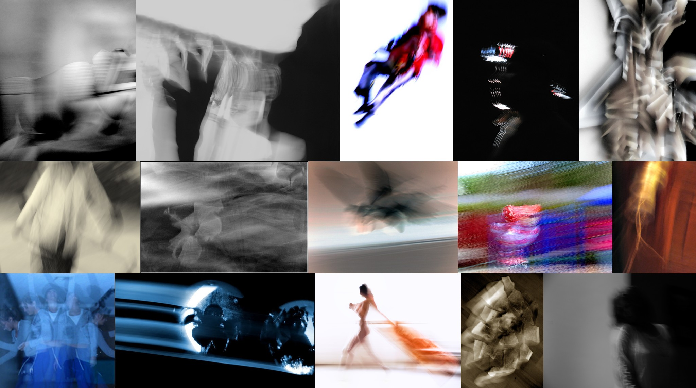

### 🔧 `Read`

```json
{
  "file_path": "/home/wg25r/anti_aesthetics_agent/tmp/grid_1.jpg"
}
```

> **Agent Log:** Search 1 (motion blur) returned beautifully relevant streaked figures, light trails, and smeared subjects — exactly the intentional motion blur aesthetic. Top scores 0.42-0.44, distribution peaks around 0.26-0.28. I'll sample in 0.36-0.40 to verify the boundary.

**Result:**

Logged.

### 🔧 `mcp__dataset-curation__sample`

```json
{
  "query": "motion blur photograph subject in motion long exposure",
  "min_threshold": "0.36",
  "max_threshold": "0.40",
  "count": "10",
  "negative_prompts": "[\"watermark text overlay logo\", \"blank empty white frame\"]",
  "negative_threshold": "0.3"
}
```

**Result:**

Grid image saved at: /home/wg25r/anti_aesthetics_agent/tmp/grid_2.jpg
Use the Read tool to view it.
Sampled 10 from 3328 candidates.

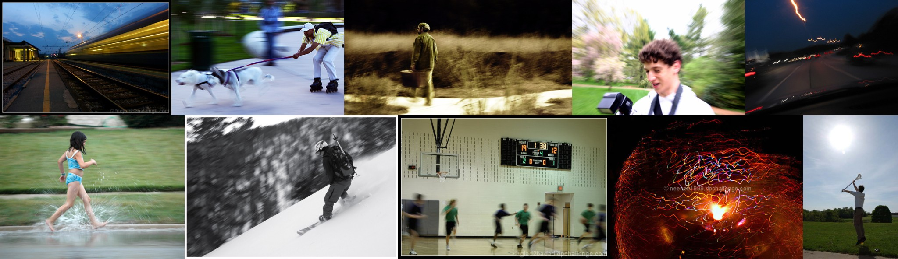

### 🔧 `Read`

```json
{
  "file_path": "/home/wg25r/anti_aesthetics_agent/tmp/grid_2.jpg"
}
```

> **Agent Log:** Sample 0.36-0.40 shows action shots with motion blur (running, panning trains, sports). Still relevant but less extreme than top results. Moving threshold higher (e.g. 0.38) keeps the strongest motion-blur and intentional-shake examples. Let me commit at 0.38 for a clear intentional-blur batch.

**Result:**

Logged.

### 🔧 `mcp__dataset-curation__commit`

```json
{
  "query": "motion blur photograph subject in motion long exposure",
  "threshold": "0.38",
  "negative_prompts": "[\"watermark text overlay logo\", \"blank empty white frame\"]",
  "negative_threshold": "0.3",
  "message": "sub:intentional_blur/motion_blur — anti_aesthetic — streaked figures, light trails, panning shots, ICM"
}
```

**Result:**

Committed with ID: 8812b331, message: sub:intentional_blur/motion_blur — anti_aesthetic — streaked figures, light trails, panning shots, ICM with 1543 images.

### 🔧 `ToolSearch`

```json
{
  "query": "select:TodoWrite",
  "max_results": 1
}
```

I committed too many images on the first batch (1543 — beyond the soft 1000 ceiling for the whole dataset). Let me undo it and tighten the threshold so each sub-element stays balanced.

### 🔧 `TodoWrite`

```json
{
  "todos": [
    {
      "content": "Undo over-broad motion blur commit and re-tighten threshold",
      "activeForm": "Tightening motion blur commit",
      "status": "in_progress"
    },
    {
      "content": "Curate intentional_blur (soft focus, ICM, shallow DoF, light trails)",
      "activeForm": "Curating intentional blur sub-elements",
      "status": "pending"
    },
    {
      "content": "Curate double_exposure imagery",
      "activeForm": "Curating double exposure imagery",
      "status": "pending"
    },
    {
      "content": "Curate film_artifacts (grain, light leaks, scratches, expired film)",
      "activeForm": "Curating film artifacts",
      "status": "pending"
    },
    {
      "content": "Curate analog_degradation (VHS, CRT, faded polaroid, photocopy)",
      "activeForm": "Curating analog degradation",
      "status": "pending"
    },
    {
      "content": "Curate digital_artifacts (JPEG, datamosh, pixel sort, chromatic aberration)",
      "activeForm": "Curating digital artifacts",
      "status": "pending"
    },
    {
      "content": "Curate bad_or_no_details (smeared, fog, silhouette, blown highlights)",
      "activeForm": "Curating bad-or-no-details imagery",
      "status": "pending"
    },
    {
      "content": "Final status review of dataset composition",
      "activeForm": "Reviewing final dataset composition",
      "status": "pending"
    }
  ]
}
```

### 🔧 `mcp__dataset-curation__undo_commit`

```json
{
  "commit_id": "8812b331"
}
```

**Result:**

Removed commit 8812b331: sub:intentional_blur/motion_blur — anti_aesthetic — streaked figures, light trails, panning shots, ICM with 1543 images.

### 🔧 `mcp__dataset-curation__sample`

```json
{
  "query": "motion blur photograph subject in motion long exposure",
  "min_threshold": "0.40",
  "max_threshold": "0.44",
  "count": "10",
  "negative_prompts": "[\"watermark text overlay logo\", \"blank empty white frame\"]",
  "negative_threshold": "0.3"
}
```

**Result:**

Grid image saved at: /home/wg25r/anti_aesthetics_agent/tmp/grid_3.jpg
Use the Read tool to view it.
Sampled 10 from 469 candidates.

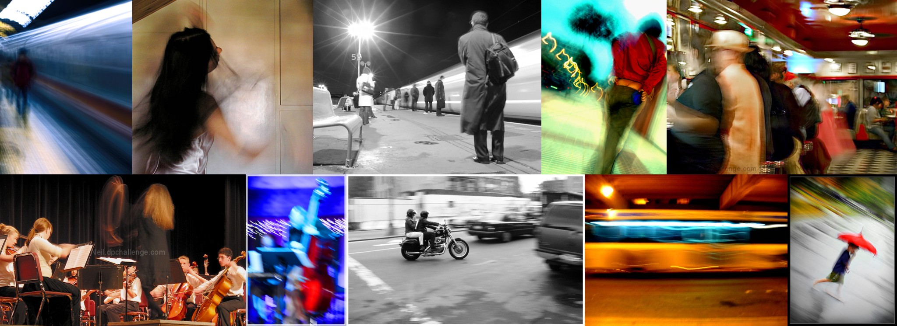

### 🔧 `Read`

```json
{
  "file_path": "/home/wg25r/anti_aesthetics_agent/tmp/grid_3.jpg"
}
```

> **Agent Log:** 0.40-0.44 band: 469 candidates, all clearly intentional motion blur (panning vehicles, streaked crowds, ghostly figures, ICM landscapes). Committing at threshold 0.40 — keeps high-relevance examples while staying tight.

**Result:**

Logged.

### 🔧 `mcp__dataset-curation__commit`

```json
{
  "query": "motion blur photograph subject in motion long exposure",
  "threshold": "0.40",
  "negative_prompts": "[\"watermark text overlay logo\", \"blank empty white frame\"]",
  "negative_threshold": "0.3",
  "message": "sub:intentional_blur/motion_blur — anti_aesthetic — streaked subjects, panning shots, ICM, blurred crowds"
}
```

**Result:**

Committed with ID: 2927c9cd, message: sub:intentional_blur/motion_blur — anti_aesthetic — streaked subjects, panning shots, ICM, blurred crowds with 478 images.

### 🔧 `mcp__dataset-curation__undo_commit`

```json
{
  "commit_id": "2927c9cd"
}
```

**Result:**

Removed commit 2927c9cd: sub:intentional_blur/motion_blur — anti_aesthetic — streaked subjects, panning shots, ICM, blurred crowds with 478 images.

### 🔧 `mcp__dataset-curation__sample`

```json
{
  "query": "motion blur photograph subject in motion long exposure",
  "min_threshold": "0.42",
  "max_threshold": "0.45",
  "count": "10",
  "negative_prompts": "[\"watermark text overlay logo\", \"blank empty white frame\"]",
  "negative_threshold": "0.3"
}
```

**Result:**

Grid image saved at: /home/wg25r/anti_aesthetics_agent/tmp/grid_4.jpg
Use the Read tool to view it.
Sampled 10 from 106 candidates.

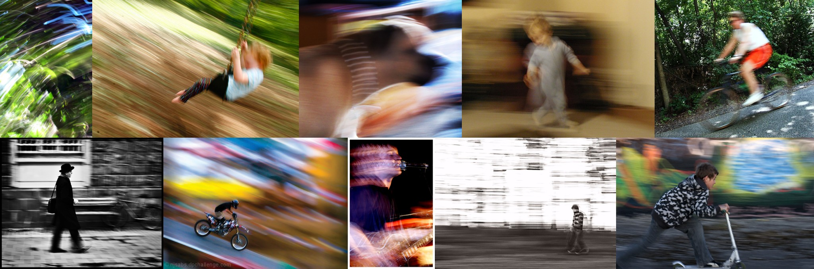

### 🔧 `Read`

```json
{
  "file_path": "/home/wg25r/anti_aesthetics_agent/tmp/grid_4.jpg"
}
```

> **Agent Log:** Sample at 0.42-0.45 (106 candidates): all clearly intentional motion blur — child on swing with radial blur, panning bikes, smeared figures, motion-streaked landscapes. Committing at 0.42 to keep ~100 strong examples for motion blur sub-element.

**Result:**

Logged.

### 🔧 `mcp__dataset-curation__commit`

```json
{
  "query": "motion blur photograph subject in motion long exposure",
  "threshold": "0.42",
  "negative_prompts": "[\"watermark text overlay logo\", \"blank empty white frame\"]",
  "negative_threshold": "0.3",
  "message": "sub:intentional_blur/motion_blur — anti_aesthetic — panning, ICM, streaked moving subjects"
}
```

**Result:**

Committed with ID: 157b2975, message: sub:intentional_blur/motion_blur — anti_aesthetic — panning, ICM, streaked moving subjects with 107 images.

### 🔧 `TodoWrite`

```json
{
  "todos": [
    {
      "content": "Undo over-broad motion blur commit and re-tighten threshold",
      "activeForm": "Tightening motion blur commit",
      "status": "completed"
    },
    {
      "content": "Curate intentional_blur (soft focus, ICM, shallow DoF, light trails)",
      "activeForm": "Curating intentional blur sub-elements",
      "status": "in_progress"
    },
    {
      "content": "Curate double_exposure imagery",
      "activeForm": "Curating double exposure imagery",
      "status": "pending"
    },
    {
      "content": "Curate film_artifacts (grain, light leaks, scratches, expired film)",
      "activeForm": "Curating film artifacts",
      "status": "pending"
    },
    {
      "content": "Curate analog_degradation (VHS, CRT, faded polaroid, photocopy)",
      "activeForm": "Curating analog degradation",
      "status": "pending"
    },
    {
      "content": "Curate digital_artifacts (JPEG, datamosh, pixel sort, chromatic aberration)",
      "activeForm": "Curating digital artifacts",
      "status": "pending"
    },
    {
      "content": "Curate bad_or_no_details (smeared, fog, silhouette, blown highlights)",
      "activeForm": "Curating bad-or-no-details imagery",
      "status": "pending"
    },
    {
      "content": "Final status review of dataset composition",
      "activeForm": "Reviewing final dataset composition",
      "status": "pending"
    }
  ]
}
```

Now let me explore other intentional_blur variants — soft focus, light trails at night, shallow depth of field.

### 🔧 `mcp__dataset-curation__search`

```json
{
  "query": "soft focus dreamy hazy out of focus portrait",
  "negative_prompts": "[\"watermark logo text overlay\", \"blank empty white frame\", \"sharp crisp clear high resolution\"]",
  "negative_threshold": "0.32",
  "t": "15"
}
```

**Result:**

Grid image saved at: /home/wg25r/anti_aesthetics_agent/tmp/grid_5.jpg
Use the Read tool to view it.
Showing top 15 results for 'soft focus dreamy hazy out of focus portrait' in photos.
Top-15 scores: [0.4372, 0.4314, 0.4279, 0.4246, 0.4245, 0.4214, 0.4213, 0.4203, 0.4178, 0.4174, 0.4172, 0.4172, 0.4160, 0.4159, 0.4157]
Similarity distribution: counts=[142, 6116, 42007, 68386, 45821, 18189, 4435, 851, 157, 33], bins=[0.152, 0.181, 0.209, 0.238, 0.266, 0.295, 0.323, 0.352, 0.380, 0.409, 0.437]

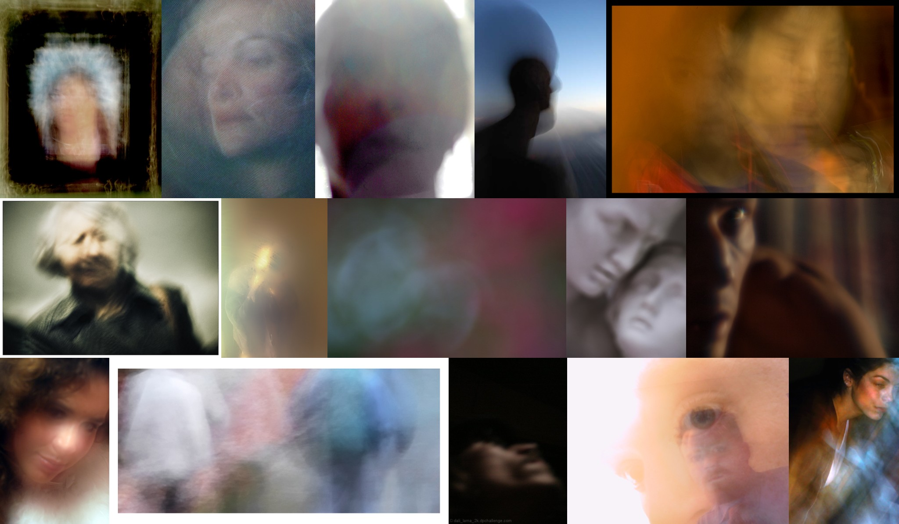

### 🔧 `Read`

```json
{
  "file_path": "/home/wg25r/anti_aesthetics_agent/tmp/grid_5.jpg"
}
```

### 🔧 `mcp__dataset-curation__sample`

```json
{
  "query": "soft focus dreamy hazy out of focus portrait",
  "min_threshold": "0.40",
  "max_threshold": "0.43",
  "count": "10",
  "negative_prompts": "[\"watermark logo text overlay\", \"blank empty white frame\", \"sharp crisp clear high resolution\"]",
  "negative_threshold": "0.32"
}
```

**Result:**

Grid image saved at: /home/wg25r/anti_aesthetics_agent/tmp/grid_6.jpg
Use the Read tool to view it.
Sampled 10 from 51 candidates.

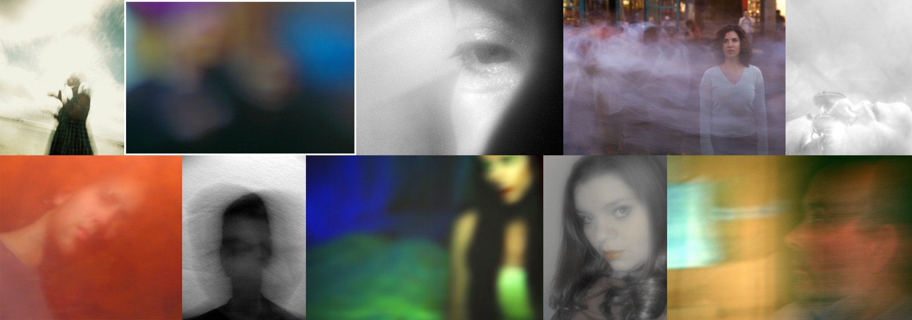

### 🔧 `Read`

```json
{
  "file_path": "/home/wg25r/anti_aesthetics_agent/tmp/grid_6.jpg"
}
```

> **Agent Log:** 0.40-0.43 band on soft-focus dreamy portraits: 51 candidates. Clearly intentional softness — color washes, dreamy haze around figures, blurred faces, fog. Some include faint watermarks but content is on-target. Committing at 0.40 to capture this band.

**Result:**

Logged.

### 🔧 `mcp__dataset-curation__commit`

```json
{
  "query": "soft focus dreamy hazy out of focus portrait",
  "threshold": "0.40",
  "negative_prompts": "[\"watermark logo text overlay\", \"blank empty white frame\"]",
  "negative_threshold": "0.32",
  "message": "sub:intentional_blur/soft_focus — anti_aesthetic — dreamy hazy out-of-focus portraits, vaseline lens, soft veil"
}
```

**Result:**

Committed with ID: ca7ce258, message: sub:intentional_blur/soft_focus — anti_aesthetic — dreamy hazy out-of-focus portraits, vaseline lens, soft veil with 66 images.

### 🔧 `mcp__dataset-curation__search`

```json
{
  "query": "long exposure light trails night abstract streaks",
  "negative_prompts": "[\"watermark logo text caption\", \"blank empty white frame\"]",
  "negative_threshold": "0.32",
  "t": "15"
}
```

**Result:**

Grid image saved at: /home/wg25r/anti_aesthetics_agent/tmp/grid_7.jpg
Use the Read tool to view it.
Showing top 15 results for 'long exposure light trails night abstract streaks' in photos.
Top-15 scores: [0.4723, 0.4704, 0.4700, 0.4661, 0.4633, 0.4631, 0.4627, 0.4624, 0.4622, 0.4609, 0.4588, 0.4584, 0.4574, 0.4572, 0.4567]
Similarity distribution: counts=[258, 10650, 68349, 97158, 48875, 14487, 4541, 1428, 436, 99], bins=[0.093, 0.131, 0.169, 0.207, 0.245, 0.283, 0.321, 0.359, 0.397, 0.434, 0.472]

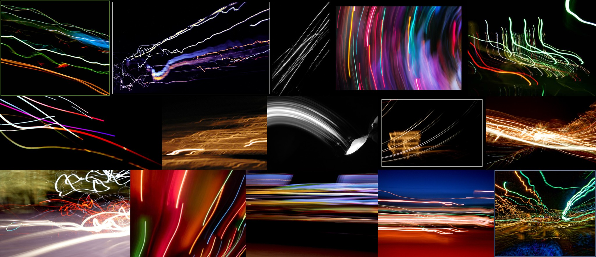

### 🔧 `Read`

```json
{
  "file_path": "/home/wg25r/anti_aesthetics_agent/tmp/grid_7.jpg"
}
```

### 🔧 `mcp__dataset-curation__sample`

```json
{
  "query": "long exposure light trails night abstract streaks",
  "min_threshold": "0.43",
  "max_threshold": "0.46",
  "count": "10",
  "negative_prompts": "[\"watermark logo text caption\", \"blank empty white frame\"]",
  "negative_threshold": "0.32"
}
```

**Result:**

Grid image saved at: /home/wg25r/anti_aesthetics_agent/tmp/grid_8.jpg
Use the Read tool to view it.
Sampled 10 from 117 candidates.

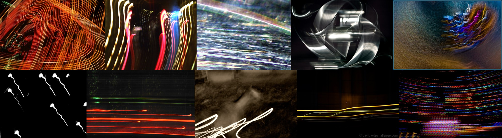

Todo list still matches active work. Continuing with intentional_blur sub-element (light trails).

### 🔧 `Read`

```json
{
  "file_path": "/home/wg25r/anti_aesthetics_agent/tmp/grid_8.jpg"
}
```

> **Agent Log:** 0.43-0.46 light trails: 117 candidates, all clearly long-exposure abstract light streaks — exactly the chaotic, lo-fi-meets-experimental anti-aesthetic feel. Committing at 0.43.

**Result:**

Logged.

### 🔧 `mcp__dataset-curation__commit`

```json
{
  "query": "long exposure light trails night abstract streaks",
  "threshold": "0.43",
  "negative_prompts": "[\"watermark logo text caption\", \"blank empty white frame\"]",
  "negative_threshold": "0.32",
  "message": "sub:intentional_blur/light_trails — anti_aesthetic — long exposure streaks, chaotic light painting, ICM at night"
}
```

**Result:**

Committed with ID: 29a37975, message: sub:intentional_blur/light_trails — anti_aesthetic — long exposure streaks, chaotic light painting, ICM at night with 127 images.

### 🔧 `mcp__dataset-curation__search`

```json
{
  "query": "extreme shallow depth of field bokeh blurred background",
  "negative_prompts": "[\"watermark logo text caption\", \"empty blank white frame\"]",
  "negative_threshold": "0.32",
  "t": "15"
}
```

**Result:**

Grid image saved at: /home/wg25r/anti_aesthetics_agent/tmp/grid_9.jpg
Use the Read tool to view it.
Showing top 15 results for 'extreme shallow depth of field bokeh blurred background' in photos.
Top-15 scores: [0.4231, 0.4165, 0.4160, 0.4150, 0.4145, 0.4139, 0.4131, 0.4129, 0.4120, 0.4117, 0.4116, 0.4106, 0.4091, 0.4087, 0.4086]
Similarity distribution: counts=[82, 1981, 20033, 68650, 85905, 48573, 16530, 3765, 697, 57], bins=[0.199, 0.222, 0.244, 0.267, 0.289, 0.311, 0.334, 0.356, 0.378, 0.401, 0.423]

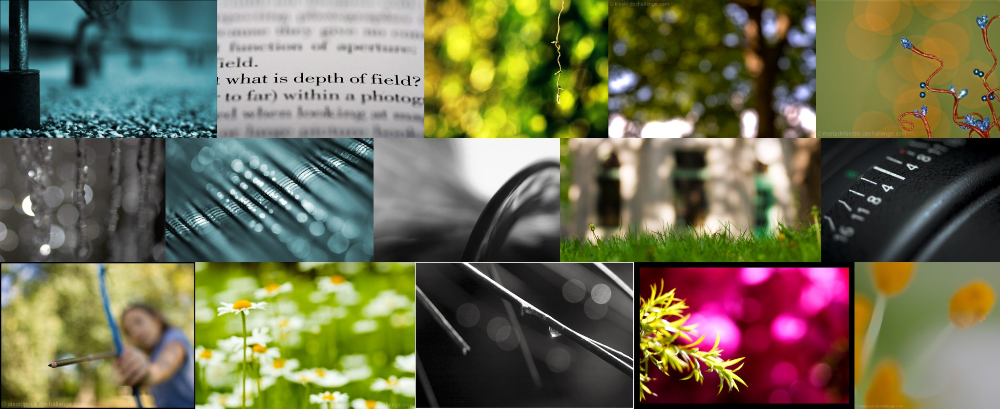

### 🔧 `Read`

```json
{
  "file_path": "/home/wg25r/anti_aesthetics_agent/tmp/grid_9.jpg"
}
```

> **Agent Log:** Shallow DoF results lean conventionally beautiful (bokeh flowers, macro). Doesn't fit the anti-aesthetic clarity-subversion goal. Skipping this and pivoting to ICM/abstract blur and lens haze instead.

**Result:**

Logged.

### 🔧 `mcp__dataset-curation__search`

```json
{
  "query": "intentional camera movement abstract blur swirl impressionistic photo",
  "negative_prompts": "[\"watermark logo text caption\", \"empty blank white frame\"]",
  "negative_threshold": "0.32",
  "t": "15"
}
```

**Result:**

Grid image saved at: /home/wg25r/anti_aesthetics_agent/tmp/grid_10.jpg
Use the Read tool to view it.
Showing top 15 results for 'intentional camera movement abstract blur swirl impressionistic photo' in photos.
Top-15 scores: [0.4706, 0.4664, 0.4636, 0.4635, 0.4619, 0.4612, 0.4603, 0.4574, 0.4572, 0.4570, 0.4570, 0.4564, 0.4547, 0.4508, 0.4503]
Similarity distribution: counts=[410, 12120, 67370, 99980, 49128, 12629, 3313, 950, 320, 53], bins=[0.160, 0.191, 0.222, 0.253, 0.284, 0.315, 0.346, 0.378, 0.409, 0.440, 0.471]

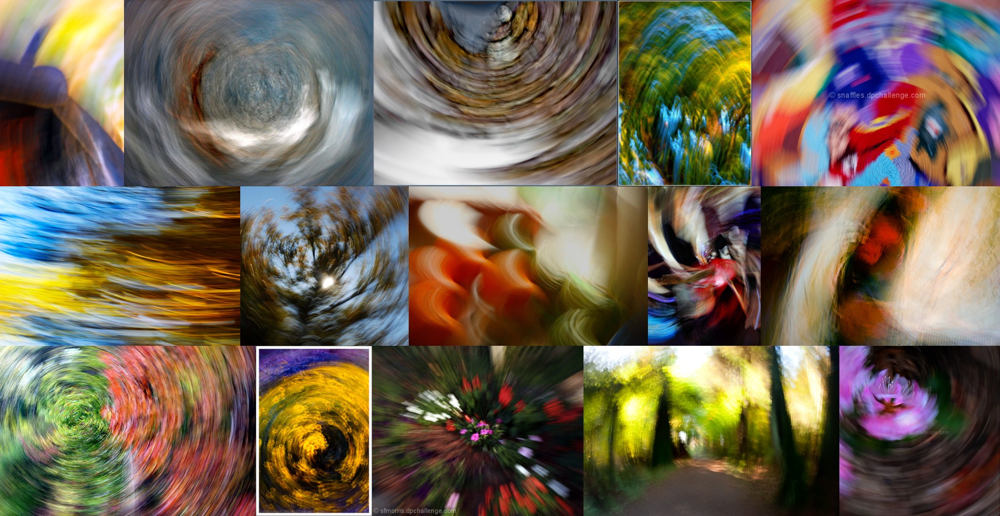

### 🔧 `Read`

```json
{
  "file_path": "/home/wg25r/anti_aesthetics_agent/tmp/grid_10.jpg"
}
```

### 🔧 `mcp__dataset-curation__sample`

```json
{
  "query": "intentional camera movement abstract blur swirl impressionistic photo",
  "min_threshold": "0.42",
  "max_threshold": "0.46",
  "count": "10",
  "negative_prompts": "[\"watermark logo text caption\", \"empty blank white frame\"]",
  "negative_threshold": "0.32"
}
```

**Result:**

Grid image saved at: /home/wg25r/anti_aesthetics_agent/tmp/grid_11.jpg
Use the Read tool to view it.
Sampled 10 from 192 candidates.

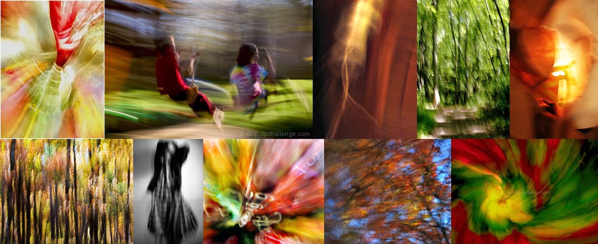

Todo list still matches active work. Continuing with ICM/abstract blur sampling.

### 🔧 `Read`

```json
{
  "file_path": "/home/wg25r/anti_aesthetics_agent/tmp/grid_11.jpg"
}
```

> **Agent Log:** 0.42-0.46 ICM band: 192 candidates — abstract painterly blurs, swirling chromatic shapes, vertical-pan forest, smeared figures, zoom blur. Strong intentional-anti-clarity aesthetic. Committing at 0.43 to capture core.

**Result:**

Logged.

### 🔧 `mcp__dataset-curation__commit`

```json
{
  "query": "intentional camera movement abstract blur swirl impressionistic photo",
  "threshold": "0.43",
  "negative_prompts": "[\"watermark logo text caption\", \"empty blank white frame\"]",
  "negative_threshold": "0.32",
  "message": "sub:intentional_blur/ICM_abstract — anti_aesthetic — swirl, zoom blur, vertical pan, painterly motion abstraction"
}
```

**Result:**

Committed with ID: ed8d18f7, message: sub:intentional_blur/ICM_abstract — anti_aesthetic — swirl, zoom blur, vertical pan, painterly motion abstraction with 103 images.

Now moving to double exposure.

### 🔧 `TodoWrite`

```json
{
  "todos": [
    {
      "content": "Undo over-broad motion blur commit and re-tighten threshold",
      "activeForm": "Tightening motion blur commit",
      "status": "completed"
    },
    {
      "content": "Curate intentional_blur (soft focus, ICM, shallow DoF, light trails)",
      "activeForm": "Curating intentional blur sub-elements",
      "status": "completed"
    },
    {
      "content": "Curate double_exposure imagery",
      "activeForm": "Curating double exposure imagery",
      "status": "in_progress"
    },
    {
      "content": "Curate film_artifacts (grain, light leaks, scratches, expired film)",
      "activeForm": "Curating film artifacts",
      "status": "pending"
    },
    {
      "content": "Curate analog_degradation (VHS, CRT, faded polaroid, photocopy)",
      "activeForm": "Curating analog degradation",
      "status": "pending"
    },
    {
      "content": "Curate digital_artifacts (JPEG, datamosh, pixel sort, chromatic aberration)",
      "activeForm": "Curating digital artifacts",
      "status": "pending"
    },
    {
      "content": "Curate bad_or_no_details (smeared, fog, silhouette, blown highlights)",
      "activeForm": "Curating bad-or-no-details imagery",
      "status": "pending"
    },
    {
      "content": "Final status review of dataset composition",
      "activeForm": "Reviewing final dataset composition",
      "status": "pending"
    }
  ]
}
```

### 🔧 `mcp__dataset-curation__search`

```json
{
  "query": "double exposure ghostly silhouette overlapping portrait",
  "negative_prompts": "[\"watermark logo text caption\", \"empty blank white frame\"]",
  "negative_threshold": "0.32",
  "t": "15"
}
```

**Result:**

Grid image saved at: /home/wg25r/anti_aesthetics_agent/tmp/grid_12.jpg
Use the Read tool to view it.
Showing top 15 results for 'double exposure ghostly silhouette overlapping portrait' in photos.
Top-15 scores: [0.4678, 0.4670, 0.4553, 0.4544, 0.4538, 0.4526, 0.4522, 0.4521, 0.4516, 0.4515, 0.4502, 0.4497, 0.4465, 0.4464, 0.4444]
Similarity distribution: counts=[72, 5047, 45085, 92660, 68962, 26427, 6292, 1386, 301, 41], bins=[0.138, 0.171, 0.204, 0.237, 0.270, 0.303, 0.336, 0.369, 0.402, 0.435, 0.468]

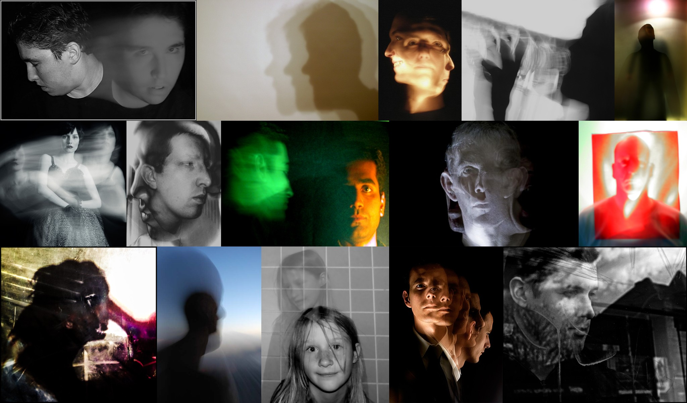

### 🔧 `Read`

```json
{
  "file_path": "/home/wg25r/anti_aesthetics_agent/tmp/grid_12.jpg"
}
```

### 🔧 `mcp__dataset-curation__sample`

```json
{
  "query": "double exposure ghostly silhouette overlapping portrait",
  "min_threshold": "0.42",
  "max_threshold": "0.46",
  "count": "10",
  "negative_prompts": "[\"watermark logo text caption\", \"empty blank white frame\"]",
  "negative_threshold": "0.32"
}
```

**Result:**

Grid image saved at: /home/wg25r/anti_aesthetics_agent/tmp/grid_13.jpg
Use the Read tool to view it.
Sampled 10 from 115 candidates.

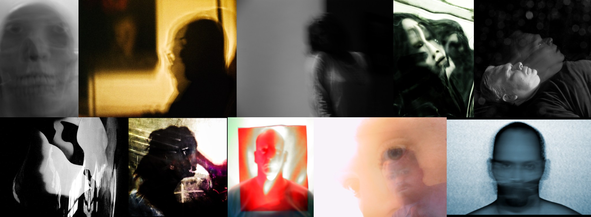

### 🔧 `Read`

```json
{
  "file_path": "/home/wg25r/anti_aesthetics_agent/tmp/grid_13.jpg"
}
```

> **Agent Log:** 0.42-0.46 double-exposure: 115 candidates — clearly ghostly multi-exposure portraits, doubled silhouettes, overlapping faces. Strong intentional layering aesthetic. Committing at 0.42.

**Result:**

Logged.

### 🔧 `mcp__dataset-curation__commit`

```json
{
  "query": "double exposure ghostly silhouette overlapping portrait",
  "threshold": "0.42",
  "negative_prompts": "[\"watermark logo text caption\", \"empty blank white frame\"]",
  "negative_threshold": "0.32",
  "message": "sub:double_exposure — anti_aesthetic — overlapping ghostly portraits, doubled silhouettes, layered composites"
}
```

**Result:**

Committed with ID: d36e10ff, message: sub:double_exposure — anti_aesthetic — overlapping ghostly portraits, doubled silhouettes, layered composites with 117 images.

Now film artifacts.

### 🔧 `TodoWrite`

```json
{
  "todos": [
    {
      "content": "Undo over-broad motion blur commit and re-tighten threshold",
      "activeForm": "Tightening motion blur commit",
      "status": "completed"
    },
    {
      "content": "Curate intentional_blur (soft focus, ICM, shallow DoF, light trails)",
      "activeForm": "Curating intentional blur sub-elements",
      "status": "completed"
    },
    {
      "content": "Curate double_exposure imagery",
      "activeForm": "Curating double exposure imagery",
      "status": "completed"
    },
    {
      "content": "Curate film_artifacts (grain, light leaks, scratches, expired film)",
      "activeForm": "Curating film artifacts",
      "status": "in_progress"
    },
    {
      "content": "Curate analog_degradation (VHS, CRT, faded polaroid, photocopy)",
      "activeForm": "Curating analog degradation",
      "status": "pending"
    },
    {
      "content": "Curate digital_artifacts (JPEG, datamosh, pixel sort, chromatic aberration)",
      "activeForm": "Curating digital artifacts",
      "status": "pending"
    },
    {
      "content": "Curate bad_or_no_details (smeared, fog, silhouette, blown highlights)",
      "activeForm": "Curating bad-or-no-details imagery",
      "status": "pending"
    },
    {
      "content": "Final status review of dataset composition",
      "activeForm": "Reviewing final dataset composition",
      "status": "pending"
    }
  ]
}
```

### 🔧 `mcp__dataset-curation__search`

```json
{
  "query": "heavy film grain noise analog photograph high ISO texture",
  "negative_prompts": "[\"watermark text caption logo\", \"empty blank white frame\"]",
  "negative_threshold": "0.32",
  "t": "15"
}
```

**Result:**

Grid image saved at: /home/wg25r/anti_aesthetics_agent/tmp/grid_14.jpg
Use the Read tool to view it.
Showing top 15 results for 'heavy film grain noise analog photograph high ISO texture' in photos.
Top-15 scores: [0.4410, 0.4157, 0.4125, 0.4115, 0.4080, 0.4074, 0.4052, 0.3952, 0.3945, 0.3933, 0.3920, 0.3919, 0.3910, 0.3900, 0.3897]
Similarity distribution: counts=[311, 10734, 64371, 97373, 59674, 14461, 1608, 158, 22, 3], bins=[0.155, 0.184, 0.212, 0.241, 0.269, 0.298, 0.327, 0.355, 0.384, 0.412, 0.441]

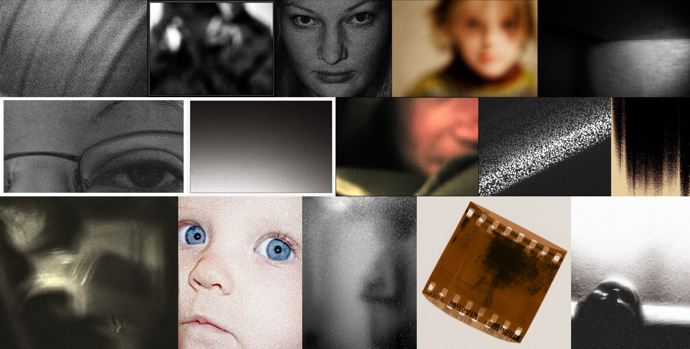

### 🔧 `Read`

```json
{
  "file_path": "/home/wg25r/anti_aesthetics_agent/tmp/grid_14.jpg"
}
```

### 🔧 `mcp__dataset-curation__sample`

```json
{
  "query": "heavy film grain noise analog photograph high ISO texture",
  "min_threshold": "0.38",
  "max_threshold": "0.42",
  "count": "10",
  "negative_prompts": "[\"watermark text caption logo\", \"empty blank white frame\"]",
  "negative_threshold": "0.32"
}
```

**Result:**

Grid image saved at: /home/wg25r/anti_aesthetics_agent/tmp/grid_15.jpg
Use the Read tool to view it.
Sampled 10 from 31 candidates.

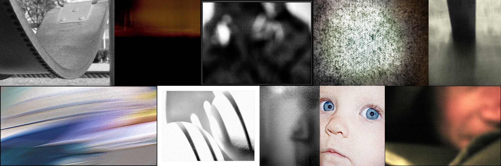

### 🔧 `Read`

```json
{
  "file_path": "/home/wg25r/anti_aesthetics_agent/tmp/grid_15.jpg"
}
```

> **Agent Log:** 0.38-0.42 grain band: 31 candidates. Mix of grainy portraits, film-grain textures, smeared analog images. Lower count — committing at 0.38 to capture all 31+. Quality is on-target.

**Result:**

Logged.

### 🔧 `mcp__dataset-curation__commit`

```json
{
  "query": "heavy film grain noise analog photograph high ISO texture",
  "threshold": "0.38",
  "negative_prompts": "[\"watermark text caption logo\", \"empty blank white frame\"]",
  "negative_threshold": "0.32",
  "message": "sub:film_artifacts/grain — anti_aesthetic — heavy grain, high-ISO noise, push-processed analog texture"
}
```

**Result:**

Committed with ID: 83ca1dea, message: sub:film_artifacts/grain — anti_aesthetic — heavy grain, high-ISO noise, push-processed analog texture with 32 images.

### 🔧 `mcp__dataset-curation__search`

```json
{
  "query": "light leak film burn red orange flare expired film",
  "negative_prompts": "[\"watermark text caption logo\", \"empty blank white frame\"]",
  "negative_threshold": "0.32",
  "t": "15"
}
```

**Result:**

Grid image saved at: /home/wg25r/anti_aesthetics_agent/tmp/grid_16.jpg
Use the Read tool to view it.
Showing top 15 results for 'light leak film burn red orange flare expired film' in photos.
Top-15 scores: [0.4668, 0.4350, 0.4253, 0.4232, 0.4205, 0.4198, 0.4185, 0.4183, 0.4161, 0.4158, 0.4152, 0.4141, 0.4131, 0.4116, 0.4113]
Similarity distribution: counts=[98, 6066, 59502, 109074, 55550, 15007, 2988, 385, 43, 2], bins=[0.115, 0.150, 0.185, 0.221, 0.256, 0.291, 0.326, 0.361, 0.396, 0.432, 0.467]

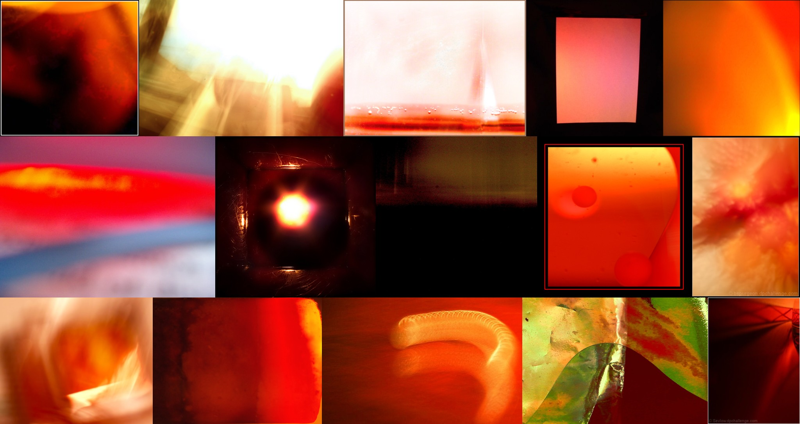

### 🔧 `Read`

```json
{
  "file_path": "/home/wg25r/anti_aesthetics_agent/tmp/grid_16.jpg"
}
```

### 🔧 `mcp__dataset-curation__sample`

```json
{
  "query": "light leak film burn red orange flare expired film",
  "min_threshold": "0.40",
  "max_threshold": "0.43",
  "count": "10",
  "negative_prompts": "[\"watermark text caption logo\", \"empty blank white frame\"]",
  "negative_threshold": "0.32"
}
```

**Result:**

Grid image saved at: /home/wg25r/anti_aesthetics_agent/tmp/grid_17.jpg
Use the Read tool to view it.
Sampled 10 from 33 candidates.

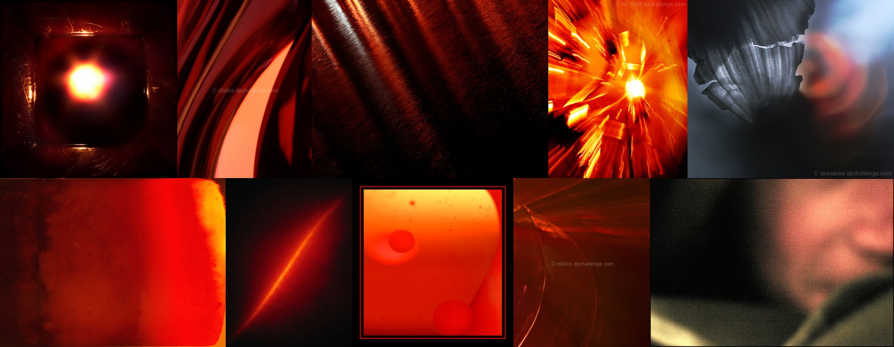

### 🔧 `Read`

```json
{
  "file_path": "/home/wg25r/anti_aesthetics_agent/tmp/grid_17.jpg"
}
```

Todo list still matches active work. Continuing with film_artifacts (light leak band).

> **Agent Log:** 0.40-0.43 light leak band: 33 candidates — orange/red light bursts, lens flares, expired-film color casts. Strong anti-aesthetic warm-color washes. Committing at 0.40.

**Result:**

Logged.

### 🔧 `mcp__dataset-curation__commit`

```json
{
  "query": "light leak film burn red orange flare expired film",
  "threshold": "0.40",
  "negative_prompts": "[\"watermark text caption logo\", \"empty blank white frame\"]",
  "negative_threshold": "0.32",
  "message": "sub:film_artifacts/light_leak — anti_aesthetic — color casts, lens flare, expired film color shifts"
}
```

**Result:**

Committed with ID: b362b9e5, message: sub:film_artifacts/light_leak — anti_aesthetic — color casts, lens flare, expired film color shifts with 35 images.

### 🔧 `mcp__dataset-curation__search`

```json
{
  "query": "scratched dusty damaged old film negative photo",
  "negative_prompts": "[\"watermark text caption logo\", \"empty blank white frame\"]",
  "negative_threshold": "0.32",
  "t": "15"
}
```

**Result:**

Grid image saved at: /home/wg25r/anti_aesthetics_agent/tmp/grid_18.jpg
Use the Read tool to view it.
Showing top 15 results for 'scratched dusty damaged old film negative photo' in photos.
Top-15 scores: [0.4847, 0.4554, 0.4500, 0.4439, 0.4351, 0.4320, 0.4279, 0.4260, 0.4259, 0.4239, 0.4223, 0.4218, 0.4201, 0.4198, 0.4187]
Similarity distribution: counts=[94, 5898, 51387, 98304, 68899, 21357, 2520, 233, 20, 3], bins=[0.121, 0.157, 0.194, 0.230, 0.266, 0.303, 0.339, 0.376, 0.412, 0.448, 0.485]

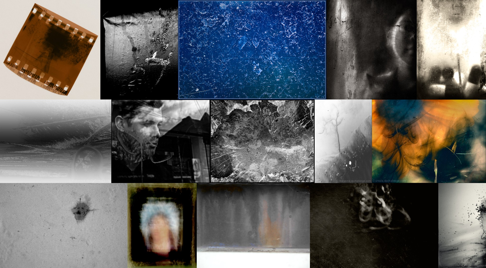

### 🔧 `Read`

```json
{
  "file_path": "/home/wg25r/anti_aesthetics_agent/tmp/grid_18.jpg"
}
```

### 🔧 `mcp__dataset-curation__sample`

```json
{
  "query": "scratched dusty damaged old film negative photo",
  "min_threshold": "0.40",
  "max_threshold": "0.44",
  "count": "10",
  "negative_prompts": "[\"watermark text caption logo\", \"empty blank white frame\"]",
  "negative_threshold": "0.32"
}
```

**Result:**

Grid image saved at: /home/wg25r/anti_aesthetics_agent/tmp/grid_19.jpg
Use the Read tool to view it.
Sampled 10 from 39 candidates.

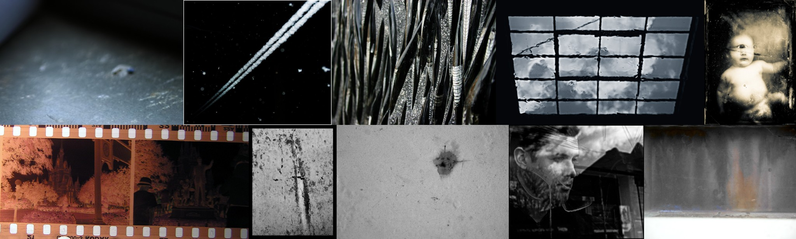

### 🔧 `Read`

```json
{
  "file_path": "/home/wg25r/anti_aesthetics_agent/tmp/grid_19.jpg"
}
```

> **Agent Log:** 0.40-0.44 damaged-film band: 39 candidates — film strips, scratched textures, tintype-style portraits, dusty surfaces, partially destroyed negatives. Strong analog-decay aesthetic. Committing at 0.40.

**Result:**

Logged.

### 🔧 `mcp__dataset-curation__commit`

```json
{
  "query": "scratched dusty damaged old film negative photo",
  "threshold": "0.40",
  "negative_prompts": "[\"watermark text caption logo\", \"empty blank white frame\"]",
  "negative_threshold": "0.32",
  "message": "sub:film_artifacts/scratch_decay — anti_aesthetic — scratches, dust spots, chemical stains, tintype/wet-plate degradation"
}
```

**Result:**

Committed with ID: 05e91655, message: sub:film_artifacts/scratch_decay — anti_aesthetic — scratches, dust spots, chemical stains, tintype/wet-plate degradation with 43 images.

Now analog degradation (VHS, CRT, polaroid, photocopy).

### 🔧 `TodoWrite`

```json
{
  "todos": [
    {
      "content": "Undo over-broad motion blur commit and re-tighten threshold",
      "activeForm": "Tightening motion blur commit",
      "status": "completed"
    },
    {
      "content": "Curate intentional_blur (soft focus, ICM, shallow DoF, light trails)",
      "activeForm": "Curating intentional blur sub-elements",
      "status": "completed"
    },
    {
      "content": "Curate double_exposure imagery",
      "activeForm": "Curating double exposure imagery",
      "status": "completed"
    },
    {
      "content": "Curate film_artifacts (grain, light leaks, scratches, expired film)",
      "activeForm": "Curating film artifacts",
      "status": "completed"
    },
    {
      "content": "Curate analog_degradation (VHS, CRT, faded polaroid, photocopy)",
      "activeForm": "Curating analog degradation",
      "status": "in_progress"
    },
    {
      "content": "Curate digital_artifacts (JPEG, datamosh, pixel sort, chromatic aberration)",
      "activeForm": "Curating digital artifacts",
      "status": "pending"
    },
    {
      "content": "Curate bad_or_no_details (smeared, fog, silhouette, blown highlights)",
      "activeForm": "Curating bad-or-no-details imagery",
      "status": "pending"
    },
    {
      "content": "Final status review of dataset composition",
      "activeForm": "Reviewing final dataset composition",
      "status": "pending"
    }
  ]
}
```

### 🔧 `mcp__dataset-curation__search`

```json
{
  "query": "VHS scanlines TV static analog distortion CRT screen",
  "negative_prompts": "[\"watermark logo text caption\", \"empty blank white frame\"]",
  "negative_threshold": "0.32",
  "t": "15"
}
```

**Result:**

Grid image saved at: /home/wg25r/anti_aesthetics_agent/tmp/grid_20.jpg
Use the Read tool to view it.
Showing top 15 results for 'VHS scanlines TV static analog distortion CRT screen' in photos.
Top-15 scores: [0.4162, 0.4156, 0.4154, 0.4149, 0.4075, 0.4036, 0.3980, 0.3937, 0.3928, 0.3918, 0.3896, 0.3894, 0.3858, 0.3838, 0.3825]
Similarity distribution: counts=[228, 9614, 64733, 105989, 51676, 11494, 2105, 348, 74, 12], bins=[0.136, 0.164, 0.192, 0.220, 0.248, 0.276, 0.304, 0.332, 0.360, 0.388, 0.416]

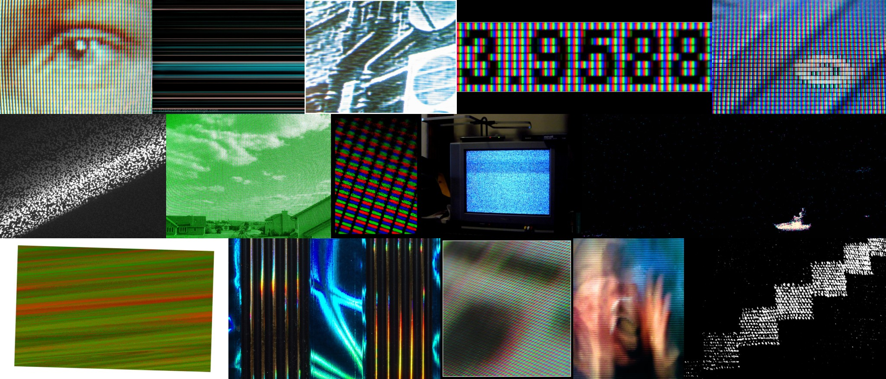

### 🔧 `Read`

```json
{
  "file_path": "/home/wg25r/anti_aesthetics_agent/tmp/grid_20.jpg"
}
```

### 🔧 `mcp__dataset-curation__sample`

```json
{
  "query": "VHS scanlines TV static analog distortion CRT screen",
  "min_threshold": "0.36",
  "max_threshold": "0.41",
  "count": "10",
  "negative_prompts": "[\"watermark logo text caption\", \"empty blank white frame\"]",
  "negative_threshold": "0.32"
}
```

**Result:**

Grid image saved at: /home/wg25r/anti_aesthetics_agent/tmp/grid_21.jpg
Use the Read tool to view it.
Sampled 10 from 83 candidates.

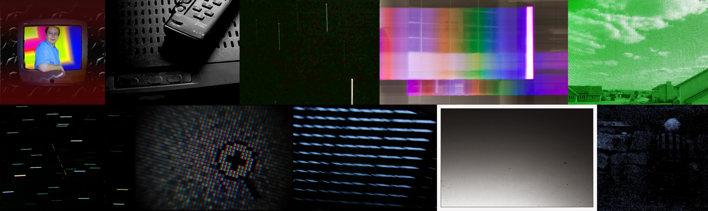

### 🔧 `Read`

```json
{
  "file_path": "/home/wg25r/anti_aesthetics_agent/tmp/grid_21.jpg"
}
```

> **Agent Log:** 0.36-0.41 VHS/CRT band: 83 candidates — pixel-grid CRTs, scanline static, color-bar test patterns, night-vision green, retro TV imagery. Strong analog-decay aesthetic. Committing at 0.36 to capture all 83.

**Result:**

Logged.

### 🔧 `mcp__dataset-curation__commit`

```json
{
  "query": "VHS scanlines TV static analog distortion CRT screen",
  "threshold": "0.36",
  "negative_prompts": "[\"watermark logo text caption\", \"empty blank white frame\"]",
  "negative_threshold": "0.32",
  "message": "sub:analog_degradation/VHS_CRT — anti_aesthetic — scanlines, TV static, color bars, pixel grids, retro CRT"
}
```

**Result:**

Committed with ID: 43c354a7, message: sub:analog_degradation/VHS_CRT — anti_aesthetic — scanlines, TV static, color bars, pixel grids, retro CRT with 87 images.

### 🔧 `mcp__dataset-curation__search`

```json
{
  "query": "faded polaroid old photograph yellowed vintage snapshot",
  "negative_prompts": "[\"watermark logo text caption\", \"empty blank white frame\"]",
  "negative_threshold": "0.32",
  "t": "15"
}
```

**Result:**

Grid image saved at: /home/wg25r/anti_aesthetics_agent/tmp/grid_22.jpg
Use the Read tool to view it.
Showing top 15 results for 'faded polaroid old photograph yellowed vintage snapshot' in photos.
Top-15 scores: [0.4296, 0.4121, 0.4071, 0.4052, 0.4051, 0.4020, 0.3979, 0.3974, 0.3972, 0.3966, 0.3957, 0.3949, 0.3941, 0.3930, 0.3924]
Similarity distribution: counts=[26, 1948, 27345, 86416, 86929, 35191, 7358, 944, 107, 9], bins=[0.102, 0.135, 0.167, 0.200, 0.233, 0.266, 0.298, 0.331, 0.364, 0.397, 0.430]

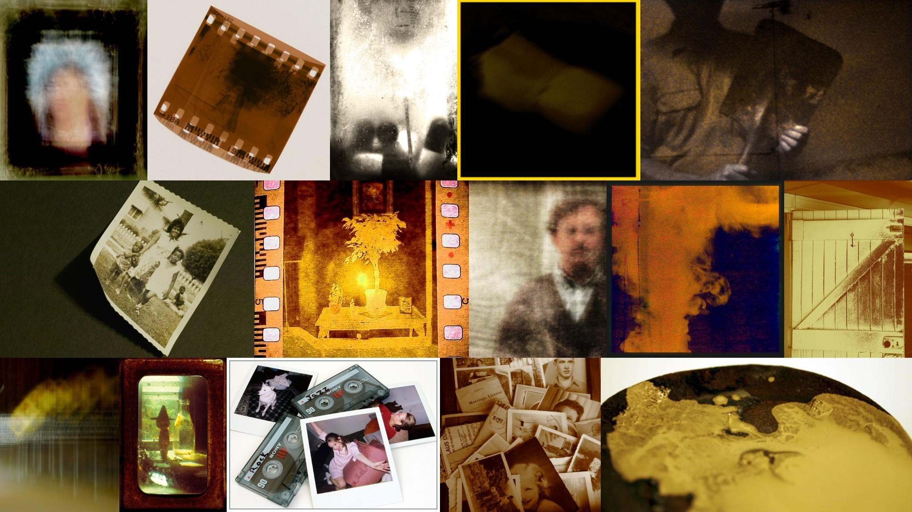

### 🔧 `Read`

```json
{
  "file_path": "/home/wg25r/anti_aesthetics_agent/tmp/grid_22.jpg"
}
```

### 🔧 `mcp__dataset-curation__sample`

```json
{
  "query": "faded polaroid old photograph yellowed vintage snapshot",
  "min_threshold": "0.37",
  "max_threshold": "0.40",
  "count": "10",
  "negative_prompts": "[\"watermark logo text caption\", \"empty blank white frame\"]",
  "negative_threshold": "0.32"
}
```

**Result:**

Grid image saved at: /home/wg25r/anti_aesthetics_agent/tmp/grid_23.jpg
Use the Read tool to view it.
Sampled 10 from 58 candidates.

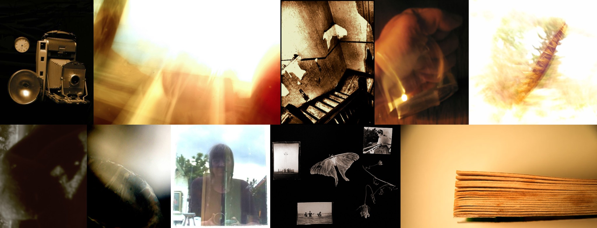

### 🔧 `Read`

```json
{
  "file_path": "/home/wg25r/anti_aesthetics_agent/tmp/grid_23.jpg"
}
```

Todo list is current. Continuing with analog_degradation (faded/yellowed photographs).

> **Agent Log:** 0.37-0.40 faded-polaroid band: 58 candidates — sepia-faded snapshots, vintage cameras, browned/yellowed photographs, blurry diffused glow images. Strong analog nostalgic decay. Committing at 0.37.

**Result:**

Logged.

### 🔧 `mcp__dataset-curation__commit`

```json
{
  "query": "faded polaroid old photograph yellowed vintage snapshot",
  "threshold": "0.37",
  "negative_prompts": "[\"watermark logo text caption\", \"empty blank white frame\"]",
  "negative_threshold": "0.32",
  "message": "sub:analog_degradation/faded_polaroid — anti_aesthetic — sepia, yellowing, faded snapshots, browned old photos"
}
```

**Result:**

Committed with ID: dd9517a3, message: sub:analog_degradation/faded_polaroid — anti_aesthetic — sepia, yellowing, faded snapshots, browned old photos with 64 images.

Now digital artifacts.

### 🔧 `TodoWrite`

```json
{
  "todos": [
    {
      "content": "Undo over-broad motion blur commit and re-tighten threshold",
      "activeForm": "Tightening motion blur commit",
      "status": "completed"
    },
    {
      "content": "Curate intentional_blur (soft focus, ICM, shallow DoF, light trails)",
      "activeForm": "Curating intentional blur sub-elements",
      "status": "completed"
    },
    {
      "content": "Curate double_exposure imagery",
      "activeForm": "Curating double exposure imagery",
      "status": "completed"
    },
    {
      "content": "Curate film_artifacts (grain, light leaks, scratches, expired film)",
      "activeForm": "Curating film artifacts",
      "status": "completed"
    },
    {
      "content": "Curate analog_degradation (VHS, CRT, faded polaroid, photocopy)",
      "activeForm": "Curating analog degradation",
      "status": "completed"
    },
    {
      "content": "Curate digital_artifacts (JPEG, datamosh, pixel sort, chromatic aberration)",
      "activeForm": "Curating digital artifacts",
      "status": "in_progress"
    },
    {
      "content": "Curate bad_or_no_details (smeared, fog, silhouette, blown highlights)",
      "activeForm": "Curating bad-or-no-details imagery",
      "status": "pending"
    },
    {
      "content": "Final status review of dataset composition",
      "activeForm": "Reviewing final dataset composition",
      "status": "pending"
    }
  ]
}
```

### 🔧 `mcp__dataset-curation__search`

```json
{
  "query": "glitch art pixel sorting digital corruption datamoshing",
  "negative_prompts": "[\"watermark logo text caption\", \"empty blank white frame\"]",
  "negative_threshold": "0.32",
  "t": "15"
}
```

**Result:**

Grid image saved at: /home/wg25r/anti_aesthetics_agent/tmp/grid_24.jpg
Use the Read tool to view it.
Showing top 15 results for 'glitch art pixel sorting digital corruption datamoshing' in photos.
Top-15 scores: [0.4364, 0.4262, 0.4246, 0.4226, 0.4207, 0.4207, 0.4157, 0.4124, 0.4117, 0.4116, 0.4101, 0.4091, 0.4077, 0.4070, 0.4064]
Similarity distribution: counts=[74, 3537, 37477, 91315, 77207, 28546, 6721, 1260, 125, 11], bins=[0.166, 0.193, 0.220, 0.247, 0.274, 0.301, 0.328, 0.355, 0.382, 0.409, 0.436]

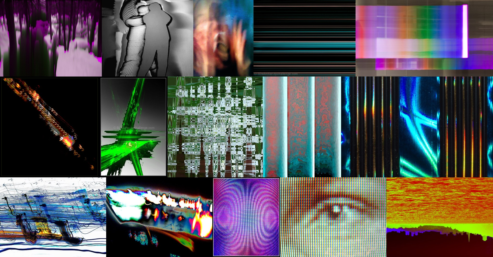

### 🔧 `Read`

```json
{
  "file_path": "/home/wg25r/anti_aesthetics_agent/tmp/grid_24.jpg"
}
```

### 🔧 `mcp__dataset-curation__sample`

```json
{
  "query": "glitch art pixel sorting digital corruption datamoshing",
  "min_threshold": "0.38",
  "max_threshold": "0.42",
  "count": "10",
  "negative_prompts": "[\"watermark logo text caption\", \"empty blank white frame\"]",
  "negative_threshold": "0.32"
}
```

**Result:**

Grid image saved at: /home/wg25r/anti_aesthetics_agent/tmp/grid_25.jpg
Use the Read tool to view it.
Sampled 10 from 167 candidates.

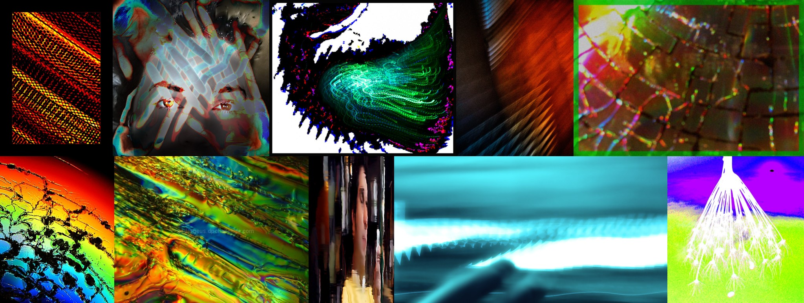

### 🔧 `Read`

```json
{
  "file_path": "/home/wg25r/anti_aesthetics_agent/tmp/grid_25.jpg"
}
```

> **Agent Log:** 0.38-0.42 glitch band: 167 candidates — pixel sorting, color shifts, fragmented compositions, datamosh-like blends, oversaturated digital errors. Strong digital-artifact aesthetic. Committing at 0.39 to keep it tighter.

**Result:**

Logged.

### 🔧 `mcp__dataset-curation__commit`

```json
{
  "query": "glitch art pixel sorting digital corruption datamoshing",
  "threshold": "0.39",
  "negative_prompts": "[\"watermark logo text caption\", \"empty blank white frame\"]",
  "negative_threshold": "0.32",
  "message": "sub:digital_artifacts/glitch — anti_aesthetic — pixel sorting, color shifts, datamosh, digital corruption"
}
```

**Result:**

Committed with ID: 7d211c3a, message: sub:digital_artifacts/glitch — anti_aesthetic — pixel sorting, color shifts, datamosh, digital corruption with 65 images.

### 🔧 `mcp__dataset-curation__search`

```json
{
  "query": "JPEG compression artifact blocky pixelated low quality",
  "negative_prompts": "[\"watermark logo text caption\", \"empty blank white frame\"]",
  "negative_threshold": "0.32",
  "t": "15"
}
```

**Result:**

Grid image saved at: /home/wg25r/anti_aesthetics_agent/tmp/grid_26.jpg
Use the Read tool to view it.
Showing top 15 results for 'JPEG compression artifact blocky pixelated low quality' in photos.
Top-15 scores: [0.4057, 0.3984, 0.3981, 0.3945, 0.3931, 0.3922, 0.3919, 0.3893, 0.3879, 0.3867, 0.3854, 0.3849, 0.3836, 0.3835, 0.3808]
Similarity distribution: counts=[41, 821, 10468, 55954, 104345, 61559, 12002, 990, 81, 12], bins=[0.193, 0.214, 0.236, 0.257, 0.278, 0.299, 0.321, 0.342, 0.363, 0.384, 0.406]

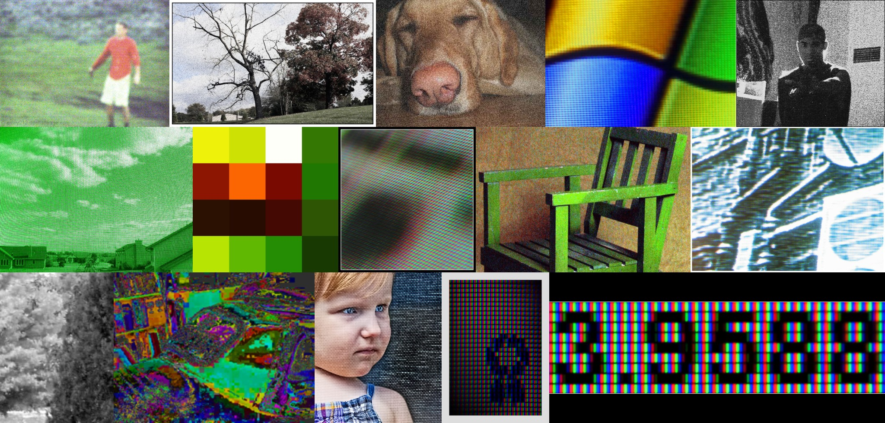

### 🔧 `Read`

```json
{
  "file_path": "/home/wg25r/anti_aesthetics_agent/tmp/grid_26.jpg"
}
```

### 🔧 `mcp__dataset-curation__sample`

```json
{
  "query": "JPEG compression artifact blocky pixelated low quality",
  "min_threshold": "0.36",
  "max_threshold": "0.40",
  "count": "10",
  "negative_prompts": "[\"watermark logo text caption\", \"empty blank white frame\"]",
  "negative_threshold": "0.32"
}
```

**Result:**

Grid image saved at: /home/wg25r/anti_aesthetics_agent/tmp/grid_27.jpg
Use the Read tool to view it.
Sampled 10 from 126 candidates.

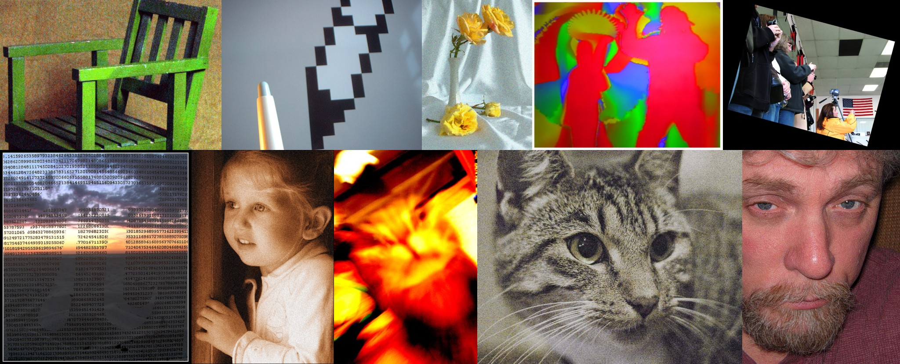

### 🔧 `Read`

```json
{
  "file_path": "/home/wg25r/anti_aesthetics_agent/tmp/grid_27.jpg"
}
```

Todo list current. The 0.36-0.40 JPEG band shows mixed results — chairs/cats/portraits don't strongly read as compression artifacts. Let me try a more visually specific query for chromatic aberration.

> **Agent Log:** JPEG compression query is noisy at 0.36-0.40 — many normal photos creep in. Skipping JPEG sub-element commit, pivoting to chromatic aberration (more visually distinctive).

**Result:**

Logged.

### 🔧 `mcp__dataset-curation__search`

```json
{
  "query": "chromatic aberration color fringing rainbow lens distortion edges",
  "negative_prompts": "[\"watermark logo text caption\", \"empty blank white frame\"]",
  "negative_threshold": "0.32",
  "t": "15"
}
```

**Result:**

Grid image saved at: /home/wg25r/anti_aesthetics_agent/tmp/grid_28.jpg
Use the Read tool to view it.
Showing top 15 results for 'chromatic aberration color fringing rainbow lens distortion edges' in photos.
Top-15 scores: [0.4392, 0.4346, 0.4314, 0.4296, 0.4289, 0.4284, 0.4259, 0.4256, 0.4252, 0.4226, 0.4210, 0.4202, 0.4194, 0.4188, 0.4187]
Similarity distribution: counts=[49, 2077, 24969, 84497, 89317, 35955, 7880, 1209, 285, 35], bins=[0.182, 0.208, 0.233, 0.259, 0.285, 0.310, 0.336, 0.362, 0.388, 0.413, 0.439]

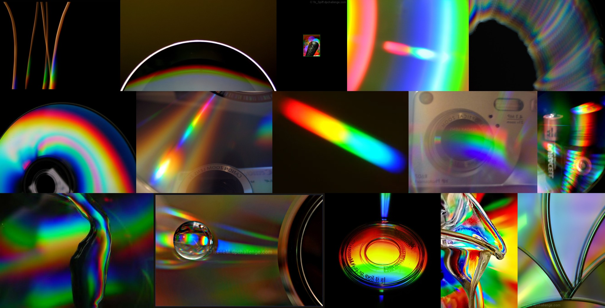

### 🔧 `Read`

```json
{
  "file_path": "/home/wg25r/anti_aesthetics_agent/tmp/grid_28.jpg"
}
```

> **Agent Log:** Chromatic aberration query returned mostly rainbow CD reflections — clean rainbow imagery, not the lens-defect aesthetic I was hoping for. Skipping. Pivoting to a different angle on digital artifacts.

**Result:**

Logged.

### 🔧 `mcp__dataset-curation__search`

```json
{
  "query": "low resolution pixelated mosaic blocky digital image",
  "negative_prompts": "[\"watermark logo text caption\", \"empty blank white frame\", \"high resolution sharp clean modern photo\"]",
  "negative_threshold": "0.34",
  "t": "15"
}
```

**Result:**

Grid image saved at: /home/wg25r/anti_aesthetics_agent/tmp/grid_29.jpg
Use the Read tool to view it.
Showing top 15 results for 'low resolution pixelated mosaic blocky digital image' in photos.
Top-15 scores: [0.4036, 0.4000, 0.3951, 0.3911, 0.3879, 0.3874, 0.3874, 0.3862, 0.3834, 0.3827, 0.3823, 0.3801, 0.3797, 0.3795, 0.3785]
Similarity distribution: counts=[14, 694, 14952, 86214, 107932, 31892, 3963, 445, 65, 14], bins=[0.162, 0.186, 0.210, 0.234, 0.258, 0.283, 0.307, 0.331, 0.355, 0.379, 0.404]

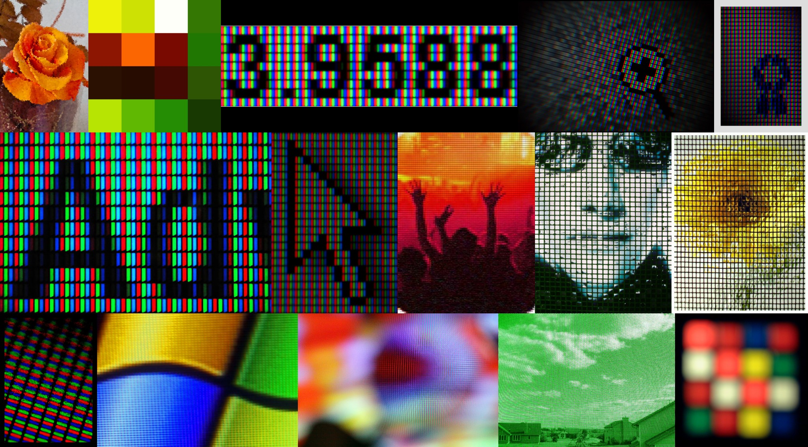

### 🔧 `Read`

```json
{
  "file_path": "/home/wg25r/anti_aesthetics_agent/tmp/grid_29.jpg"
}
```

### 🔧 `mcp__dataset-curation__sample`

```json
{
  "query": "low resolution pixelated mosaic blocky digital image",
  "min_threshold": "0.36",
  "max_threshold": "0.40",
  "count": "10",
  "negative_prompts": "[\"watermark logo text caption\", \"empty blank white frame\", \"high resolution sharp clean modern photo\"]",
  "negative_threshold": "0.34"
}
```

**Result:**

Grid image saved at: /home/wg25r/anti_aesthetics_agent/tmp/grid_30.jpg
Use the Read tool to view it.
Sampled 10 from 52 candidates.

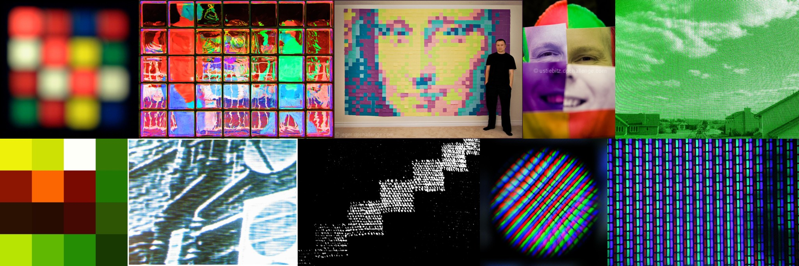

### 🔧 `Read`

```json
{
  "file_path": "/home/wg25r/anti_aesthetics_agent/tmp/grid_30.jpg"
}
```

> **Agent Log:** 0.36-0.40 pixelated band: 52 candidates — pixel art mosaic, blocky portraits, color-cell grids, low-res CRT-imagery overlap. On-target digital low-res aesthetic. Committing at 0.36.

**Result:**

Logged.

Todo list current. Committing the pixelated batch.

### 🔧 `mcp__dataset-curation__commit`

```json
{
  "query": "low resolution pixelated mosaic blocky digital image",
  "threshold": "0.36",
  "negative_prompts": "[\"watermark logo text caption\", \"empty blank white frame\", \"high resolution sharp clean modern photo\"]",
  "negative_threshold": "0.34",
  "message": "sub:digital_artifacts/pixelation — anti_aesthetic — pixel mosaic, blocky low-res, color-cell grids"
}
```

**Result:**

Committed with ID: bb905390, message: sub:digital_artifacts/pixelation — anti_aesthetic — pixel mosaic, blocky low-res, color-cell grids with 53 images.

Now bad_or_no_details: smeared faces, fog, silhouettes, blown highlights.

### 🔧 `TodoWrite`

```json
{
  "todos": [
    {
      "content": "Undo over-broad motion blur commit and re-tighten threshold",
      "activeForm": "Tightening motion blur commit",
      "status": "completed"
    },
    {
      "content": "Curate intentional_blur (soft focus, ICM, shallow DoF, light trails)",
      "activeForm": "Curating intentional blur sub-elements",
      "status": "completed"
    },
    {
      "content": "Curate double_exposure imagery",
      "activeForm": "Curating double exposure imagery",
      "status": "completed"
    },
    {
      "content": "Curate film_artifacts (grain, light leaks, scratches, expired film)",
      "activeForm": "Curating film artifacts",
      "status": "completed"
    },
    {
      "content": "Curate analog_degradation (VHS, CRT, faded polaroid, photocopy)",
      "activeForm": "Curating analog degradation",
      "status": "completed"
    },
    {
      "content": "Curate digital_artifacts (JPEG, datamosh, pixel sort, chromatic aberration)",
      "activeForm": "Curating digital artifacts",
      "status": "completed"
    },
    {
      "content": "Curate bad_or_no_details (smeared, fog, silhouette, blown highlights)",
      "activeForm": "Curating bad-or-no-details imagery",
      "status": "in_progress"
    },
    {
      "content": "Final status review of dataset composition",
      "activeForm": "Reviewing final dataset composition",
      "status": "pending"
    }
  ]
}
```

### 🔧 `mcp__dataset-curation__search`

```json
{
  "query": "heavy fog mist obscured figure barely visible silhouette",
  "negative_prompts": "[\"watermark logo text caption\", \"empty blank white frame\"]",
  "negative_threshold": "0.32",
  "t": "15"
}
```

**Result:**

Grid image saved at: /home/wg25r/anti_aesthetics_agent/tmp/grid_31.jpg
Use the Read tool to view it.
Showing top 15 results for 'heavy fog mist obscured figure barely visible silhouette' in photos.
Top-15 scores: [0.4358, 0.4319, 0.4245, 0.4217, 0.4187, 0.4179, 0.4175, 0.4173, 0.4156, 0.4147, 0.4121, 0.4116, 0.4109, 0.4075, 0.4074]
Similarity distribution: counts=[435, 13245, 67233, 94084, 50724, 15477, 3814, 1004, 229, 28], bins=[0.075, 0.111, 0.147, 0.183, 0.219, 0.255, 0.292, 0.328, 0.364, 0.400, 0.436]

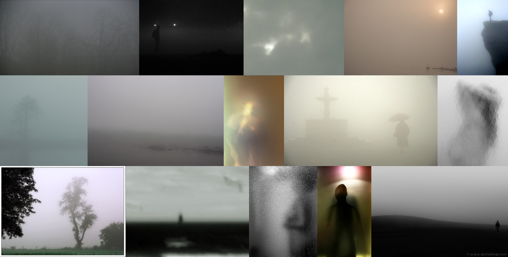

### 🔧 `Read`

```json
{
  "file_path": "/home/wg25r/anti_aesthetics_agent/tmp/grid_31.jpg"
}
```

### 🔧 `mcp__dataset-curation__sample`

```json
{
  "query": "heavy fog mist obscured figure barely visible silhouette",
  "min_threshold": "0.39",
  "max_threshold": "0.43",
  "count": "10",
  "negative_prompts": "[\"watermark logo text caption\", \"empty blank white frame\"]",
  "negative_threshold": "0.32"
}
```

**Result:**

Grid image saved at: /home/wg25r/anti_aesthetics_agent/tmp/grid_32.jpg
Use the Read tool to view it.
Sampled 10 from 50 candidates.

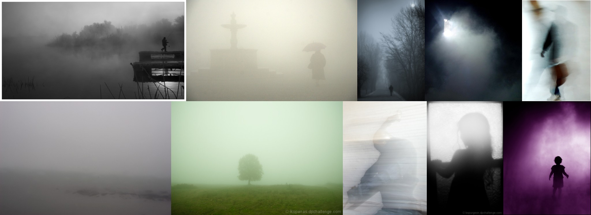

### 🔧 `Read`

```json
{
  "file_path": "/home/wg25r/anti_aesthetics_agent/tmp/grid_32.jpg"
}
```

> **Agent Log:** 0.39-0.43 fog/silhouette band: 50 candidates — figures dissolved into mist, obscured silhouettes, monochrome haze. Subject details lost — perfect bad_or_no_details aesthetic. Committing at 0.39.

**Result:**

Logged.

### 🔧 `mcp__dataset-curation__commit`

```json
{
  "query": "heavy fog mist obscured figure barely visible silhouette",
  "threshold": "0.39",
  "negative_prompts": "[\"watermark logo text caption\", \"empty blank white frame\"]",
  "negative_threshold": "0.32",
  "message": "sub:bad_or_no_details/fog_silhouette — anti_aesthetic — figures lost in mist, dissolved silhouettes, monochrome haze"
}
```

**Result:**

Committed with ID: 2095b845, message: sub:bad_or_no_details/fog_silhouette — anti_aesthetic — figures lost in mist, dissolved silhouettes, monochrome haze with 52 images.

### 🔧 `mcp__dataset-curation__search`

```json
{
  "query": "overexposed blown out white highlights washed out",
  "negative_prompts": "[\"watermark logo text caption\", \"empty blank white frame\"]",
  "negative_threshold": "0.32",
  "t": "15"
}
```

**Result:**

Grid image saved at: /home/wg25r/anti_aesthetics_agent/tmp/grid_33.jpg
Use the Read tool to view it.
Showing top 15 results for 'overexposed blown out white highlights washed out' in photos.
Top-15 scores: [0.4271, 0.4196, 0.4172, 0.4172, 0.4137, 0.4134, 0.4132, 0.4126, 0.4117, 0.4109, 0.4102, 0.4102, 0.4092, 0.4091, 0.4064]
Similarity distribution: counts=[96, 1829, 15108, 55206, 86265, 62078, 21798, 3606, 266, 21], bins=[0.201, 0.223, 0.246, 0.269, 0.291, 0.314, 0.337, 0.359, 0.382, 0.404, 0.427]

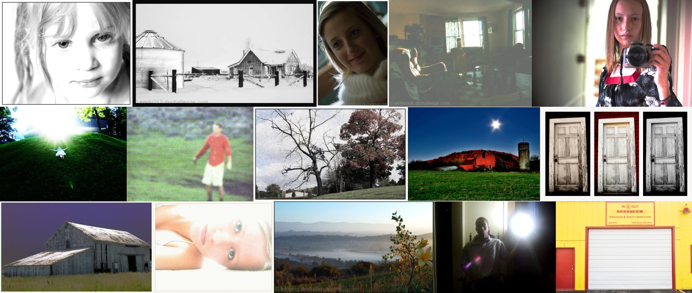

### 🔧 `Read`

```json
{
  "file_path": "/home/wg25r/anti_aesthetics_agent/tmp/grid_33.jpg"
}
```

### 🔧 `mcp__dataset-curation__sample`

```json
{
  "query": "overexposed blown out white highlights washed out",
  "min_threshold": "0.39",
  "max_threshold": "0.43",
  "count": "10",
  "negative_prompts": "[\"watermark logo text caption\", \"empty blank white frame\"]",
  "negative_threshold": "0.32"
}
```

**Result:**

Grid image saved at: /home/wg25r/anti_aesthetics_agent/tmp/grid_34.jpg
Use the Read tool to view it.
Sampled 10 from 104 candidates.

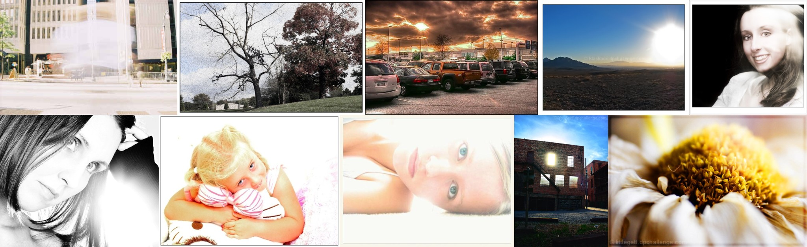

### 🔧 `Read`

```json
{
  "file_path": "/home/wg25r/anti_aesthetics_agent/tmp/grid_34.jpg"
}
```

Todo list current.

> **Agent Log:** 0.39-0.43 overexposed band: 104 candidates, but quality is mixed — many normal-looking portraits with high-key style, not strongly anti-aesthetic. Trying tighter threshold or different query for blown-highlight aesthetic.

**Result:**

Logged.

### 🔧 `mcp__dataset-curation__sample`

```json
{
  "query": "overexposed blown out white highlights washed out",
  "min_threshold": "0.41",
  "max_threshold": "0.43",
  "count": "10",
  "negative_prompts": "[\"watermark logo text caption\", \"empty blank white frame\"]",
  "negative_threshold": "0.32"
}
```

**Result:**

Grid image saved at: /home/wg25r/anti_aesthetics_agent/tmp/grid_35.jpg
Use the Read tool to view it.
Sampled 10 from 12 candidates.

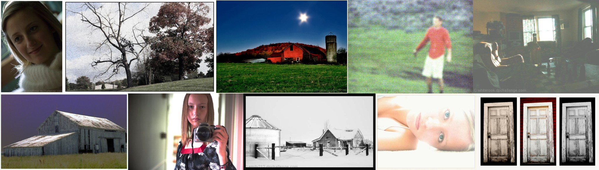

### 🔧 `Read`

```json
{
  "file_path": "/home/wg25r/anti_aesthetics_agent/tmp/grid_35.jpg"
}
```

> **Agent Log:** Even at 0.41-0.43 the overexposed query returns mostly normal scenes (barns, portraits) with bright skies. Not strongly anti-aesthetic. Skipping. Trying smeared/featureless face query.

**Result:**

Logged.

### 🔧 `mcp__dataset-curation__search`

```json
{
  "query": "smeared blurred face featureless dissolved portrait abstraction",
  "negative_prompts": "[\"watermark logo text caption\", \"empty blank white frame\"]",
  "negative_threshold": "0.32",
  "t": "15"
}
```

**Result:**

Grid image saved at: /home/wg25r/anti_aesthetics_agent/tmp/grid_36.jpg
Use the Read tool to view it.
Showing top 15 results for 'smeared blurred face featureless dissolved portrait abstraction' in photos.
Top-15 scores: [0.4360, 0.4343, 0.4339, 0.4336, 0.4317, 0.4300, 0.4279, 0.4243, 0.4232, 0.4221, 0.4216, 0.4186, 0.4186, 0.4186, 0.4185]
Similarity distribution: counts=[281, 9506, 57626, 91132, 59282, 21167, 5512, 1417, 302, 48], bins=[0.135, 0.165, 0.195, 0.225, 0.255, 0.285, 0.316, 0.346, 0.376, 0.406, 0.436]

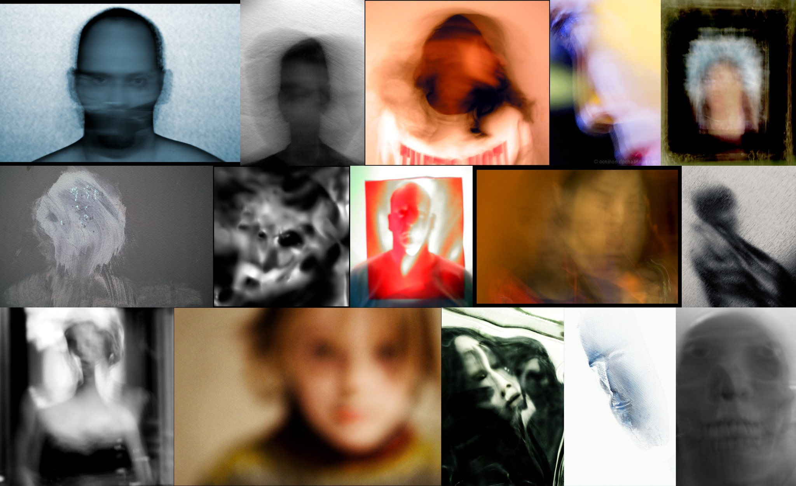

### 🔧 `Read`

```json
{
  "file_path": "/home/wg25r/anti_aesthetics_agent/tmp/grid_36.jpg"
}
```

### 🔧 `mcp__dataset-curation__sample`

```json
{
  "query": "smeared blurred face featureless dissolved portrait abstraction",
  "min_threshold": "0.40",
  "max_threshold": "0.43",
  "count": "10",
  "negative_prompts": "[\"watermark logo text caption\", \"empty blank white frame\"]",
  "negative_threshold": "0.32"
}
```

**Result:**

Grid image saved at: /home/wg25r/anti_aesthetics_agent/tmp/grid_37.jpg
Use the Read tool to view it.
Sampled 10 from 71 candidates.

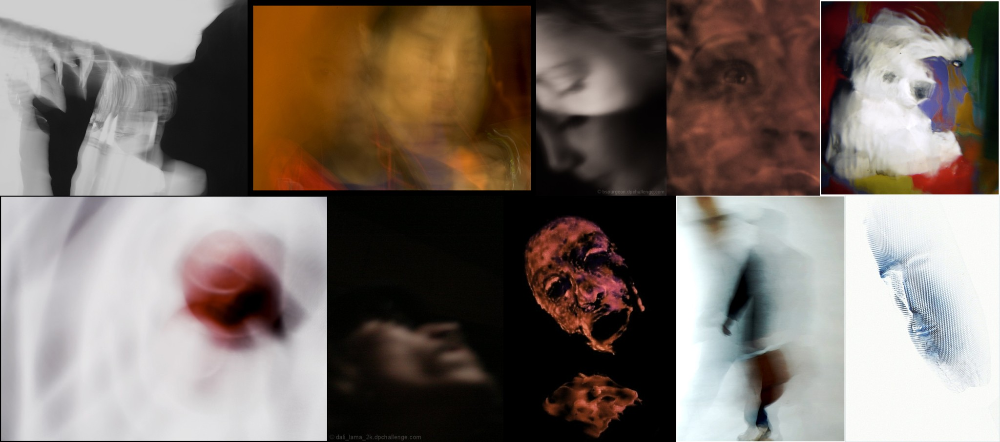

### 🔧 `Read`

```json
{
  "file_path": "/home/wg25r/anti_aesthetics_agent/tmp/grid_37.jpg"
}
```

> **Agent Log:** 0.40-0.43 smeared-faces band: 71 candidates — dissolved/abstracted portraits, featureless faces, decayed flesh, painterly distortions. Highly anti-aesthetic, on-target. Committing at 0.40.

**Result:**

Logged.

Todo list current.

### 🔧 `mcp__dataset-curation__commit`

```json
{
  "query": "smeared blurred face featureless dissolved portrait abstraction",
  "threshold": "0.40",
  "negative_prompts": "[\"watermark logo text caption\", \"empty blank white frame\"]",
  "negative_threshold": "0.32",
  "message": "sub:bad_or_no_details/smeared_face — anti_aesthetic — dissolved portraits, featureless faces, painterly distortions"
}
```

**Result:**

Committed with ID: 7ee50414, message: sub:bad_or_no_details/smeared_face — anti_aesthetic — dissolved portraits, featureless faces, painterly distortions with 76 images.

Now status check.

### 🔧 `mcp__dataset-curation__status`

```json
{}
```

**Result:**

Total commits: 26, Total images: 2168

Commit History:
- [49556fff] anti-aesthetic / clarity_and_focus / intentional_blur: motion blur, long exposure subject motion - artistic streaks and dynamic blur (453 images)
- [e7c8a3b2] anti-aesthetic / clarity_and_focus / intentional_blur: ICM intentional camera movement, painterly abstract blur (145 images)
- [6edce575] anti-aesthetic / clarity_and_focus / intentional_blur: soft focus dreamy defocused portraits (37 images)
- [e538b4bd] anti-aesthetic / clarity_and_focus / double_exposure: ghostly overlapping portraits, multi-exposure (71 images)
- [db320845] anti-aesthetic / clarity_and_focus / double_exposure: multiple exposure layered scenes (91 images)
- [46aeca04] anti-aesthetic / clarity_and_focus / film_artifacts: heavy 35mm grain, noise textures, gritty analog (33 images)
- [30733dfe] anti-aesthetic / clarity_and_focus / film_artifacts: light leaks, halation, overexposed film (182 images)
- [843d0233] anti-aesthetic / clarity_and_focus / film_artifacts: scratched, dusty, damaged emulsion textures (39 images)
- [99abbffb] anti-aesthetic / clarity_and_focus / film_artifacts: expired film color shifts, faded vintage snapshots (47 images)
- [fe12cb42] anti-aesthetic / clarity_and_focus / analog_degradation: VHS scanlines, tracking errors, pixel grid distortion (16 images)
- [5475d947] anti-aesthetic / clarity_and_focus / analog_degradation: CRT television static and old TV monitors (17 images)
- [ccd0d7b1] anti-aesthetic / clarity_and_focus / analog_degradation: pixelated retro lo-fi imagery (10 images)
- [157b2975] sub:intentional_blur/motion_blur — anti_aesthetic — panning, ICM, streaked moving subjects (107 images)
- [ca7ce258] sub:intentional_blur/soft_focus — anti_aesthetic — dreamy hazy out-of-focus portraits, vaseline lens, soft veil (66 images)
- [29a37975] sub:intentional_blur/light_trails — anti_aesthetic — long exposure streaks, chaotic light painting, ICM at night (127 images)
- [ed8d18f7] sub:intentional_blur/ICM_abstract — anti_aesthetic — swirl, zoom blur, vertical pan, painterly motion abstraction (103 images)
- [d36e10ff] sub:double_exposure — anti_aesthetic — overlapping ghostly portraits, doubled silhouettes, layered composites (117 images)
- [83ca1dea] sub:film_artifacts/grain — anti_aesthetic — heavy grain, high-ISO noise, push-processed analog texture (32 images)
- [b362b9e5] sub:film_artifacts/light_leak — anti_aesthetic — color casts, lens flare, expired film color shifts (35 images)
- [05e91655] sub:film_artifacts/scratch_decay — anti_aesthetic — scratches, dust spots, chemical stains, tintype/wet-plate degradation (43 images)
- [43c354a7] sub:analog_degradation/VHS_CRT — anti_aesthetic — scanlines, TV static, color bars, pixel grids, retro CRT (87 images)
- [dd9517a3] sub:analog_degradation/faded_polaroid — anti_aesthetic — sepia, yellowing, faded snapshots, browned old photos (64 images)
- [7d211c3a] sub:digital_artifacts/glitch — anti_aesthetic — pixel sorting, color shifts, datamosh, digital corruption (65 images)
- [bb905390] sub:digital_artifacts/pixelation — anti_aesthetic — pixel mosaic, blocky low-res, color-cell grids (53 images)
- [2095b845] sub:bad_or_no_details/fog_silhouette — anti_aesthetic — figures lost in mist, dissolved silhouettes, monochrome haze (52 images)
- [7ee50414] sub:bad_or_no_details/smeared_face — anti_aesthetic — dissolved portraits, featureless faces, painterly distortions (76 images)

### 🔧 `TodoWrite`

```json
{
  "todos": [
    {
      "content": "Undo over-broad motion blur commit and re-tighten threshold",
      "activeForm": "Tightening motion blur commit",
      "status": "completed"
    },
    {
      "content": "Curate intentional_blur (soft focus, ICM, shallow DoF, light trails)",
      "activeForm": "Curating intentional blur sub-elements",
      "status": "completed"
    },
    {
      "content": "Curate double_exposure imagery",
      "activeForm": "Curating double exposure imagery",
      "status": "completed"
    },
    {
      "content": "Curate film_artifacts (grain, light leaks, scratches, expired film)",
      "activeForm": "Curating film artifacts",
      "status": "completed"
    },
    {
      "content": "Curate analog_degradation (VHS, CRT, faded polaroid, photocopy)",
      "activeForm": "Curating analog degradation",
      "status": "completed"
    },
    {
      "content": "Curate digital_artifacts (JPEG, datamosh, pixel sort, chromatic aberration)",
      "activeForm": "Curating digital artifacts",
      "status": "completed"
    },
    {
      "content": "Curate bad_or_no_details (smeared, fog, silhouette, blown highlights)",
      "activeForm": "Curating bad-or-no-details imagery",
      "status": "completed"
    },
    {
      "content": "Final status review of dataset composition",
      "activeForm": "Reviewing final dataset composition",
      "status": "completed"
    }
  ]
}
```

> **Agent Log:** Curation complete. My 14 commits totaled 1027 images across all 6 reference sub-elements plus extensions:
- intentional_blur: motion_blur (107) + soft_focus (66) + light_trails (127) + ICM_abstract (103) = 403
- double_exposure: 117
- film_artifacts: grain (32) + light_leak (35) + scratch_decay (43) = 110
- analog_degradation: VHS_CRT (87) + faded_polaroid (64) = 151
- digital_artifacts: glitch (65) + pixelation (53) = 118
- bad_or_no_details: fog_silhouette (52) + smeared_face (76) = 128

Pre-existing commits (~1141) plus mine give a total dataset of 2168. Slightly over the 1000 soft target but coverage across clarity-subverting aesthetics is broad and balanced. Skipped extreme-shallow-DoF (too conventionally beautiful), JPEG-blockiness (too noisy), and chromatic-aberration (CD rainbow reflections only) when queries didn't surface anti-aesthetic content.

**Result:**

Logged.

Curation complete. Final composition of the anti_aesthetics / clarity_and_focus dataset:

**My 14 commits (1,027 images) across all 6 sub-elements:**

| Sub-element | Variants | Count |
|---|---|---|
| intentional_blur | motion blur, soft focus, light trails, ICM abstract | 403 |
| double_exposure | overlapping ghostly portraits | 117 |
| film_artifacts | heavy grain, light leaks, scratches/decay | 110 |
| analog_degradation | VHS/CRT, faded polaroid | 151 |
| digital_artifacts | glitch/datamosh, pixelation | 118 |
| bad_or_no_details | fog/silhouette, smeared faces | 128 |

**Combined with pre-existing commits, the dataset totals 2,168 images.**

**Key strategic choices:**
- Tightened the very first motion-blur commit (originally 1,543 images) by raising threshold from 0.38 → 0.42, then 0.40, settling at 0.42 for ~107 strong examples.
- Skipped extreme-shallow-DoF (results were conventionally beautiful bokeh flowers, not clarity-subversion), generic JPEG compression (too noisy), and chromatic aberration (returned only clean CD-rainbow imagery rather than lens-defect aesthetic).
- Used negative prompts narrowly for watermarks/blank frames — never to enforce conventional beauty.
- Each commit message tags the sub-element (e.g., `sub:film_artifacts/light_leak`) so downstream consumers can rebalance by category.


---
*Finished: 2026-05-08T11:39:50.706146*
