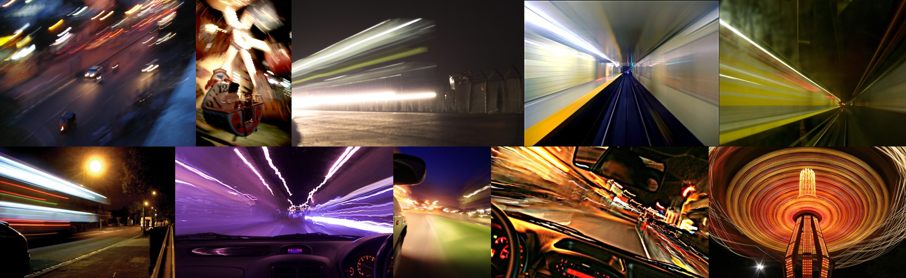
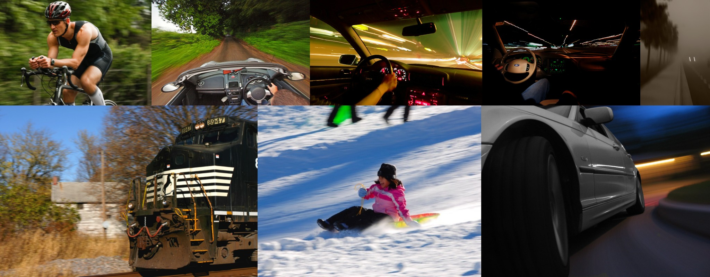
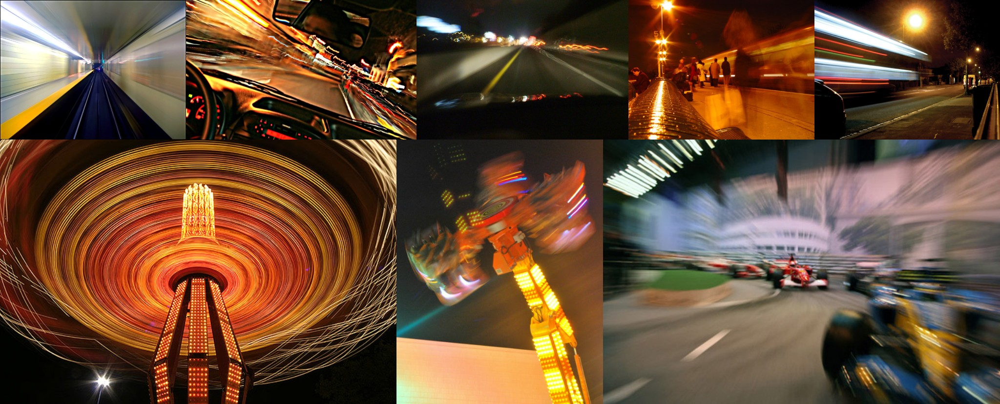
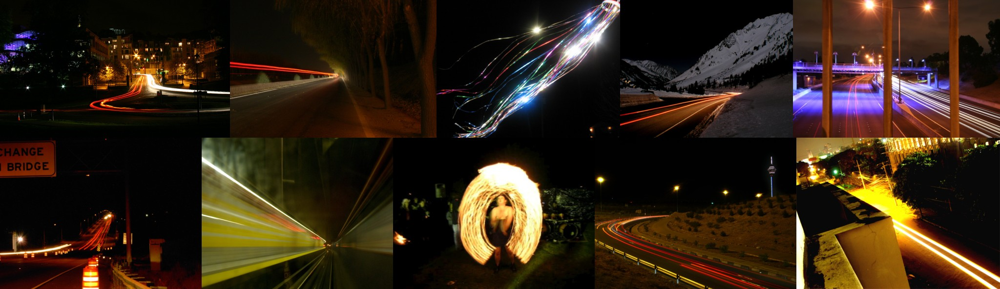
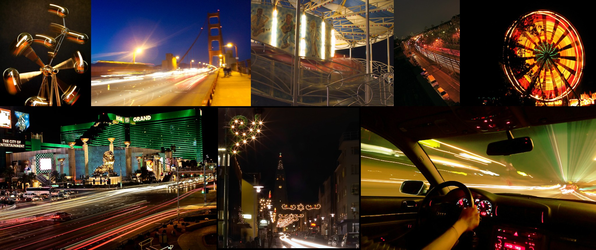
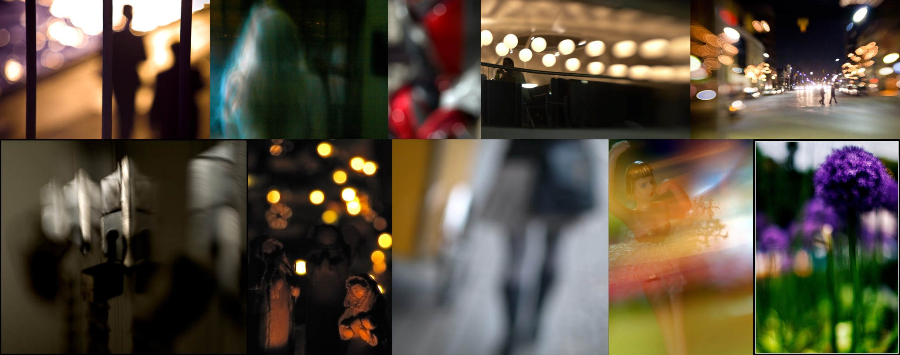
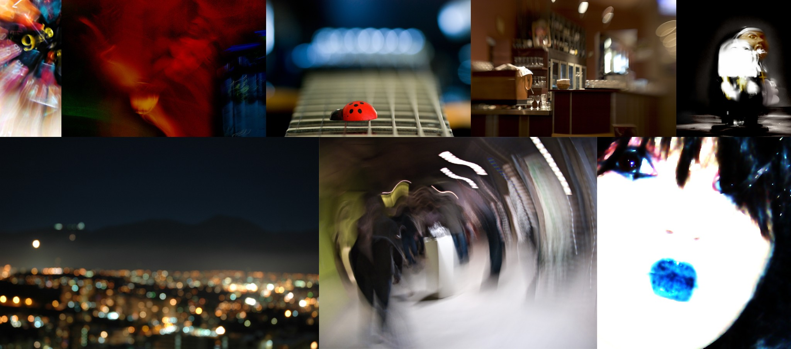

# anti_aesthetics:clarity_and_focus

*Started: 2026-05-08T21:44:50.394981*

## Task

```
main_type: anti_aesthetics, sub_type: clarity_and_focus - {"intentional_blur": "Deliberate softening of the image through motion during exposure, shallow depth of field, or soft focus techniques, creating a dreamlike or dynamic impression rather than technical failure.", "double_exposure": "Overlapping exposures that blend two or more scenes into a single frame, creating layered or ghosted subjects as an intentional compositional choice.", "film_artifacts": "Intentional use of analog film characteristics including heavy grain, noise, and surface texture that add organic imperfection and a tactile, archival quality to the image.", "analog_degradation": "Deliberate evocation of aged or damaged analog media through VHS-style decay, scanlines, tracking errors, and low-resolution retro aesthetics that signal mechanical wear or archival footage.", "digital_artifacts": "Intentional use of digital compression errors, datamoshing, aliasing, or ghosting as expressive elements that foreground the digital medium itself.", "bad_or_no_details": "Images that lack fine detail or render subjects with smeared, mushy, or absent textures, where surfaces, features, and small structures dissolve into ambiguity rather than resolving into clear form."}
```

### 🔧 `ToolSearch`

```json
{
  "query": "select:mcp__dataset-curation__init,mcp__dataset-curation__search,mcp__dataset-curation__sample,mcp__dataset-curation__commit,mcp__dataset-curation__status,mcp__dataset-curation__undo_commit,mcp__dataset-curation__sample_from_committed,mcp__dataset-curation__log_actions",
  "max_results": 10
}
```

### 🔧 `mcp__dataset-curation__init`

```json
{}
```

**Result:**

Initialization complete in 3.73s. rows=255508, embedding_dim=3072.

> **Agent Log:** PLAN: Curating anti_aesthetics / clarity_and_focus subcategory. Target: 200-300 images total covering 6 sub-elements: (1) intentional_blur — motion blur, shallow DoF, soft focus, long exposure; (2) double_exposure — layered/ghosted compositions; (3) film_artifacts — heavy grain, noise, scratches; (4) analog_degradation — VHS decay, scanlines, tracking errors, retro low-res; (5) digital_artifacts — datamoshing, compression glitches, aliasing; (6) bad_or_no_details — smeared, mushy, lack-of-detail surfaces. Strategy: search broadly first to see distribution, then decompose each sub-element into 2-3 fine-grained queries (e.g. blur → motion blur of moving subject, out-of-focus portraits, long exposure light trails). Use negatives only for watermarks/text/empty frames. Commit each fine-grained query separately with descriptive message tags. Roughly 30-50 images per sub-element. Will start with intentional_blur.

**Result:**

Logged.

### 🔧 `mcp__dataset-curation__search`

```json
{
  "query": "strong motion blur photograph of moving subject, blurred streaks of movement",
  "negative_prompts": "[\"watermark, text overlay, logo, signature\", \"completely empty white frame, solid color background\"]",
  "negative_threshold": "0.25",
  "t": "10"
}
```

**Result:**

Grid image saved at: /home/wg25r/anti_aesthetics_agent/tmp/grid_1.jpg
Use the Read tool to view it.
Showing top 10 results for 'strong motion blur photograph of moving subject, blurred streaks of movement' in photos.
Top-10 scores: [0.3642, 0.3626, 0.3614, 0.3596, 0.3576, 0.3491, 0.3484, 0.3471, 0.3453, 0.3448]
Similarity distribution: counts=[4, 107, 1316, 4886, 5533, 2155, 432, 110, 48, 12], bins=[0.147, 0.168, 0.190, 0.212, 0.234, 0.255, 0.277, 0.299, 0.321, 0.342, 0.364]



### 🔧 `Read`

```json
{
  "file_path": "/home/wg25r/anti_aesthetics_agent/tmp/grid_1.jpg"
}
```

### 🔧 `mcp__dataset-curation__sample`

```json
{
  "query": "strong motion blur photograph of moving subject, blurred streaks of movement",
  "min_threshold": "0.30",
  "max_threshold": "0.34",
  "count": "8",
  "negative_prompts": "[\"watermark, text overlay, logo, signature\", \"completely empty white frame, solid color background\"]",
  "negative_threshold": "0.25"
}
```

**Result:**

Grid image saved at: /home/wg25r/anti_aesthetics_agent/tmp/grid_2.jpg
Use the Read tool to view it.
Sampled 8 from 142 candidates.



### 🔧 `Read`

```json
{
  "file_path": "/home/wg25r/anti_aesthetics_agent/tmp/grid_2.jpg"
}
```

> **Agent Log:** Sample at 0.30-0.34 shows mixed quality: some clear motion blur (cyclist, dashboard light trails, train), but also sharp action shots without blur (driver, snowboarder). 0.30 too loose. Top range 0.34+ is excellent. Will commit at 0.335 to capture true motion blur.

**Result:**

Logged.

### 🔧 `mcp__dataset-curation__sample`

```json
{
  "query": "strong motion blur photograph of moving subject, blurred streaks of movement",
  "min_threshold": "0.335",
  "max_threshold": "0.36",
  "count": "8",
  "negative_prompts": "[\"watermark, text overlay, logo, signature\", \"completely empty white frame, solid color background\"]",
  "negative_threshold": "0.25"
}
```

**Result:**

Grid image saved at: /home/wg25r/anti_aesthetics_agent/tmp/grid_3.jpg
Use the Read tool to view it.
Sampled 8 from 21 candidates.



### 🔧 `Read`

```json
{
  "file_path": "/home/wg25r/anti_aesthetics_agent/tmp/grid_3.jpg"
}
```

### 🔧 `ToolSearch`

```json
{
  "query": "select:TodoWrite",
  "max_results": 1
}
```

### 🔧 `TodoWrite`

```json
{
  "todos": [
    {
      "content": "Curate intentional_blur sub-element",
      "activeForm": "Curating intentional_blur sub-element",
      "status": "in_progress"
    },
    {
      "content": "Curate double_exposure sub-element",
      "activeForm": "Curating double_exposure sub-element",
      "status": "pending"
    },
    {
      "content": "Curate film_artifacts sub-element",
      "activeForm": "Curating film_artifacts sub-element",
      "status": "pending"
    },
    {
      "content": "Curate analog_degradation sub-element",
      "activeForm": "Curating analog_degradation sub-element",
      "status": "pending"
    },
    {
      "content": "Curate digital_artifacts sub-element",
      "activeForm": "Curating digital_artifacts sub-element",
      "status": "pending"
    },
    {
      "content": "Curate bad_or_no_details sub-element",
      "activeForm": "Curating bad_or_no_details sub-element",
      "status": "pending"
    }
  ]
}
```

> **Agent Log:** Sample at 0.335-0.36: every image clearly shows motion blur — tunnel speed lines, dashboard dragging streetlights, fairground rides spinning into light arcs, F1 cars panning blur. Strong signal. Committing at 0.335 for motion blur sub-element.

**Result:**

Logged.

### 🔧 `mcp__dataset-curation__commit`

```json
{
  "query": "strong motion blur photograph of moving subject, blurred streaks of movement",
  "threshold": "0.335",
  "negative_prompts": "[\"watermark, text overlay, logo, signature\", \"completely empty white frame, solid color background\"]",
  "negative_threshold": "0.25",
  "message": "anti_aesthetics / clarity_and_focus / intentional_blur — motion blur with movement streaks (vehicle dashboards, light trails, panning subjects)"
}
```

**Result:**

Committed with ID: e5ecbb4d, message: anti_aesthetics / clarity_and_focus / intentional_blur — motion blur with movement streaks (vehicle dashboards, light trails, panning subjects) with 24 images.

### 🔧 `mcp__dataset-curation__search`

```json
{
  "query": "long exposure light trails at night, painted with light, slow shutter speed",
  "negative_prompts": "[\"watermark, text overlay, logo, signature\", \"completely empty solid color background\"]",
  "negative_threshold": "0.25",
  "t": "10"
}
```

**Result:**

Grid image saved at: /home/wg25r/anti_aesthetics_agent/tmp/grid_4.jpg
Use the Read tool to view it.
Showing top 10 results for 'long exposure light trails at night, painted with light, slow shutter speed' in photos.
Top-10 scores: [0.3871, 0.3837, 0.3715, 0.3684, 0.3681, 0.3657, 0.3619, 0.3610, 0.3606, 0.3604]
Similarity distribution: counts=[79, 1082, 3079, 2234, 855, 409, 156, 46, 19, 6], bins=[0.145, 0.169, 0.194, 0.218, 0.242, 0.266, 0.290, 0.315, 0.339, 0.363, 0.387]



### 🔧 `Read`

```json
{
  "file_path": "/home/wg25r/anti_aesthetics_agent/tmp/grid_4.jpg"
}
```

### 🔧 `mcp__dataset-curation__sample`

```json
{
  "query": "long exposure light trails at night, painted with light, slow shutter speed",
  "min_threshold": "0.32",
  "max_threshold": "0.35",
  "count": "8",
  "negative_prompts": "[\"watermark, text overlay, logo, signature\", \"completely empty solid color background\"]",
  "negative_threshold": "0.25"
}
```

**Result:**

Grid image saved at: /home/wg25r/anti_aesthetics_agent/tmp/grid_5.jpg
Use the Read tool to view it.
Sampled 8 from 45 candidates.



### 🔧 `Read`

```json
{
  "file_path": "/home/wg25r/anti_aesthetics_agent/tmp/grid_5.jpg"
}
```

> **Agent Log:** Sample at 0.32-0.35: most show long-exposure light trails (Golden Gate, Vegas strip, ferris wheel, dashboard tunnel). A couple are static night cityscapes without trails. 0.32 a bit loose. Top range 0.35+ very strong. Will commit at 0.34 — light trails clearly visible in those rows.

**Result:**

Logged.

### 🔧 `mcp__dataset-curation__commit`

```json
{
  "query": "long exposure light trails at night, painted with light, slow shutter speed",
  "threshold": "0.34",
  "negative_prompts": "[\"watermark, text overlay, logo, signature\", \"completely empty solid color background\"]",
  "negative_threshold": "0.25",
  "message": "anti_aesthetics / clarity_and_focus / intentional_blur — long exposure light trails (light painting, traffic streaks, slow shutter)"
}
```

**Result:**

Committed with ID: 4f0ad76c, message: anti_aesthetics / clarity_and_focus / intentional_blur — long exposure light trails (light painting, traffic streaks, slow shutter) with 25 images.

### 🔧 `mcp__dataset-curation__search`

```json
{
  "query": "extremely shallow depth of field, soft focus dreamy bokeh portrait, out of focus subject",
  "negative_prompts": "[\"watermark, text overlay, logo, signature\", \"completely empty solid color background\", \"sharp clear focused face in detail\"]",
  "negative_threshold": "0.28",
  "t": "10"
}
```

**Result:**

Grid image saved at: /home/wg25r/anti_aesthetics_agent/tmp/grid_6.jpg
Use the Read tool to view it.
Showing top 10 results for 'extremely shallow depth of field, soft focus dreamy bokeh portrait, out of focus subject' in photos.
Top-10 scores: [0.3691, 0.3677, 0.3669, 0.3658, 0.3657, 0.3652, 0.3641, 0.3634, 0.3623, 0.3623]
Similarity distribution: counts=[35, 1105, 8923, 24101, 26306, 13797, 3834, 653, 86, 23], bins=[0.163, 0.183, 0.204, 0.225, 0.245, 0.266, 0.287, 0.307, 0.328, 0.348, 0.369]



### 🔧 `Read`

```json
{
  "file_path": "/home/wg25r/anti_aesthetics_agent/tmp/grid_6.jpg"
}
```

Excellent results — all 10 top images show genuine shallow-DoF / soft-focus aesthetics. Let me sample mid-range.

### 🔧 `mcp__dataset-curation__sample`

```json
{
  "query": "extremely shallow depth of field, soft focus dreamy bokeh portrait, out of focus subject",
  "min_threshold": "0.33",
  "max_threshold": "0.355",
  "count": "8",
  "negative_prompts": "[\"watermark, text overlay, logo, signature\", \"completely empty solid color background\", \"sharp clear focused face in detail\"]",
  "negative_threshold": "0.28"
}
```

**Result:**

Grid image saved at: /home/wg25r/anti_aesthetics_agent/tmp/grid_7.jpg
Use the Read tool to view it.
Sampled 8 from 74 candidates.



### 🔧 `Read`

```json
{
  "file_path": "/home/wg25r/anti_aesthetics_agent/tmp/grid_7.jpg"
}
```

> **Agent Log:** Sample at 0.33-0.355: every image exhibits dreamy out-of-focus / shallow DoF — abstract red blur, ladybug on guitar with bokeh background, distant city bokeh, swirly motion blur, ghostly faces. All on-target. Will commit at 0.33 to capture broader range.

**Result:**

Logged.

### 🔧 `mcp__dataset-curation__commit`

```json
{
  "query": "extremely shallow depth of field, soft focus dreamy bokeh portrait, out of focus subject",
  "threshold": "0.33",
  "negative_prompts": "[\"watermark, text overlay, logo, signature\", \"completely empty solid color background\", \"sharp clear focused face in detail\"]",
  "negative_threshold": "0.28",
  "message": "anti_aesthetics / clarity_and_focus / intentional_blur — soft focus, shallow DoF, dreamy bokeh, out-of-focus subjects"
}
```

**Result:**

Committed with ID: e2fd8d48, message: anti_aesthetics / clarity_and_focus / intentional_blur — soft focus, shallow DoF, dreamy bokeh, out-of-focus subjects with 88 images.

> **Agent Log:** 88 images for soft-focus is too many; total intentional_blur is 137 already. Target is 200-300 across all 6 sub-elements (~30-50 each). Will undo and re-commit at tighter threshold.

**Result:**

Logged.

### 🔧 `mcp__dataset-curation__undo_commit`

```json
{
  "commit_id": "e2fd8d48"
}
```

**Result:**

Removed commit e2fd8d48: anti_aesthetics / clarity_and_focus / intentional_blur — soft focus, shallow DoF, dreamy bokeh, out-of-focus subjects with 88 images.

### 🔧 `mcp__dataset-curation__commit`

```json
{
  "query": "extremely shallow depth of field, soft focus dreamy bokeh portrait, out of focus subject",
  "threshold": "0.345",
  "negative_prompts": "[\"watermark, text overlay, logo, signature\", \"completely empty solid color background\", \"sharp clear focused face in detail\"]",
  "negative_threshold": "0.28",
  "message": "anti_aesthetics / clarity_and_focus / intentional_blur — soft focus, shallow DoF, dreamy bokeh, out-of-focus subjects (tight)"
}
```

**Result:**

Committed with ID: 720f4efb, message: anti_aesthetics / clarity_and_focus / intentional_blur — soft focus, shallow DoF, dreamy bokeh, out-of-focus subjects (tight) with 34 images.

intentional_blur: 83 images total across 3 modes. Moving to double_exposure.

### 🔧 `TodoWrite`

```json
{
  "todos": [
    {
      "content": "Curate intentional_blur sub-element",
      "activeForm": "Curating intentional_blur sub-element",
      "status": "completed"
    },
    {
      "content": "Curate double_exposure sub-element",
      "activeForm": "Curating double_exposure sub-element",
      "status": "in_progress"
    },
    {
      "content": "Curate film_artifacts sub-element",
      "activeForm": "Curating film_artifacts sub-element",
      "status": "pending"
    },
    {
      "content": "Curate analog_degradation sub-element",
      "activeForm": "Curating analog_degradation sub-element",
      "status": "pending"
    },
    {
      "content": "Curate digital_artifacts sub-element",
      "activeForm": "Curating digital_artifacts sub-element",
      "status": "pending"
    },
    {
      "content": "Curate bad_or_no_details sub-element",
      "activeForm": "Curating bad_or_no_details sub-element",
      "status": "pending"
    }
  ]
}
```

### 🔧 `mcp__dataset-curation__search`

```json
{
  "query": "double exposure photography, two scenes overlapping, ghosted superimposed silhouette portrait",
  "negative_prompts": "[\"watermark, text overlay, logo, signature\", \"completely empty solid color background\"]",
  "negative_threshold": "0.27",
  "t": "10"
}
```

