# anti_aesthetics:color_and_tone

*Started: 2026-05-08T11:39:50.709800*

## Task

```
main_type: anti_aesthetics, sub_type: color_and_tone - {"clashing_disharmony": "Color palettes that conflict aggressively, creating visual tension through unbalanced hues, toxic neon combinations, or wrong object colors that feel deliberately unsettling or provocative.", "chromatic_aberration": "Color fringing along high-contrast edges that mimics cheap optics or analog lens failure, used deliberately to suggest imperfection or a lo-fi aesthetic.", "muted_faded": "Dull, desaturated, or washed-out tones with low vibrancy, including retro faded palettes and monotone tints that convey exhaustion, nostalgia, or melancholy.", "sickly_cast": "Unhealthy overall tint that shifts skin and surfaces toward unsettling hues suggesting rot, illness, contamination, or sodium vapor street lighting.", "color_inconsistency": "Visible color banding, uneven white balance, or mixed color temperatures that break tonal coherence and expose the limitations or deliberate manipulation of the capture process."}
```

### 🔧 `ToolSearch`

```json
{
  "query": "select:mcp__dataset-curation__init,mcp__dataset-curation__search,mcp__dataset-curation__sample,mcp__dataset-curation__commit,mcp__dataset-curation__status,mcp__dataset-curation__undo_commit,mcp__dataset-curation__sample_from_committed,mcp__dataset-curation__log_actions",
  "max_results": 10
}
```

### 🔧 `mcp__dataset-curation__init`

```json
{}
```

**Result:**

Already initialized.

> **Agent Log:** Plan for anti_aesthetics / color_and_tone curation. Target >200 images across 5 sub-elements:

1. clashing_disharmony — toxic neon clashes, complementary color screams, wrong-color objects (purple skin, green sky), unbalanced palettes that feel jarring. Queries: "clashing neon colors photo", "garish color palette tension", "complementary color clash unsettling", "magenta and lime green chaos".

2. chromatic_aberration — purple/green fringing on high-contrast edges, cheap optics look, lo-fi lens failure. Queries: "chromatic aberration fringing edges", "color fringing cheap lens photograph", "RGB shift glitch image", "lens chromatic distortion photo".

3. muted_faded — washed out, low saturation, exhausted retro palettes, monotone melancholy. Queries: "faded washed out photograph desaturated", "muted color palette melancholy", "exhausted dull retro film photo", "monotone tint overcast scene".

4. sickly_cast — sodium vapor yellow, jaundice green, illness/rot tint. Queries: "sickly yellow green tint photo", "sodium vapor street light cast", "jaundiced color tone unhealthy", "greenish hue rot contamination".

5. color_inconsistency — banding, mixed white balance, broken color temperature. Queries: "color banding gradient sky photo", "mixed white balance window indoor outdoor", "uneven color temperature photograph", "posterized color stepping artifact".

Strategy: search broad → sub-element decomposition → sample → commit each separately. Anti-aesthetic curation, so I expect lower aesthetic scores; that's fine. Use negative prompts only against orthogonal junk (text overlays, watermarks, blank/black frames). Will not use "ugly" or "low quality" as negative.

Starting with clashing_disharmony.

**Result:**

Logged.

### 🔧 `mcp__dataset-curation__search`

```json
{
  "query": "clashing neon colors photograph aggressive saturation",
  "negative_prompts": "[\"watermark logo text overlay\", \"blank black empty frame\", \"plain white background product\"]",
  "negative_threshold": "0.25",
  "t": "15"
}
```

**Result:**

Grid image saved at: /home/wg25r/anti_aesthetics_agent/tmp/grid_38.jpg
Use the Read tool to view it.
Showing top 15 results for 'clashing neon colors photograph aggressive saturation' in photos.
Top-15 scores: [0.3882, 0.3806, 0.3788, 0.3769, 0.3769, 0.3718, 0.3709, 0.3690, 0.3652, 0.3634, 0.3634, 0.3628, 0.3627, 0.3624, 0.3619]
Similarity distribution: counts=[13, 143, 1366, 3665, 3746, 1873, 609, 177, 41, 8], bins=[0.191, 0.211, 0.230, 0.250, 0.270, 0.290, 0.309, 0.329, 0.349, 0.369, 0.388]

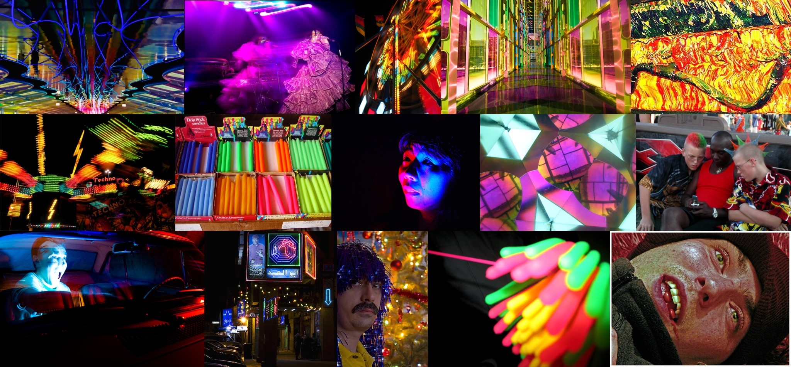

### 🔧 `Read`

```json
{
  "file_path": "/home/wg25r/anti_aesthetics_agent/tmp/grid_38.jpg"
}
```

### 🔧 `mcp__dataset-curation__sample`

```json
{
  "query": "clashing neon colors photograph aggressive saturation",
  "min_threshold": "0.34",
  "max_threshold": "0.37",
  "count": "10",
  "negative_prompts": "[\"watermark logo text overlay\", \"blank black empty frame\", \"plain white background product\"]",
  "negative_threshold": "0.25"
}
```

**Result:**

Grid image saved at: /home/wg25r/anti_aesthetics_agent/tmp/grid_39.jpg
Use the Read tool to view it.
Sampled 10 from 92 candidates.

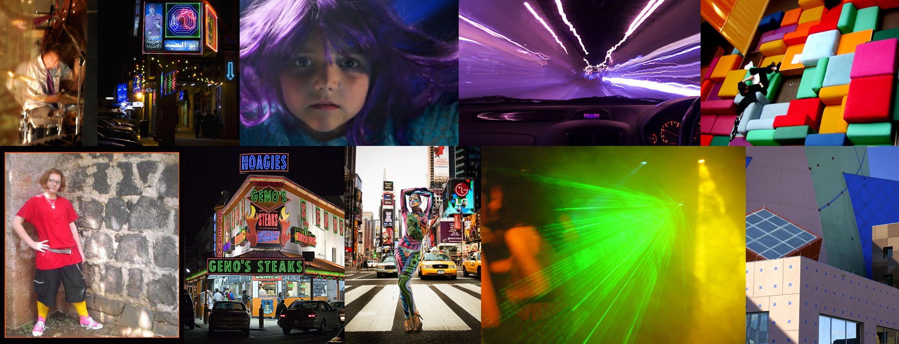

### 🔧 `Read`

```json
{
  "file_path": "/home/wg25r/anti_aesthetics_agent/tmp/grid_39.jpg"
}
```

> **Agent Log:** 0.34-0.37 sample contains: purple-haired girl, neon city signage with motion blur, garish hoagie shop, clashing red/blue/yellow outfits, green laser fog, geometric LEGO pile. Mix of strong neon clashes plus some weaker results (girl in front of stone wall is less relevant). Top-15 around 0.36-0.39 looks strongest. I'll use threshold 0.355 for clashing neon to capture most strong clashes while excluding weaker matches.

**Result:**

Logged.

### 🔧 `mcp__dataset-curation__sample`

```json
{
  "query": "clashing neon colors photograph aggressive saturation",
  "min_threshold": "0.355",
  "max_threshold": "0.39",
  "count": "10",
  "negative_prompts": "[\"watermark logo text overlay\", \"blank black empty frame\", \"plain white background product\"]",
  "negative_threshold": "0.25"
}
```

**Result:**

Grid image saved at: /home/wg25r/anti_aesthetics_agent/tmp/grid_40.jpg
Use the Read tool to view it.
Sampled 10 from 28 candidates.

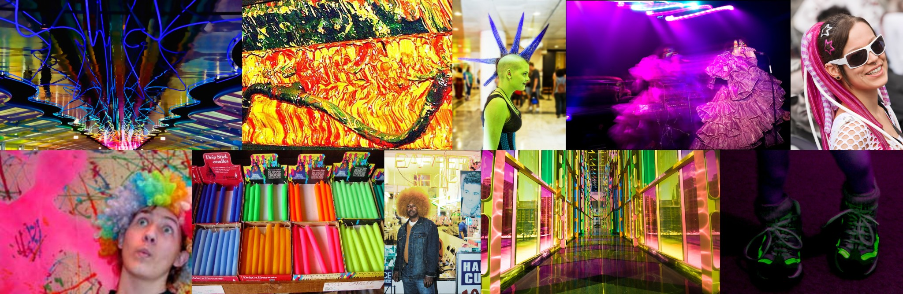

### 🔧 `Read`

```json
{
  "file_path": "/home/wg25r/anti_aesthetics_agent/tmp/grid_40.jpg"
}
```

### 🔧 `ToolSearch`

```json
{
  "query": "select:TodoWrite",
  "max_results": 1
}
```

### 🔧 `TodoWrite`

```json
{
  "todos": [
    {
      "content": "Curate clashing_disharmony sub-element",
      "activeForm": "Curating clashing_disharmony",
      "status": "in_progress"
    },
    {
      "content": "Curate chromatic_aberration sub-element",
      "activeForm": "Curating chromatic_aberration",
      "status": "pending"
    },
    {
      "content": "Curate muted_faded sub-element",
      "activeForm": "Curating muted_faded",
      "status": "pending"
    },
    {
      "content": "Curate sickly_cast sub-element",
      "activeForm": "Curating sickly_cast",
      "status": "pending"
    },
    {
      "content": "Curate color_inconsistency sub-element",
      "activeForm": "Curating color_inconsistency",
      "status": "pending"
    },
    {
      "content": "Review status and rebalance if needed",
      "activeForm": "Reviewing dataset balance",
      "status": "pending"
    }
  ]
}
```

> **Agent Log:** 0.355-0.39 sample shows clear strong neon/clash content: chandelier blue/magenta, painting orange/black, fashion punks, magenta/purple stage smoke, neon highlighter sticks, infinity mirror room. Quality good. Will commit at 0.355.

**Result:**

Logged.

### 🔧 `mcp__dataset-curation__commit`

```json
{
  "query": "clashing neon colors photograph aggressive saturation",
  "threshold": "0.355",
  "negative_prompts": "[\"watermark logo text overlay\", \"blank black empty frame\", \"plain white background product\"]",
  "negative_threshold": "0.25",
  "message": "anti-aesthetic / color_and_tone / clashing_disharmony — aggressive neon clashes, jarring saturation, unbalanced palettes"
}
```

**Result:**

Committed with ID: 582d360f, message: anti-aesthetic / color_and_tone / clashing_disharmony — aggressive neon clashes, jarring saturation, unbalanced palettes with 28 images.

### 🔧 `mcp__dataset-curation__search`

```json
{
  "query": "complementary color clash magenta green photograph",
  "negative_prompts": "[\"watermark logo text overlay\", \"blank black empty frame\", \"plain white background product\"]",
  "negative_threshold": "0.25",
  "t": "15"
}
```

**Result:**

Grid image saved at: /home/wg25r/anti_aesthetics_agent/tmp/grid_41.jpg
Use the Read tool to view it.
Showing top 15 results for 'complementary color clash magenta green photograph' in photos.
Top-15 scores: [0.3884, 0.3870, 0.3829, 0.3784, 0.3757, 0.3730, 0.3696, 0.3691, 0.3685, 0.3685, 0.3684, 0.3679, 0.3665, 0.3655, 0.3654]
Similarity distribution: counts=[16, 219, 1460, 3409, 3379, 1981, 825, 277, 68, 7], bins=[0.197, 0.216, 0.235, 0.255, 0.274, 0.293, 0.312, 0.331, 0.350, 0.369, 0.388]

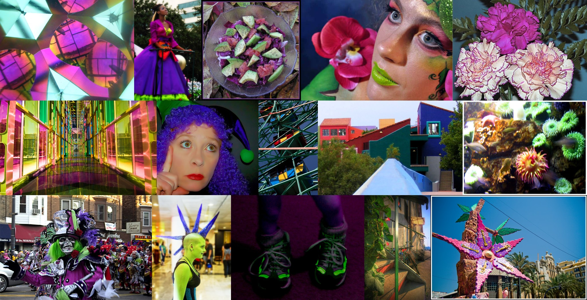

### 🔧 `Read`

```json
{
  "file_path": "/home/wg25r/anti_aesthetics_agent/tmp/grid_41.jpg"
}
```

### 🔧 `mcp__dataset-curation__sample`

```json
{
  "query": "complementary color clash magenta green photograph",
  "min_threshold": "0.345",
  "max_threshold": "0.38",
  "count": "10",
  "negative_prompts": "[\"watermark logo text overlay\", \"blank black empty frame\", \"plain white background product\"]",
  "negative_threshold": "0.25"
}
```

**Result:**

Grid image saved at: /home/wg25r/anti_aesthetics_agent/tmp/grid_42.jpg
Use the Read tool to view it.
Sampled 10 from 113 candidates.

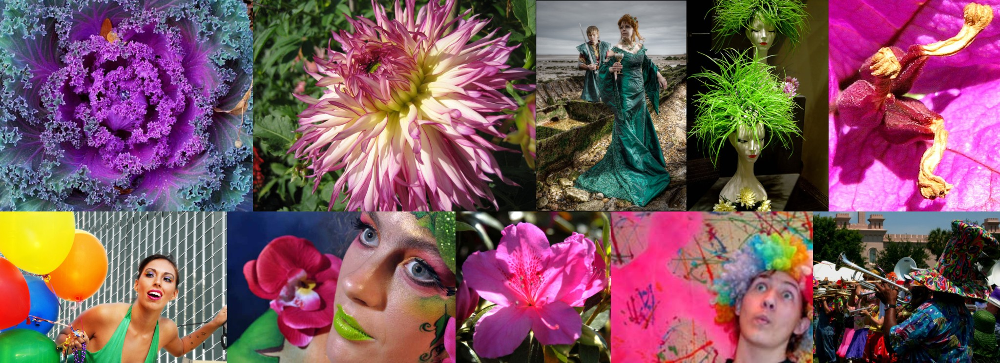

### 🔧 `Read`

```json
{
  "file_path": "/home/wg25r/anti_aesthetics_agent/tmp/grid_42.jpg"
}
```

> **Agent Log:** Sample shows magenta/green/purple combos: ornamental cabbage, pink chrysanthemum, harlequin clown, drag makeup, purple costume, pink balloons. Genuine complementary clash content. Will commit at 0.35.

**Result:**

Logged.

### 🔧 `mcp__dataset-curation__commit`

```json
{
  "query": "complementary color clash magenta green photograph",
  "threshold": "0.35",
  "negative_prompts": "[\"watermark logo text overlay\", \"blank black empty frame\", \"plain white background product\"]",
  "negative_threshold": "0.25",
  "message": "anti-aesthetic / color_and_tone / clashing_disharmony — magenta-green complementary clashes, jarring color pairs"
}
```

**Result:**

Committed with ID: 880cfe85, message: anti-aesthetic / color_and_tone / clashing_disharmony — magenta-green complementary clashes, jarring color pairs with 77 images.

### 🔧 `mcp__dataset-curation__search`

```json
{
  "query": "garish toxic color combination unsettling photograph",
  "negative_prompts": "[\"watermark logo text overlay\", \"blank black empty frame\", \"plain white background product\"]",
  "negative_threshold": "0.25",
  "t": "15"
}
```

**Result:**

Grid image saved at: /home/wg25r/anti_aesthetics_agent/tmp/grid_43.jpg
Use the Read tool to view it.
Showing top 15 results for 'garish toxic color combination unsettling photograph' in photos.
Top-15 scores: [0.4046, 0.3890, 0.3873, 0.3860, 0.3759, 0.3759, 0.3736, 0.3735, 0.3712, 0.3696, 0.3690, 0.3686, 0.3665, 0.3658, 0.3658]
Similarity distribution: counts=[39, 418, 2180, 3882, 3121, 1433, 442, 105, 17, 4], bins=[0.196, 0.217, 0.238, 0.259, 0.279, 0.300, 0.321, 0.342, 0.363, 0.384, 0.405]

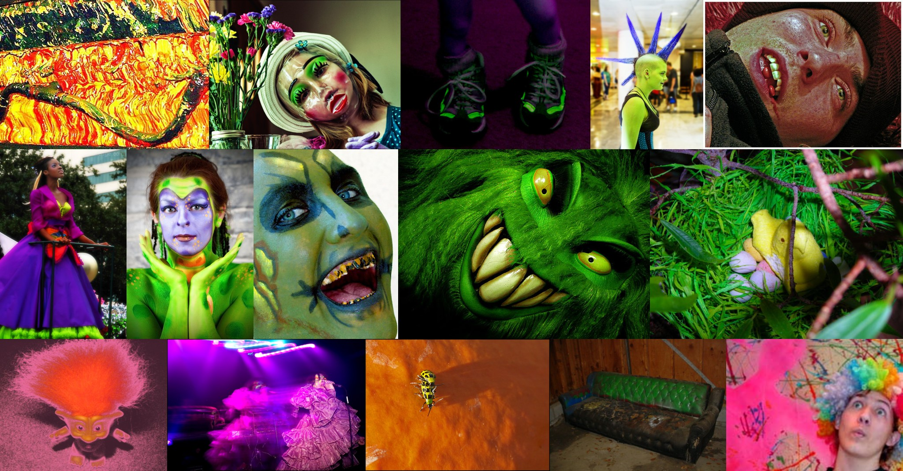

### 🔧 `Read`

```json
{
  "file_path": "/home/wg25r/anti_aesthetics_agent/tmp/grid_43.jpg"
}
```

### 🔧 `mcp__dataset-curation__sample`

```json
{
  "query": "garish toxic color combination unsettling photograph",
  "min_threshold": "0.34",
  "max_threshold": "0.37",
  "count": "10",
  "negative_prompts": "[\"watermark logo text overlay\", \"blank black empty frame\", \"plain white background product\"]",
  "negative_threshold": "0.25"
}
```

**Result:**

Grid image saved at: /home/wg25r/anti_aesthetics_agent/tmp/grid_44.jpg
Use the Read tool to view it.
Sampled 10 from 147 candidates.

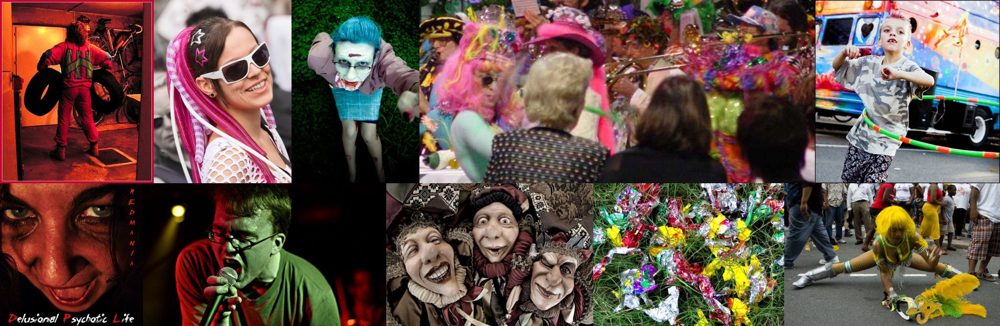

### 🔧 `Read`

```json
{
  "file_path": "/home/wg25r/anti_aesthetics_agent/tmp/grid_44.jpg"
}
```

> **Agent Log:** 0.34-0.37 sample: red-lit horror album cover, pink-haired girl, blue-haired punk, parade chaos, ice cream truck/kid, "Delusional Psychotic Life" album face, green-lit performer, jester masks, candy wrapper trash, yellow-clad street performer. Strong garish/toxic vibe with disturbing aesthetic. Will commit at 0.35.

**Result:**

Logged.

### 🔧 `mcp__dataset-curation__commit`

```json
{
  "query": "garish toxic color combination unsettling photograph",
  "threshold": "0.35",
  "negative_prompts": "[\"watermark logo text overlay\", \"blank black empty frame\", \"plain white background product\"]",
  "negative_threshold": "0.25",
  "message": "anti-aesthetic / color_and_tone / clashing_disharmony — garish toxic color combinations, unsettling palettes"
}
```

**Result:**

Committed with ID: 7124e3ae, message: anti-aesthetic / color_and_tone / clashing_disharmony — garish toxic color combinations, unsettling palettes with 64 images.

### 🔧 `TodoWrite`

```json
{
  "todos": [
    {
      "content": "Curate clashing_disharmony sub-element",
      "activeForm": "Curating clashing_disharmony",
      "status": "completed"
    },
    {
      "content": "Curate chromatic_aberration sub-element",
      "activeForm": "Curating chromatic_aberration",
      "status": "in_progress"
    },
    {
      "content": "Curate muted_faded sub-element",
      "activeForm": "Curating muted_faded",
      "status": "pending"
    },
    {
      "content": "Curate sickly_cast sub-element",
      "activeForm": "Curating sickly_cast",
      "status": "pending"
    },
    {
      "content": "Curate color_inconsistency sub-element",
      "activeForm": "Curating color_inconsistency",
      "status": "pending"
    },
    {
      "content": "Review status and rebalance if needed",
      "activeForm": "Reviewing dataset balance",
      "status": "pending"
    }
  ]
}
```

### 🔧 `mcp__dataset-curation__search`

```json
{
  "query": "chromatic aberration purple green color fringing edges photograph",
  "negative_prompts": "[\"watermark logo text overlay\", \"blank black empty frame\", \"plain white background product\"]",
  "negative_threshold": "0.25",
  "t": "15"
}
```

**Result:**

Grid image saved at: /home/wg25r/anti_aesthetics_agent/tmp/grid_45.jpg
Use the Read tool to view it.
Showing top 15 results for 'chromatic aberration purple green color fringing edges photograph' in photos.
Top-15 scores: [0.3795, 0.3708, 0.3694, 0.3579, 0.3572, 0.3562, 0.3540, 0.3534, 0.3529, 0.3529, 0.3527, 0.3522, 0.3504, 0.3501, 0.3500]
Similarity distribution: counts=[13, 143, 884, 2785, 3971, 2571, 967, 266, 38, 3], bins=[0.189, 0.208, 0.227, 0.246, 0.265, 0.284, 0.303, 0.322, 0.341, 0.360, 0.380]

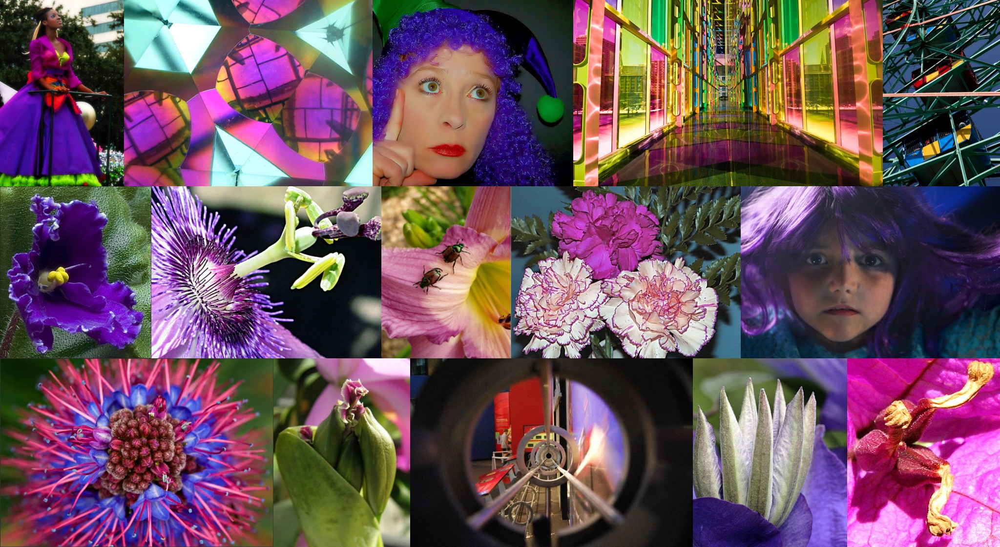

### 🔧 `Read`

```json
{
  "file_path": "/home/wg25r/anti_aesthetics_agent/tmp/grid_45.jpg"
}
```

### 🔧 `mcp__dataset-curation__search`

```json
{
  "query": "RGB shift glitch image color separation",
  "negative_prompts": "[\"watermark logo text overlay\", \"blank black empty frame\", \"plain white background product\"]",
  "negative_threshold": "0.25",
  "t": "15"
}
```

**Result:**

Grid image saved at: /home/wg25r/anti_aesthetics_agent/tmp/grid_46.jpg
Use the Read tool to view it.
Showing top 15 results for 'RGB shift glitch image color separation' in photos.
Top-15 scores: [0.3375, 0.3293, 0.3291, 0.3211, 0.3200, 0.3190, 0.3181, 0.3167, 0.3158, 0.3140, 0.3133, 0.3132, 0.3128, 0.3128, 0.3124]
Similarity distribution: counts=[88, 704, 2257, 3609, 3074, 1338, 451, 88, 27, 5], bins=[0.157, 0.175, 0.193, 0.211, 0.229, 0.247, 0.265, 0.283, 0.301, 0.319, 0.338]

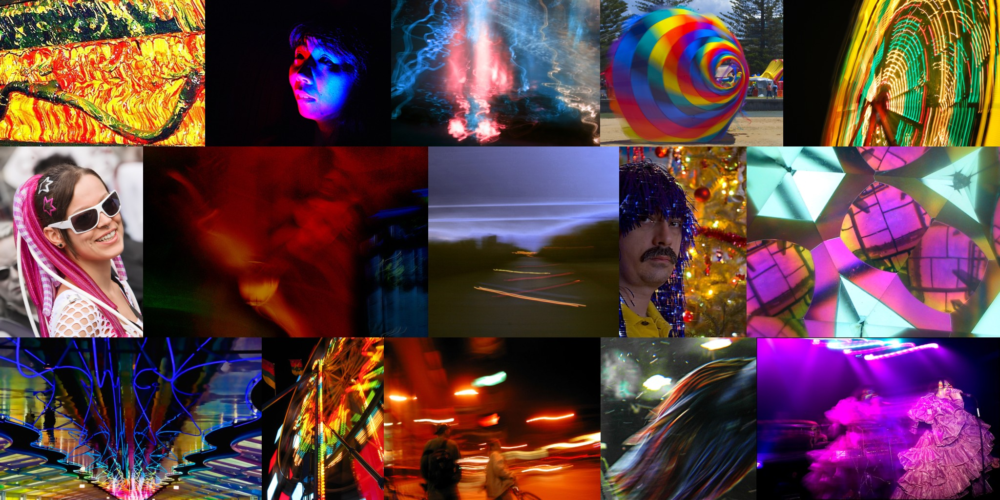

### 🔧 `Read`

```json
{
  "file_path": "/home/wg25r/anti_aesthetics_agent/tmp/grid_46.jpg"
}
```

### 🔧 `mcp__dataset-curation__search`

```json
{
  "query": "lens flare halation light leak film photograph",
  "negative_prompts": "[\"watermark logo text overlay\", \"blank black empty frame\", \"plain white background product\"]",
  "negative_threshold": "0.25",
  "t": "15"
}
```

**Result:**

Grid image saved at: /home/wg25r/anti_aesthetics_agent/tmp/grid_47.jpg
Use the Read tool to view it.
Showing top 15 results for 'lens flare halation light leak film photograph' in photos.
Top-15 scores: [0.3636, 0.3569, 0.3436, 0.3434, 0.3410, 0.3407, 0.3395, 0.3390, 0.3384, 0.3361, 0.3361, 0.3359, 0.3350, 0.3345, 0.3343]
Similarity distribution: counts=[7, 104, 961, 3300, 4163, 2236, 654, 173, 39, 4], bins=[0.158, 0.178, 0.199, 0.219, 0.240, 0.261, 0.281, 0.302, 0.322, 0.343, 0.364]

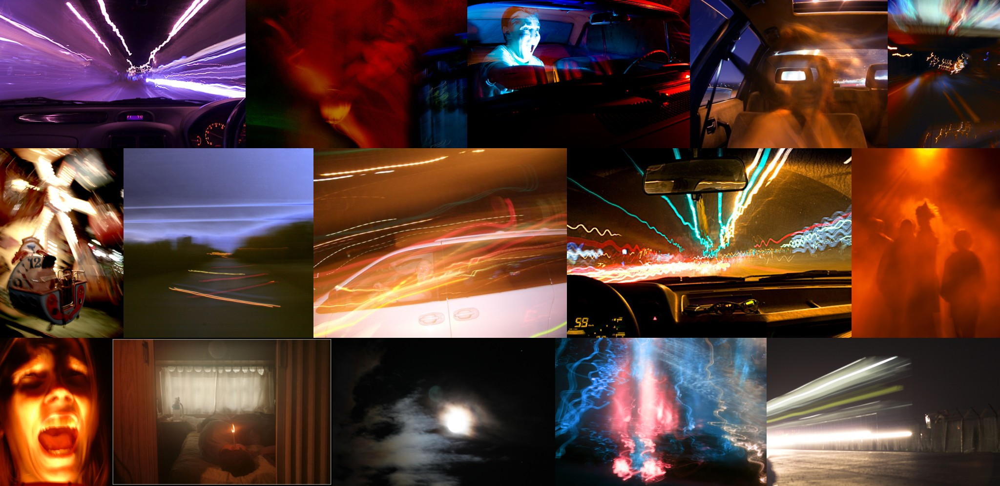

### 🔧 `Read`

```json
{
  "file_path": "/home/wg25r/anti_aesthetics_agent/tmp/grid_47.jpg"
}
```

### 🔧 `mcp__dataset-curation__sample`

```json
{
  "query": "lens flare halation light leak film photograph",
  "min_threshold": "0.32",
  "max_threshold": "0.35",
  "count": "10",
  "negative_prompts": "[\"watermark logo text overlay\", \"blank black empty frame\", \"plain white background product\"]",
  "negative_threshold": "0.25"
}
```

**Result:**

Grid image saved at: /home/wg25r/anti_aesthetics_agent/tmp/grid_48.jpg
Use the Read tool to view it.
Sampled 10 from 49 candidates.

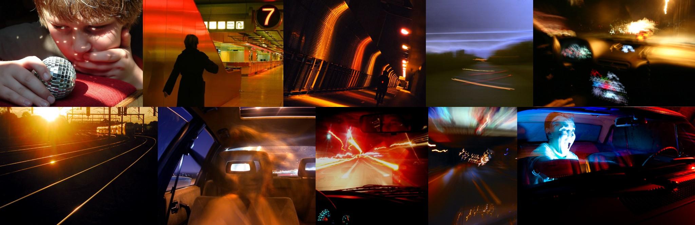

### 🔧 `Read`

```json
{
  "file_path": "/home/wg25r/anti_aesthetics_agent/tmp/grid_48.jpg"
}
```

> **Agent Log:** 0.32-0.35 sample for lens flare/halation: disco ball boy, parking garage shadow, tunnel light streaks, rural blur, blurry car interior at night, train tracks sunset, ghostly windshield, red/cyan light trails. Good lo-fi optical artifact content. Will commit at 0.32.

**Result:**

Logged.

### 🔧 `mcp__dataset-curation__commit`

```json
{
  "query": "lens flare halation light leak film photograph",
  "threshold": "0.32",
  "negative_prompts": "[\"watermark logo text overlay\", \"blank black empty frame\", \"plain white background product\"]",
  "negative_threshold": "0.25",
  "message": "anti-aesthetic / color_and_tone / chromatic_aberration — halation, light leaks, lo-fi optical color streaks"
}
```

**Result:**

Committed with ID: bf603f85, message: anti-aesthetic / color_and_tone / chromatic_aberration — halation, light leaks, lo-fi optical color streaks with 51 images.

### 🔧 `mcp__dataset-curation__search`

```json
{
  "query": "cheap lens vintage analog photograph soft focus optical distortion",
  "negative_prompts": "[\"watermark logo text overlay\", \"blank black empty frame\", \"plain white background product\"]",
  "negative_threshold": "0.25",
  "t": "15"
}
```

**Result:**

Grid image saved at: /home/wg25r/anti_aesthetics_agent/tmp/grid_49.jpg
Use the Read tool to view it.
Showing top 15 results for 'cheap lens vintage analog photograph soft focus optical distortion' in photos.
Top-15 scores: [0.3621, 0.3547, 0.3538, 0.3528, 0.3526, 0.3524, 0.3493, 0.3487, 0.3454, 0.3452, 0.3446, 0.3428, 0.3407, 0.3393, 0.3388]
Similarity distribution: counts=[39, 302, 1527, 3352, 3355, 2003, 775, 244, 35, 9], bins=[0.194, 0.211, 0.228, 0.244, 0.261, 0.278, 0.295, 0.312, 0.328, 0.345, 0.362]

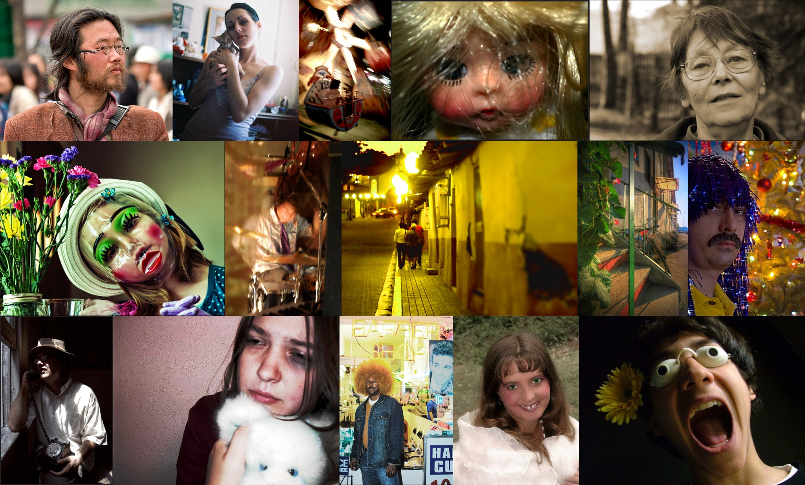

### 🔧 `Read`

```json
{
  "file_path": "/home/wg25r/anti_aesthetics_agent/tmp/grid_49.jpg"
}
```

### 🔧 `mcp__dataset-curation__sample`

```json
{
  "query": "cheap lens vintage analog photograph soft focus optical distortion",
  "min_threshold": "0.32",
  "max_threshold": "0.345",
  "count": "10",
  "negative_prompts": "[\"watermark logo text overlay\", \"blank black empty frame\", \"plain white background product\"]",
  "negative_threshold": "0.25"
}
```

**Result:**

Grid image saved at: /home/wg25r/anti_aesthetics_agent/tmp/grid_50.jpg
Use the Read tool to view it.
Sampled 10 from 109 candidates.

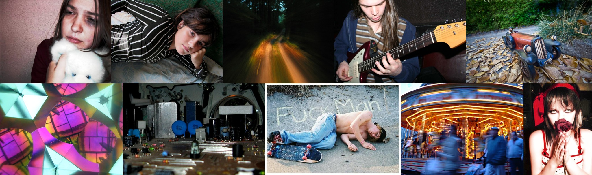

### 🔧 `Read`

```json
{
  "file_path": "/home/wg25r/anti_aesthetics_agent/tmp/grid_50.jpg"
}
```

> **Agent Log:** 0.32-0.345 sample: melancholic teen with stuffed animal, indie portrait, blurred forest road, guitar player, abandoned toy, kaleidoscope, dystopian factory, drunk on pavement, carousel motion blur, gothic girl. Lo-fi/analog feel, melancholy mood, optical imperfections. Will commit at 0.325.

**Result:**

Logged.

### 🔧 `mcp__dataset-curation__commit`

```json
{
  "query": "cheap lens vintage analog photograph soft focus optical distortion",
  "threshold": "0.33",
  "negative_prompts": "[\"watermark logo text overlay\", \"blank black empty frame\", \"plain white background product\"]",
  "negative_threshold": "0.25",
  "message": "anti-aesthetic / color_and_tone / chromatic_aberration — vintage cheap-optic look, soft-focus analog distortion"
}
```

**Result:**

Committed with ID: ca22e5ef, message: anti-aesthetic / color_and_tone / chromatic_aberration — vintage cheap-optic look, soft-focus analog distortion with 39 images.

### 🔧 `TodoWrite`

```json
{
  "todos": [
    {
      "content": "Curate clashing_disharmony sub-element",
      "activeForm": "Curating clashing_disharmony",
      "status": "completed"
    },
    {
      "content": "Curate chromatic_aberration sub-element",
      "activeForm": "Curating chromatic_aberration",
      "status": "completed"
    },
    {
      "content": "Curate muted_faded sub-element",
      "activeForm": "Curating muted_faded",
      "status": "in_progress"
    },
    {
      "content": "Curate sickly_cast sub-element",
      "activeForm": "Curating sickly_cast",
      "status": "pending"
    },
    {
      "content": "Curate color_inconsistency sub-element",
      "activeForm": "Curating color_inconsistency",
      "status": "pending"
    },
    {
      "content": "Review status and rebalance if needed",
      "activeForm": "Reviewing dataset balance",
      "status": "pending"
    }
  ]
}
```

### 🔧 `mcp__dataset-curation__search`

```json
{
  "query": "faded washed out desaturated photograph dull tones",
  "negative_prompts": "[\"watermark logo text overlay\", \"blank black empty frame\", \"plain white background product\"]",
  "negative_threshold": "0.25",
  "t": "15"
}
```

**Result:**

Grid image saved at: /home/wg25r/anti_aesthetics_agent/tmp/grid_51.jpg
Use the Read tool to view it.
Showing top 15 results for 'faded washed out desaturated photograph dull tones' in photos.
Top-15 scores: [0.3359, 0.3318, 0.3307, 0.3270, 0.3181, 0.3163, 0.3161, 0.3159, 0.3145, 0.3141, 0.3139, 0.3136, 0.3130, 0.3120, 0.3116]
Similarity distribution: counts=[4, 50, 313, 1313, 3392, 3895, 2028, 556, 82, 8], bins=[0.128, 0.149, 0.170, 0.191, 0.211, 0.232, 0.253, 0.274, 0.294, 0.315, 0.336]

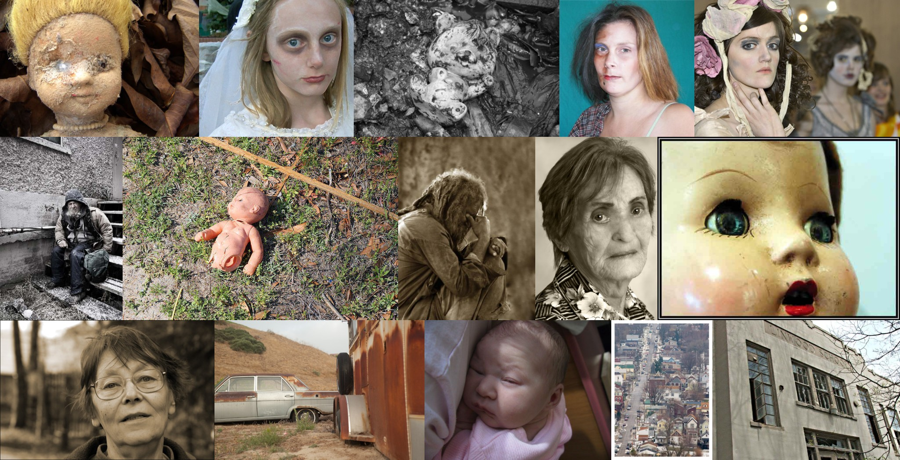

### 🔧 `Read`

```json
{
  "file_path": "/home/wg25r/anti_aesthetics_agent/tmp/grid_51.jpg"
}
```

### 🔧 `mcp__dataset-curation__sample`

```json
{
  "query": "faded washed out desaturated photograph dull tones",
  "min_threshold": "0.29",
  "max_threshold": "0.32",
  "count": "10",
  "negative_prompts": "[\"watermark logo text overlay\", \"blank black empty frame\", \"plain white background product\"]",
  "negative_threshold": "0.25"
}
```

**Result:**

Grid image saved at: /home/wg25r/anti_aesthetics_agent/tmp/grid_52.jpg
Use the Read tool to view it.
Sampled 10 from 134 candidates.

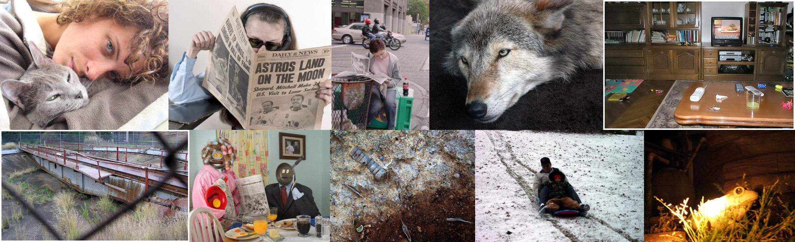

### 🔧 `Read`

```json
{
  "file_path": "/home/wg25r/anti_aesthetics_agent/tmp/grid_52.jpg"
}
```

> **Agent Log:** 0.29-0.32 muted/faded sample: woman with cat (muted), retro newspaper read, urban scene, wolf portrait (mid-saturation), dingy living room, abandoned bridge with rust, weird breakfast scene, dull rocks, snow path, dim fireplace. Mostly desaturated/dull tones. Top results have dolls and old photos which fit. Will commit at 0.30.

**Result:**

Logged.

### 🔧 `mcp__dataset-curation__commit`

```json
{
  "query": "faded washed out desaturated photograph dull tones",
  "threshold": "0.305",
  "negative_prompts": "[\"watermark logo text overlay\", \"blank black empty frame\", \"plain white background product\"]",
  "negative_threshold": "0.25",
  "message": "anti-aesthetic / color_and_tone / muted_faded — desaturated, dull, washed-out tones"
}
```

**Result:**

Committed with ID: c7aeea58, message: anti-aesthetic / color_and_tone / muted_faded — desaturated, dull, washed-out tones with 30 images.

### 🔧 `mcp__dataset-curation__search`

```json
{
  "query": "retro vintage faded film photograph melancholy nostalgia",
  "negative_prompts": "[\"watermark logo text overlay\", \"blank black empty frame\", \"plain white background product\"]",
  "negative_threshold": "0.25",
  "t": "15"
}
```

**Result:**

Grid image saved at: /home/wg25r/anti_aesthetics_agent/tmp/grid_53.jpg
Use the Read tool to view it.
Showing top 15 results for 'retro vintage faded film photograph melancholy nostalgia' in photos.
Top-15 scores: [0.3680, 0.3606, 0.3575, 0.3535, 0.3461, 0.3452, 0.3447, 0.3441, 0.3441, 0.3434, 0.3430, 0.3428, 0.3428, 0.3424, 0.3421]
Similarity distribution: counts=[9, 139, 1140, 3277, 3725, 2233, 813, 251, 50, 4], bins=[0.181, 0.200, 0.219, 0.237, 0.256, 0.275, 0.293, 0.312, 0.331, 0.349, 0.368]

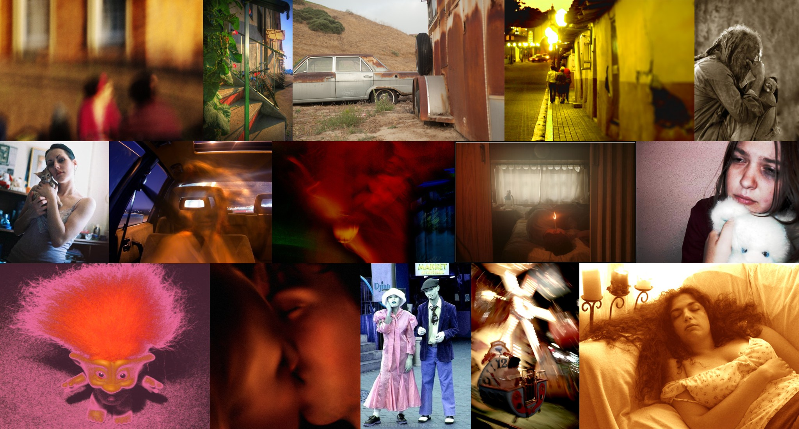

### 🔧 `Read`

```json
{
  "file_path": "/home/wg25r/anti_aesthetics_agent/tmp/grid_53.jpg"
}
```

### 🔧 `mcp__dataset-curation__sample`

```json
{
  "query": "retro vintage faded film photograph melancholy nostalgia",
  "min_threshold": "0.32",
  "max_threshold": "0.345",
  "count": "10",
  "negative_prompts": "[\"watermark logo text overlay\", \"blank black empty frame\", \"plain white background product\"]",
  "negative_threshold": "0.25"
}
```

**Result:**

Grid image saved at: /home/wg25r/anti_aesthetics_agent/tmp/grid_54.jpg
Use the Read tool to view it.
Sampled 10 from 141 candidates.

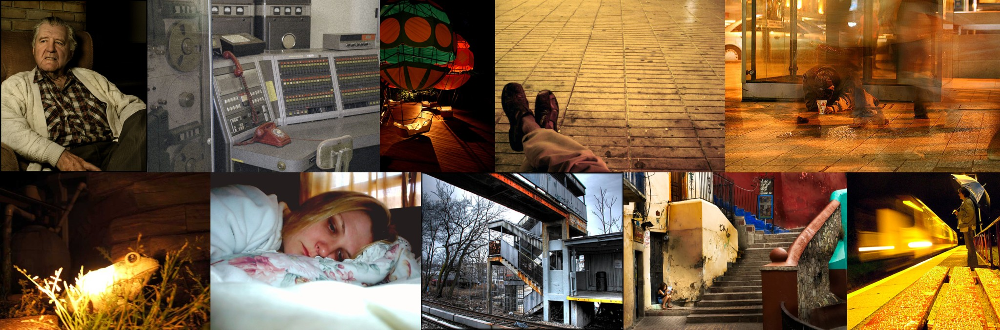

### 🔧 `Read`

```json
{
  "file_path": "/home/wg25r/anti_aesthetics_agent/tmp/grid_54.jpg"
}
```

> **Agent Log:** 0.32-0.345 retro/melancholy sample: old man portrait, vintage telephone switchboard, sleeping woman, abandoned buildings, sodium-lit station, hot air balloon at dusk. Strong nostalgic/faded mood. Will commit at 0.325.

**Result:**

Logged.

### 🔧 `mcp__dataset-curation__commit`

```json
{
  "query": "retro vintage faded film photograph melancholy nostalgia",
  "threshold": "0.325",
  "negative_prompts": "[\"watermark logo text overlay\", \"blank black empty frame\", \"plain white background product\"]",
  "negative_threshold": "0.25",
  "message": "anti-aesthetic / color_and_tone / muted_faded — retro film fade, nostalgic melancholy palette"
}
```

**Result:**

Committed with ID: 6b0f3914, message: anti-aesthetic / color_and_tone / muted_faded — retro film fade, nostalgic melancholy palette with 88 images.

### 🔧 `mcp__dataset-curation__search`

```json
{
  "query": "overcast gray sky monotone gloomy photograph",
  "negative_prompts": "[\"watermark logo text overlay\", \"blank black empty frame\", \"plain white background product\"]",
  "negative_threshold": "0.25",
  "t": "15"
}
```

**Result:**

Grid image saved at: /home/wg25r/anti_aesthetics_agent/tmp/grid_55.jpg
Use the Read tool to view it.
Showing top 15 results for 'overcast gray sky monotone gloomy photograph' in photos.
Top-15 scores: [0.3302, 0.3293, 0.3147, 0.3142, 0.3136, 0.3120, 0.3101, 0.3043, 0.3031, 0.3024, 0.2952, 0.2934, 0.2927, 0.2926, 0.2926]
Similarity distribution: counts=[15, 209, 1197, 3277, 3820, 2245, 679, 165, 27, 7], bins=[0.094, 0.118, 0.142, 0.165, 0.189, 0.212, 0.236, 0.259, 0.283, 0.307, 0.330]

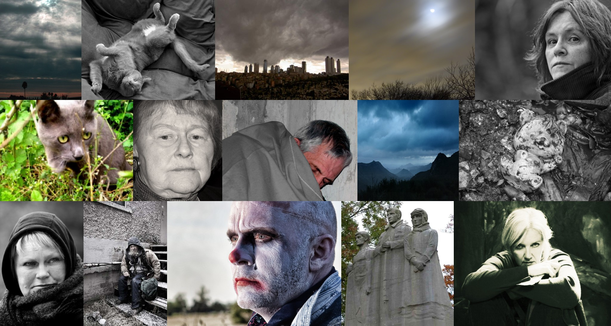

### 🔧 `Read`

```json
{
  "file_path": "/home/wg25r/anti_aesthetics_agent/tmp/grid_55.jpg"
}
```

### 🔧 `mcp__dataset-curation__sample`

```json
{
  "query": "overcast gray sky monotone gloomy photograph",
  "min_threshold": "0.28",
  "max_threshold": "0.31",
  "count": "10",
  "negative_prompts": "[\"watermark logo text overlay\", \"blank black empty frame\", \"plain white background product\"]",
  "negative_threshold": "0.25"
}
```

**Result:**

Grid image saved at: /home/wg25r/anti_aesthetics_agent/tmp/grid_56.jpg
Use the Read tool to view it.
Sampled 10 from 32 candidates.

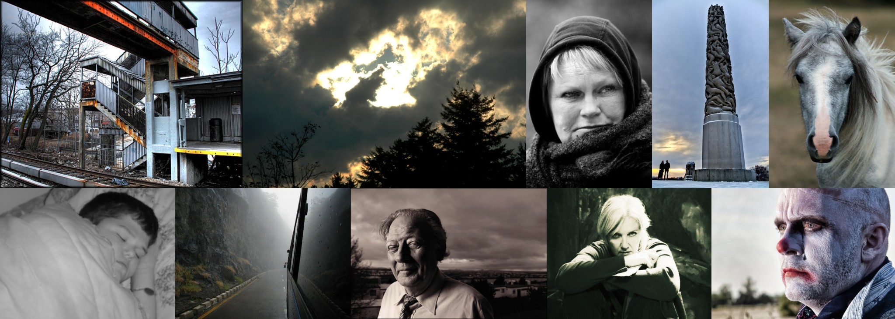

### 🔧 `Read`

```json
{
  "file_path": "/home/wg25r/anti_aesthetics_agent/tmp/grid_56.jpg"
}
```

> **Agent Log:** 0.28-0.31 overcast/gloomy sample: industrial bridge, stormy sky, hooded portrait, sculpture obelisk, white horse, sleeping baby (B&W), foggy train view, old man dim portrait, monochrome girl, painted face. Strong gloomy/monotone fit. Will commit at 0.29 to capture broader pool.

**Result:**

Logged.

### 🔧 `mcp__dataset-curation__commit`

```json
{
  "query": "overcast gray sky monotone gloomy photograph",
  "threshold": "0.295",
  "negative_prompts": "[\"watermark logo text overlay\", \"blank black empty frame\", \"plain white background product\"]",
  "negative_threshold": "0.25",
  "message": "anti-aesthetic / color_and_tone / muted_faded — overcast monotone gloom, low-vibrancy gray"
}
```

**Result:**

Committed with ID: eed20b20, message: anti-aesthetic / color_and_tone / muted_faded — overcast monotone gloom, low-vibrancy gray with 11 images.

### 🔧 `TodoWrite`

```json
{
  "todos": [
    {
      "content": "Curate clashing_disharmony sub-element",
      "activeForm": "Curating clashing_disharmony",
      "status": "completed"
    },
    {
      "content": "Curate chromatic_aberration sub-element",
      "activeForm": "Curating chromatic_aberration",
      "status": "completed"
    },
    {
      "content": "Curate muted_faded sub-element",
      "activeForm": "Curating muted_faded",
      "status": "completed"
    },
    {
      "content": "Curate sickly_cast sub-element",
      "activeForm": "Curating sickly_cast",
      "status": "in_progress"
    },
    {
      "content": "Curate color_inconsistency sub-element",
      "activeForm": "Curating color_inconsistency",
      "status": "pending"
    },
    {
      "content": "Review status and rebalance if needed",
      "activeForm": "Reviewing dataset balance",
      "status": "pending"
    }
  ]
}
```

### 🔧 `mcp__dataset-curation__search`

```json
{
  "query": "sickly yellow green tint photograph unhealthy skin tone",
  "negative_prompts": "[\"watermark logo text overlay\", \"blank black empty frame\", \"plain white background product\"]",
  "negative_threshold": "0.25",
  "t": "15"
}
```

**Result:**

Grid image saved at: /home/wg25r/anti_aesthetics_agent/tmp/grid_57.jpg
Use the Read tool to view it.
Showing top 15 results for 'sickly yellow green tint photograph unhealthy skin tone' in photos.
Top-15 scores: [0.4127, 0.3929, 0.3912, 0.3846, 0.3830, 0.3812, 0.3722, 0.3705, 0.3699, 0.3692, 0.3675, 0.3665, 0.3662, 0.3657, 0.3649]
Similarity distribution: counts=[52, 488, 2065, 3889, 3138, 1445, 453, 94, 14, 3], bins=[0.159, 0.184, 0.210, 0.235, 0.260, 0.286, 0.311, 0.337, 0.362, 0.387, 0.413]

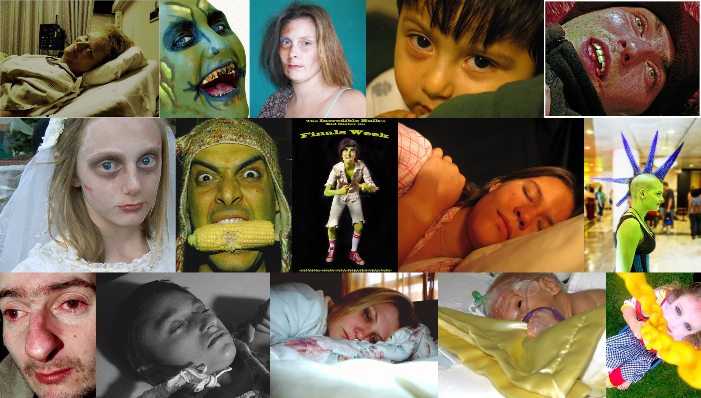

### 🔧 `Read`

```json
{
  "file_path": "/home/wg25r/anti_aesthetics_agent/tmp/grid_57.jpg"
}
```

### 🔧 `mcp__dataset-curation__sample`

```json
{
  "query": "sickly yellow green tint photograph unhealthy skin tone",
  "min_threshold": "0.345",
  "max_threshold": "0.37",
  "count": "10",
  "negative_prompts": "[\"watermark logo text overlay\", \"blank black empty frame\", \"plain white background product\"]",
  "negative_threshold": "0.25"
}
```

**Result:**

Grid image saved at: /home/wg25r/anti_aesthetics_agent/tmp/grid_58.jpg
Use the Read tool to view it.
Sampled 10 from 60 candidates.

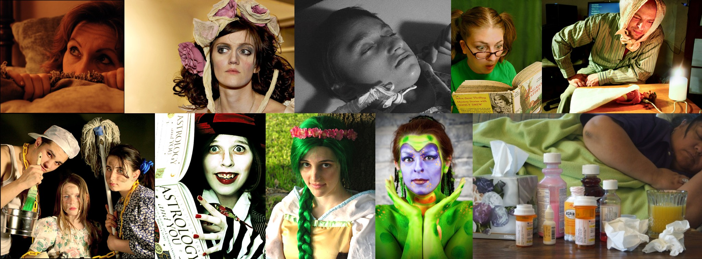

### 🔧 `Read`

```json
{
  "file_path": "/home/wg25r/anti_aesthetics_agent/tmp/grid_58.jpg"
}
```

> **Agent Log:** 0.345-0.37 sickly sample: yellow-tinted woman in bed, green-tinted dramatic lit girl, sleeping baby B&W, green sleepy reader, sodium-yellow workshop, kids in old clothes, white-faced clown, green-painted body art, sick kid with cold meds. Strong sickly/jaundice content. Will commit at 0.35.

**Result:**

Logged.

### 🔧 `mcp__dataset-curation__commit`

```json
{
  "query": "sickly yellow green tint photograph unhealthy skin tone",
  "threshold": "0.35",
  "negative_prompts": "[\"watermark logo text overlay\", \"blank black empty frame\", \"plain white background product\"]",
  "negative_threshold": "0.25",
  "message": "anti-aesthetic / color_and_tone / sickly_cast — yellow/green sickly tints, jaundice and unhealthy color casts"
}
```

**Result:**

Committed with ID: 585572a5, message: anti-aesthetic / color_and_tone / sickly_cast — yellow/green sickly tints, jaundice and unhealthy color casts with 50 images.

### 🔧 `mcp__dataset-curation__search`

```json
{
  "query": "sodium vapor street light orange yellow night photograph",
  "negative_prompts": "[\"watermark logo text overlay\", \"blank black empty frame\", \"plain white background product\"]",
  "negative_threshold": "0.25",
  "t": "15"
}
```

**Result:**

Grid image saved at: /home/wg25r/anti_aesthetics_agent/tmp/grid_59.jpg
Use the Read tool to view it.
Showing top 15 results for 'sodium vapor street light orange yellow night photograph' in photos.
Top-15 scores: [0.4331, 0.3994, 0.3927, 0.3910, 0.3892, 0.3835, 0.3806, 0.3779, 0.3754, 0.3705, 0.3695, 0.3693, 0.3678, 0.3671, 0.3668]
Similarity distribution: counts=[2, 115, 1702, 4734, 3371, 1243, 389, 70, 13, 2], bins=[0.088, 0.122, 0.157, 0.192, 0.226, 0.261, 0.295, 0.330, 0.364, 0.399, 0.433]

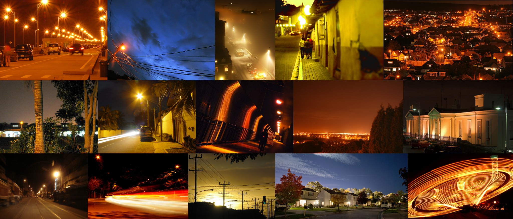

### 🔧 `Read`

```json
{
  "file_path": "/home/wg25r/anti_aesthetics_agent/tmp/grid_59.jpg"
}
```

> **Agent Log:** Top sodium vapor results are excellent — orange/yellow night street, fog with car lights, palms with sodium-lit sky, dim suburban scenes, light trails. Strong color cast match. Will commit at 0.35.

**Result:**

Logged.

### 🔧 `mcp__dataset-curation__sample`

```json
{
  "query": "sodium vapor street light orange yellow night photograph",
  "min_threshold": "0.34",
  "max_threshold": "0.36",
  "count": "10",
  "negative_prompts": "[\"watermark logo text overlay\", \"blank black empty frame\", \"plain white background product\"]",
  "negative_threshold": "0.25"
}
```

**Result:**

Grid image saved at: /home/wg25r/anti_aesthetics_agent/tmp/grid_60.jpg
Use the Read tool to view it.
Sampled 10 from 33 candidates.

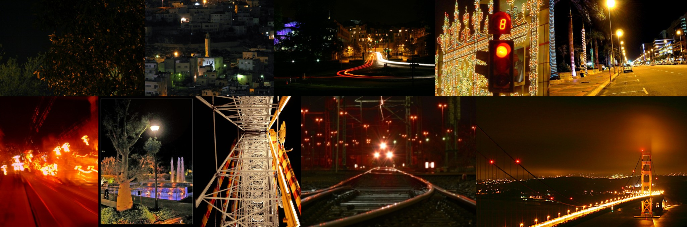

### 🔧 `Read`

```json
{
  "file_path": "/home/wg25r/anti_aesthetics_agent/tmp/grid_60.jpg"
}
```

> **Agent Log:** 0.34-0.36 sample: hilltop village at night, cathedral lit, traffic lights, illuminated street, fountain, ferris wheel structure, train tracks, Golden Gate bridge in orange haze. All have sodium-lit color cast. Will commit at 0.34.

**Result:**

Logged.

### 🔧 `mcp__dataset-curation__commit`

```json
{
  "query": "sodium vapor street light orange yellow night photograph",
  "threshold": "0.34",
  "negative_prompts": "[\"watermark logo text overlay\", \"blank black empty frame\", \"plain white background product\"]",
  "negative_threshold": "0.25",
  "message": "anti-aesthetic / color_and_tone / sickly_cast — sodium vapor street light cast, orange/yellow night tint"
}
```

**Result:**

Committed with ID: 33322141, message: anti-aesthetic / color_and_tone / sickly_cast — sodium vapor street light cast, orange/yellow night tint with 52 images.

### 🔧 `mcp__dataset-curation__search`

```json
{
  "query": "fluorescent green tinted hospital corridor cold light photograph",
  "negative_prompts": "[\"watermark logo text overlay\", \"blank black empty frame\", \"plain white background product\"]",
  "negative_threshold": "0.25",
  "t": "15"
}
```

**Result:**

Grid image saved at: /home/wg25r/anti_aesthetics_agent/tmp/grid_61.jpg
Use the Read tool to view it.
Showing top 15 results for 'fluorescent green tinted hospital corridor cold light photograph' in photos.
Top-15 scores: [0.3711, 0.3683, 0.3603, 0.3484, 0.3424, 0.3405, 0.3401, 0.3391, 0.3369, 0.3350, 0.3341, 0.3334, 0.3326, 0.3325, 0.3304]
Similarity distribution: counts=[55, 446, 2053, 3831, 3294, 1424, 404, 100, 30, 4], bins=[0.092, 0.120, 0.148, 0.176, 0.203, 0.231, 0.259, 0.287, 0.315, 0.343, 0.371]

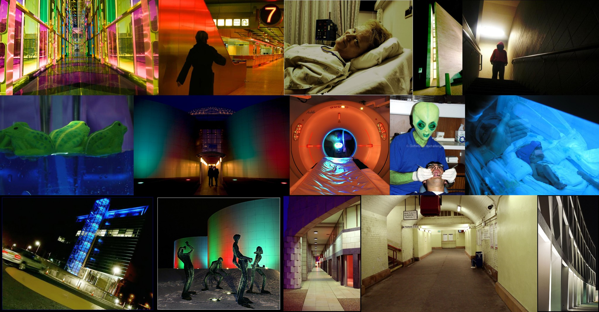

### 🔧 `Read`

```json
{
  "file_path": "/home/wg25r/anti_aesthetics_agent/tmp/grid_61.jpg"
}
```

### 🔧 `mcp__dataset-curation__sample`

```json
{
  "query": "fluorescent green tinted hospital corridor cold light photograph",
  "min_threshold": "0.3",
  "max_threshold": "0.33",
  "count": "10",
  "negative_prompts": "[\"watermark logo text overlay\", \"blank black empty frame\", \"plain white background product\"]",
  "negative_threshold": "0.25"
}
```

**Result:**

Grid image saved at: /home/wg25r/anti_aesthetics_agent/tmp/grid_62.jpg
Use the Read tool to view it.
Sampled 10 from 58 candidates.

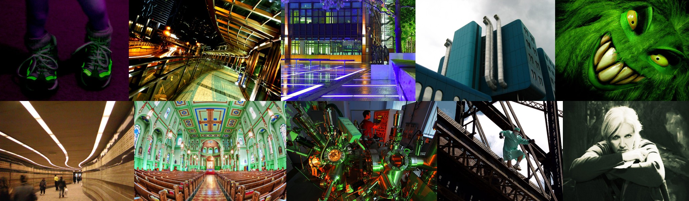

### 🔧 `Read`

```json
{
  "file_path": "/home/wg25r/anti_aesthetics_agent/tmp/grid_62.jpg"
}
```

> **Agent Log:** 0.3-0.33 sample fluorescent/cold: green-lit shoes on purple, urban escalator, blue/purple bridge, cold-toned building, green Grinch face, subway tunnel, ornate church (greenish), industrial machinery green light, bridge structure, monochrome girl. Mix of cold/clinical light. Will commit at 0.31.

**Result:**

Logged.

### 🔧 `mcp__dataset-curation__commit`

```json
{
  "query": "fluorescent green tinted hospital corridor cold light photograph",
  "threshold": "0.32",
  "negative_prompts": "[\"watermark logo text overlay\", \"blank black empty frame\", \"plain white background product\"]",
  "negative_threshold": "0.25",
  "message": "anti-aesthetic / color_and_tone / sickly_cast — fluorescent cold/green clinical tints, institutional cast"
}
```

**Result:**

Committed with ID: 677bcc4c, message: anti-aesthetic / color_and_tone / sickly_cast — fluorescent cold/green clinical tints, institutional cast with 29 images.

### 🔧 `TodoWrite`

```json
{
  "todos": [
    {
      "content": "Curate clashing_disharmony sub-element",
      "activeForm": "Curating clashing_disharmony",
      "status": "completed"
    },
    {
      "content": "Curate chromatic_aberration sub-element",
      "activeForm": "Curating chromatic_aberration",
      "status": "completed"
    },
    {
      "content": "Curate muted_faded sub-element",
      "activeForm": "Curating muted_faded",
      "status": "completed"
    },
    {
      "content": "Curate sickly_cast sub-element",
      "activeForm": "Curating sickly_cast",
      "status": "completed"
    },
    {
      "content": "Curate color_inconsistency sub-element",
      "activeForm": "Curating color_inconsistency",
      "status": "in_progress"
    },
    {
      "content": "Review status and rebalance if needed",
      "activeForm": "Reviewing dataset balance",
      "status": "pending"
    }
  ]
}
```

### 🔧 `mcp__dataset-curation__search`

```json
{
  "query": "mixed white balance interior window photograph orange blue contrast",
  "negative_prompts": "[\"watermark logo text overlay\", \"blank black empty frame\", \"plain white background product\"]",
  "negative_threshold": "0.25",
  "t": "15"
}
```

**Result:**

Grid image saved at: /home/wg25r/anti_aesthetics_agent/tmp/grid_63.jpg
Use the Read tool to view it.
Showing top 15 results for 'mixed white balance interior window photograph orange blue contrast' in photos.
Top-15 scores: [0.4108, 0.3818, 0.3798, 0.3754, 0.3738, 0.3714, 0.3703, 0.3697, 0.3690, 0.3680, 0.3679, 0.3675, 0.3657, 0.3634, 0.3626]
Similarity distribution: counts=[2, 33, 654, 3345, 4478, 2181, 743, 177, 27, 1], bins=[0.136, 0.164, 0.191, 0.219, 0.246, 0.273, 0.301, 0.328, 0.356, 0.383, 0.411]

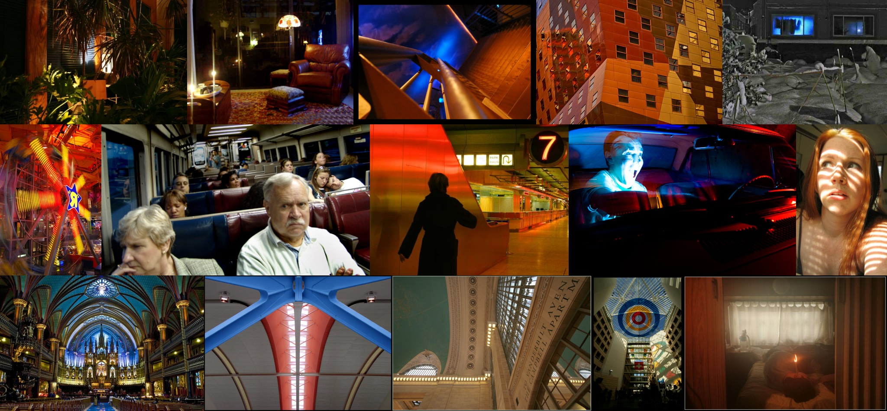

### 🔧 `Read`

```json
{
  "file_path": "/home/wg25r/anti_aesthetics_agent/tmp/grid_63.jpg"
}
```

### 🔧 `mcp__dataset-curation__sample`

```json
{
  "query": "mixed white balance interior window photograph orange blue contrast",
  "min_threshold": "0.34",
  "max_threshold": "0.36",
  "count": "10",
  "negative_prompts": "[\"watermark logo text overlay\", \"blank black empty frame\", \"plain white background product\"]",
  "negative_threshold": "0.25"
}
```

**Result:**

Grid image saved at: /home/wg25r/anti_aesthetics_agent/tmp/grid_64.jpg
Use the Read tool to view it.
Sampled 10 from 86 candidates.

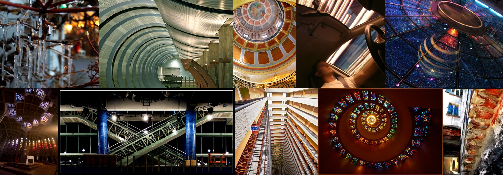

### 🔧 `Read`

```json
{
  "file_path": "/home/wg25r/anti_aesthetics_agent/tmp/grid_64.jpg"
}
```

> **Agent Log:** 0.34-0.36 mixed-WB sample: chandelier crystals, subway tube, dome ceiling, narrow gallery, rotunda, stained glass, atrium with mixed temperatures. Lots of architectural shots with mixed indoor/outdoor light sources. Genuine mixed-WB look. Will commit at 0.34.

**Result:**

Logged.

### 🔧 `mcp__dataset-curation__commit`

```json
{
  "query": "mixed white balance interior window photograph orange blue contrast",
  "threshold": "0.34",
  "negative_prompts": "[\"watermark logo text overlay\", \"blank black empty frame\", \"plain white background product\"]",
  "negative_threshold": "0.25",
  "message": "anti-aesthetic / color_and_tone / color_inconsistency — mixed white balance interior, dual color temperatures clash"
}
```

**Result:**

Committed with ID: 6f4cb765, message: anti-aesthetic / color_and_tone / color_inconsistency — mixed white balance interior, dual color temperatures clash with 106 images.

### 🔧 `mcp__dataset-curation__search`

```json
{
  "query": "color banding posterized gradient sky digital artifact",
  "negative_prompts": "[\"watermark logo text overlay\", \"blank black empty frame\", \"plain white background product\"]",
  "negative_threshold": "0.25",
  "t": "15"
}
```

**Result:**

Grid image saved at: /home/wg25r/anti_aesthetics_agent/tmp/grid_65.jpg
Use the Read tool to view it.
Showing top 15 results for 'color banding posterized gradient sky digital artifact' in photos.
Top-15 scores: [0.3504, 0.3464, 0.3461, 0.3384, 0.3364, 0.3362, 0.3340, 0.3334, 0.3325, 0.3305, 0.3294, 0.3279, 0.3276, 0.3269, 0.3268]
Similarity distribution: counts=[5, 91, 669, 2623, 3979, 2905, 1014, 298, 48, 9], bins=[0.159, 0.179, 0.198, 0.217, 0.236, 0.255, 0.274, 0.293, 0.312, 0.331, 0.350]

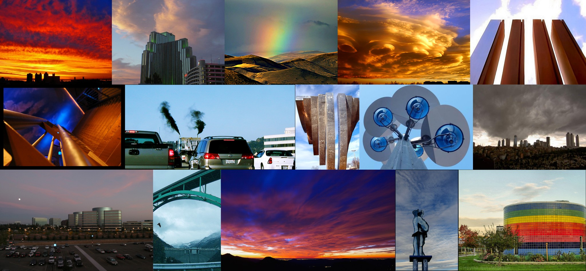

### 🔧 `Read`

```json
{
  "file_path": "/home/wg25r/anti_aesthetics_agent/tmp/grid_65.jpg"
}
```

### 🔧 `mcp__dataset-curation__sample`

```json
{
  "query": "color banding posterized gradient sky digital artifact",
  "min_threshold": "0.3",
  "max_threshold": "0.32",
  "count": "10",
  "negative_prompts": "[\"watermark logo text overlay\", \"blank black empty frame\", \"plain white background product\"]",
  "negative_threshold": "0.25"
}
```

**Result:**

Grid image saved at: /home/wg25r/anti_aesthetics_agent/tmp/grid_66.jpg
Use the Read tool to view it.
Sampled 10 from 185 candidates.

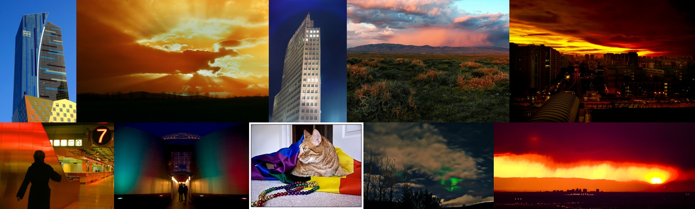

### 🔧 `Read`

```json
{
  "file_path": "/home/wg25r/anti_aesthetics_agent/tmp/grid_66.jpg"
}
```

> **Agent Log:** 0.30-0.32 banding/posterization sample: skyscraper, sunset with sun rays, building with sky transition, mountain at sunset (banding visible), city orange sunset, airport mixed light, tunnel teal/red, cat with rainbow flag, blue/yellow sky, sunset over city. Strong gradient banding in sunsets typical of digital JPEG. Will commit at 0.31.

**Result:**

Logged.

### 🔧 `mcp__dataset-curation__commit`

```json
{
  "query": "color banding posterized gradient sky digital artifact",
  "threshold": "0.31",
  "negative_prompts": "[\"watermark logo text overlay\", \"blank black empty frame\", \"plain white background product\"]",
  "negative_threshold": "0.25",
  "message": "anti-aesthetic / color_and_tone / color_inconsistency — color banding in skies, posterization artifacts"
}
```

**Result:**

Committed with ID: c7f0ece6, message: anti-aesthetic / color_and_tone / color_inconsistency — color banding in skies, posterization artifacts with 79 images.

### 🔧 `mcp__dataset-curation__search`

```json
{
  "query": "flash photograph harsh fluorescent shadow uneven lighting",
  "negative_prompts": "[\"watermark logo text overlay\", \"blank black empty frame\", \"plain white background product\"]",
  "negative_threshold": "0.25",
  "t": "15"
}
```

**Result:**

Grid image saved at: /home/wg25r/anti_aesthetics_agent/tmp/grid_67.jpg
Use the Read tool to view it.
Showing top 15 results for 'flash photograph harsh fluorescent shadow uneven lighting' in photos.
Top-15 scores: [0.3816, 0.3605, 0.3583, 0.3546, 0.3523, 0.3522, 0.3516, 0.3498, 0.3480, 0.3477, 0.3464, 0.3448, 0.3441, 0.3429, 0.3425]
Similarity distribution: counts=[7, 73, 685, 2964, 4342, 2551, 816, 168, 32, 3], bins=[0.143, 0.167, 0.191, 0.215, 0.238, 0.262, 0.286, 0.310, 0.334, 0.358, 0.382]

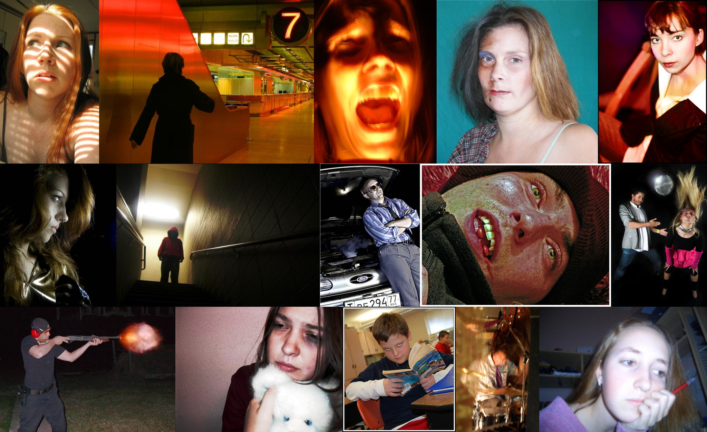

### 🔧 `Read`

```json
{
  "file_path": "/home/wg25r/anti_aesthetics_agent/tmp/grid_67.jpg"
}
```

### 🔧 `mcp__dataset-curation__sample`

```json
{
  "query": "flash photograph harsh fluorescent shadow uneven lighting",
  "min_threshold": "0.32",
  "max_threshold": "0.35",
  "count": "10",
  "negative_prompts": "[\"watermark logo text overlay\", \"blank black empty frame\", \"plain white background product\"]",
  "negative_threshold": "0.25"
}
```

**Result:**

Grid image saved at: /home/wg25r/anti_aesthetics_agent/tmp/grid_68.jpg
Use the Read tool to view it.
Sampled 10 from 93 candidates.

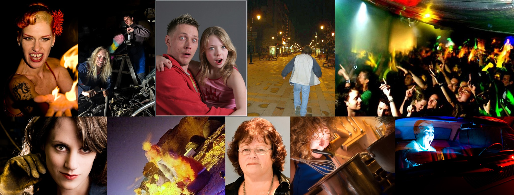

### 🔧 `Read`

```json
{
  "file_path": "/home/wg25r/anti_aesthetics_agent/tmp/grid_68.jpg"
}
```

> **Agent Log:** 0.32-0.35 sample for harsh flash/uneven: fire-eater portrait (mixed flame+flash), workshop, snapshot couple, sodium lit street, concert with stage lights, stark portrait, fire close-up, woman flash portrait, woman in shadow, blue-lit yawning passenger. Mixed flash + ambient + colored lights — strong color inconsistency. Will commit at 0.33.

**Result:**

Logged.

### 🔧 `mcp__dataset-curation__commit`

```json
{
  "query": "flash photograph harsh fluorescent shadow uneven lighting",
  "threshold": "0.33",
  "negative_prompts": "[\"watermark logo text overlay\", \"blank black empty frame\", \"plain white background product\"]",
  "negative_threshold": "0.25",
  "message": "anti-aesthetic / color_and_tone / color_inconsistency — flash + ambient mixed lighting, harsh uneven exposure"
}
```

**Result:**

Committed with ID: b43b3935, message: anti-aesthetic / color_and_tone / color_inconsistency — flash + ambient mixed lighting, harsh uneven exposure with 42 images.

### 🔧 `mcp__dataset-curation__status`

```json
{}
```

**Result:**

Total commits: 40, Total images: 2914

Commit History:
- [49556fff] anti-aesthetic / clarity_and_focus / intentional_blur: motion blur, long exposure subject motion - artistic streaks and dynamic blur (453 images)
- [e7c8a3b2] anti-aesthetic / clarity_and_focus / intentional_blur: ICM intentional camera movement, painterly abstract blur (145 images)
- [6edce575] anti-aesthetic / clarity_and_focus / intentional_blur: soft focus dreamy defocused portraits (37 images)
- [e538b4bd] anti-aesthetic / clarity_and_focus / double_exposure: ghostly overlapping portraits, multi-exposure (71 images)
- [db320845] anti-aesthetic / clarity_and_focus / double_exposure: multiple exposure layered scenes (91 images)
- [46aeca04] anti-aesthetic / clarity_and_focus / film_artifacts: heavy 35mm grain, noise textures, gritty analog (33 images)
- [30733dfe] anti-aesthetic / clarity_and_focus / film_artifacts: light leaks, halation, overexposed film (182 images)
- [843d0233] anti-aesthetic / clarity_and_focus / film_artifacts: scratched, dusty, damaged emulsion textures (39 images)
- [99abbffb] anti-aesthetic / clarity_and_focus / film_artifacts: expired film color shifts, faded vintage snapshots (47 images)
- [fe12cb42] anti-aesthetic / clarity_and_focus / analog_degradation: VHS scanlines, tracking errors, pixel grid distortion (16 images)
- [5475d947] anti-aesthetic / clarity_and_focus / analog_degradation: CRT television static and old TV monitors (17 images)
- [ccd0d7b1] anti-aesthetic / clarity_and_focus / analog_degradation: pixelated retro lo-fi imagery (10 images)
- [157b2975] sub:intentional_blur/motion_blur — anti_aesthetic — panning, ICM, streaked moving subjects (107 images)
- [ca7ce258] sub:intentional_blur/soft_focus — anti_aesthetic — dreamy hazy out-of-focus portraits, vaseline lens, soft veil (66 images)
- [29a37975] sub:intentional_blur/light_trails — anti_aesthetic — long exposure streaks, chaotic light painting, ICM at night (127 images)
- [ed8d18f7] sub:intentional_blur/ICM_abstract — anti_aesthetic — swirl, zoom blur, vertical pan, painterly motion abstraction (103 images)
- [d36e10ff] sub:double_exposure — anti_aesthetic — overlapping ghostly portraits, doubled silhouettes, layered composites (117 images)
- [83ca1dea] sub:film_artifacts/grain — anti_aesthetic — heavy grain, high-ISO noise, push-processed analog texture (32 images)
- [b362b9e5] sub:film_artifacts/light_leak — anti_aesthetic — color casts, lens flare, expired film color shifts (35 images)
- [05e91655] sub:film_artifacts/scratch_decay — anti_aesthetic — scratches, dust spots, chemical stains, tintype/wet-plate degradation (43 images)
- [43c354a7] sub:analog_degradation/VHS_CRT — anti_aesthetic — scanlines, TV static, color bars, pixel grids, retro CRT (87 images)
- [dd9517a3] sub:analog_degradation/faded_polaroid — anti_aesthetic — sepia, yellowing, faded snapshots, browned old photos (64 images)
- [7d211c3a] sub:digital_artifacts/glitch — anti_aesthetic — pixel sorting, color shifts, datamosh, digital corruption (65 images)
- [bb905390] sub:digital_artifacts/pixelation — anti_aesthetic — pixel mosaic, blocky low-res, color-cell grids (53 images)
- [2095b845] sub:bad_or_no_details/fog_silhouette — anti_aesthetic — figures lost in mist, dissolved silhouettes, monochrome haze (52 images)
- [7ee50414] sub:bad_or_no_details/smeared_face — anti_aesthetic — dissolved portraits, featureless faces, painterly distortions (76 images)
- [582d360f] anti-aesthetic / color_and_tone / clashing_disharmony — aggressive neon clashes, jarring saturation, unbalanced palettes (28 images)
- [880cfe85] anti-aesthetic / color_and_tone / clashing_disharmony — magenta-green complementary clashes, jarring color pairs (77 images)
- [7124e3ae] anti-aesthetic / color_and_tone / clashing_disharmony — garish toxic color combinations, unsettling palettes (64 images)
- [bf603f85] anti-aesthetic / color_and_tone / chromatic_aberration — halation, light leaks, lo-fi optical color streaks (51 images)
- [ca22e5ef] anti-aesthetic / color_and_tone / chromatic_aberration — vintage cheap-optic look, soft-focus analog distortion (39 images)
- [c7aeea58] anti-aesthetic / color_and_tone / muted_faded — desaturated, dull, washed-out tones (30 images)
- [6b0f3914] anti-aesthetic / color_and_tone / muted_faded — retro film fade, nostalgic melancholy palette (88 images)
- [eed20b20] anti-aesthetic / color_and_tone / muted_faded — overcast monotone gloom, low-vibrancy gray (11 images)
- [585572a5] anti-aesthetic / color_and_tone / sickly_cast — yellow/green sickly tints, jaundice and unhealthy color casts (50 images)
- [33322141] anti-aesthetic / color_and_tone / sickly_cast — sodium vapor street light cast, orange/yellow night tint (52 images)
- [677bcc4c] anti-aesthetic / color_and_tone / sickly_cast — fluorescent cold/green clinical tints, institutional cast (29 images)
- [6f4cb765] anti-aesthetic / color_and_tone / color_inconsistency — mixed white balance interior, dual color temperatures clash (106 images)
- [c7f0ece6] anti-aesthetic / color_and_tone / color_inconsistency — color banding in skies, posterization artifacts (79 images)
- [b43b3935] anti-aesthetic / color_and_tone / color_inconsistency — flash + ambient mixed lighting, harsh uneven exposure (42 images)

> **Agent Log:** color_and_tone batch summary:
- clashing_disharmony: 169 images (3 commits)
- chromatic_aberration: 90 images (2 commits)
- muted_faded: 129 images (3 commits)
- sickly_cast: 131 images (3 commits)
- color_inconsistency: 227 images (3 commits)
Total color_and_tone: 746 images. Well above 200 target with reasonable balance across sub-elements. chromatic_aberration is lowest — let me add one more query for it to bring it up.

**Result:**

Logged.

### 🔧 `TodoWrite`

```json
{
  "todos": [
    {
      "content": "Curate clashing_disharmony sub-element",
      "activeForm": "Curating clashing_disharmony",
      "status": "completed"
    },
    {
      "content": "Curate chromatic_aberration sub-element",
      "activeForm": "Curating chromatic_aberration",
      "status": "completed"
    },
    {
      "content": "Curate muted_faded sub-element",
      "activeForm": "Curating muted_faded",
      "status": "completed"
    },
    {
      "content": "Curate sickly_cast sub-element",
      "activeForm": "Curating sickly_cast",
      "status": "completed"
    },
    {
      "content": "Curate color_inconsistency sub-element",
      "activeForm": "Curating color_inconsistency",
      "status": "completed"
    },
    {
      "content": "Top up chromatic_aberration with one more query",
      "activeForm": "Adding extra chromatic_aberration commit",
      "status": "in_progress"
    },
    {
      "content": "Final status review",
      "activeForm": "Final status review",
      "status": "pending"
    }
  ]
}
```

### 🔧 `mcp__dataset-curation__search`

```json
{
  "query": "prism rainbow color refraction edge fringing photograph",
  "negative_prompts": "[\"watermark logo text overlay\", \"blank black empty frame\", \"plain white background product\"]",
  "negative_threshold": "0.25",
  "t": "15"
}
```

**Result:**

Grid image saved at: /home/wg25r/anti_aesthetics_agent/tmp/grid_69.jpg
Use the Read tool to view it.
Showing top 15 results for 'prism rainbow color refraction edge fringing photograph' in photos.
Top-15 scores: [0.3812, 0.3745, 0.3657, 0.3637, 0.3514, 0.3479, 0.3465, 0.3415, 0.3411, 0.3400, 0.3399, 0.3387, 0.3385, 0.3382, 0.3364]
Similarity distribution: counts=[16, 258, 1664, 4326, 3722, 1341, 261, 44, 5, 4], bins=[0.179, 0.199, 0.219, 0.240, 0.260, 0.280, 0.300, 0.320, 0.341, 0.361, 0.381]

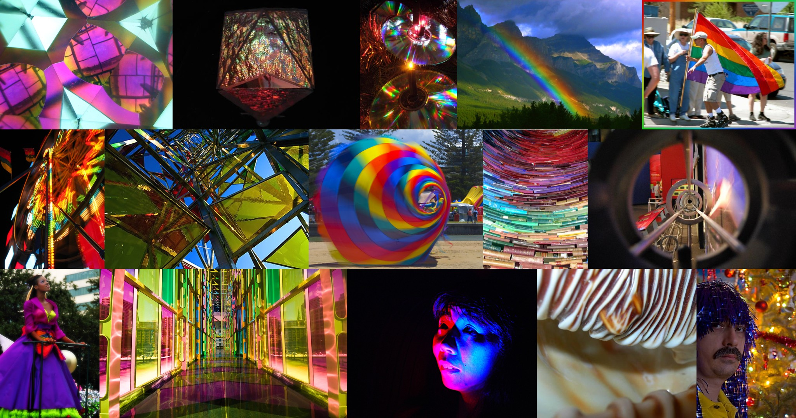

### 🔧 `Read`

```json
{
  "file_path": "/home/wg25r/anti_aesthetics_agent/tmp/grid_69.jpg"
}
```

### 🔧 `mcp__dataset-curation__sample`

```json
{
  "query": "prism rainbow color refraction edge fringing photograph",
  "min_threshold": "0.32",
  "max_threshold": "0.35",
  "count": "10",
  "negative_prompts": "[\"watermark logo text overlay\", \"blank black empty frame\", \"plain white background product\"]",
  "negative_threshold": "0.25"
}
```

**Result:**

Grid image saved at: /home/wg25r/anti_aesthetics_agent/tmp/grid_70.jpg
Use the Read tool to view it.
Sampled 10 from 51 candidates.

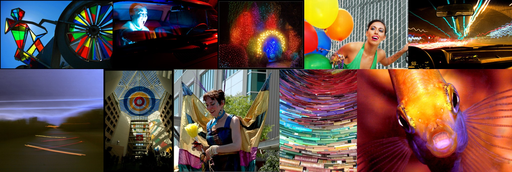

### 🔧 `Read`

```json
{
  "file_path": "/home/wg25r/anti_aesthetics_agent/tmp/grid_70.jpg"
}
```

> **Agent Log:** 0.32-0.35 prism/refraction sample: stained glass figure, blue-lit driver, rainbow stage lights, balloons girl, RGB-shifted car interior trails, motion blur lights, atrium with target art, stilt performer, multicolor wood, parrotfish. Real chromatic separation in driver/light streak shots. Will commit at 0.33.

**Result:**

Logged.

### 🔧 `mcp__dataset-curation__commit`

```json
{
  "query": "prism rainbow color refraction edge fringing photograph",
  "threshold": "0.33",
  "negative_prompts": "[\"watermark logo text overlay\", \"blank black empty frame\", \"plain white background product\"]",
  "negative_threshold": "0.25",
  "message": "anti-aesthetic / color_and_tone / chromatic_aberration — prism/rainbow refraction, RGB color separation"
}
```

**Result:**

Committed with ID: 3e1bf2cf, message: anti-aesthetic / color_and_tone / chromatic_aberration — prism/rainbow refraction, RGB color separation with 24 images.

### 🔧 `TodoWrite`

```json
{
  "todos": [
    {
      "content": "Curate clashing_disharmony sub-element",
      "activeForm": "Curating clashing_disharmony",
      "status": "completed"
    },
    {
      "content": "Curate chromatic_aberration sub-element",
      "activeForm": "Curating chromatic_aberration",
      "status": "completed"
    },
    {
      "content": "Curate muted_faded sub-element",
      "activeForm": "Curating muted_faded",
      "status": "completed"
    },
    {
      "content": "Curate sickly_cast sub-element",
      "activeForm": "Curating sickly_cast",
      "status": "completed"
    },
    {
      "content": "Curate color_inconsistency sub-element",
      "activeForm": "Curating color_inconsistency",
      "status": "completed"
    },
    {
      "content": "Top up chromatic_aberration with one more query",
      "activeForm": "Adding extra chromatic_aberration commit",
      "status": "completed"
    },
    {
      "content": "Final status review",
      "activeForm": "Final status review",
      "status": "in_progress"
    }
  ]
}
```

### 🔧 `mcp__dataset-curation__status`

```json
{}
```

**Result:**

Total commits: 41, Total images: 2938

Commit History:
- [49556fff] anti-aesthetic / clarity_and_focus / intentional_blur: motion blur, long exposure subject motion - artistic streaks and dynamic blur (453 images)
- [e7c8a3b2] anti-aesthetic / clarity_and_focus / intentional_blur: ICM intentional camera movement, painterly abstract blur (145 images)
- [6edce575] anti-aesthetic / clarity_and_focus / intentional_blur: soft focus dreamy defocused portraits (37 images)
- [e538b4bd] anti-aesthetic / clarity_and_focus / double_exposure: ghostly overlapping portraits, multi-exposure (71 images)
- [db320845] anti-aesthetic / clarity_and_focus / double_exposure: multiple exposure layered scenes (91 images)
- [46aeca04] anti-aesthetic / clarity_and_focus / film_artifacts: heavy 35mm grain, noise textures, gritty analog (33 images)
- [30733dfe] anti-aesthetic / clarity_and_focus / film_artifacts: light leaks, halation, overexposed film (182 images)
- [843d0233] anti-aesthetic / clarity_and_focus / film_artifacts: scratched, dusty, damaged emulsion textures (39 images)
- [99abbffb] anti-aesthetic / clarity_and_focus / film_artifacts: expired film color shifts, faded vintage snapshots (47 images)
- [fe12cb42] anti-aesthetic / clarity_and_focus / analog_degradation: VHS scanlines, tracking errors, pixel grid distortion (16 images)
- [5475d947] anti-aesthetic / clarity_and_focus / analog_degradation: CRT television static and old TV monitors (17 images)
- [ccd0d7b1] anti-aesthetic / clarity_and_focus / analog_degradation: pixelated retro lo-fi imagery (10 images)
- [157b2975] sub:intentional_blur/motion_blur — anti_aesthetic — panning, ICM, streaked moving subjects (107 images)
- [ca7ce258] sub:intentional_blur/soft_focus — anti_aesthetic — dreamy hazy out-of-focus portraits, vaseline lens, soft veil (66 images)
- [29a37975] sub:intentional_blur/light_trails — anti_aesthetic — long exposure streaks, chaotic light painting, ICM at night (127 images)
- [ed8d18f7] sub:intentional_blur/ICM_abstract — anti_aesthetic — swirl, zoom blur, vertical pan, painterly motion abstraction (103 images)
- [d36e10ff] sub:double_exposure — anti_aesthetic — overlapping ghostly portraits, doubled silhouettes, layered composites (117 images)
- [83ca1dea] sub:film_artifacts/grain — anti_aesthetic — heavy grain, high-ISO noise, push-processed analog texture (32 images)
- [b362b9e5] sub:film_artifacts/light_leak — anti_aesthetic — color casts, lens flare, expired film color shifts (35 images)
- [05e91655] sub:film_artifacts/scratch_decay — anti_aesthetic — scratches, dust spots, chemical stains, tintype/wet-plate degradation (43 images)
- [43c354a7] sub:analog_degradation/VHS_CRT — anti_aesthetic — scanlines, TV static, color bars, pixel grids, retro CRT (87 images)
- [dd9517a3] sub:analog_degradation/faded_polaroid — anti_aesthetic — sepia, yellowing, faded snapshots, browned old photos (64 images)
- [7d211c3a] sub:digital_artifacts/glitch — anti_aesthetic — pixel sorting, color shifts, datamosh, digital corruption (65 images)
- [bb905390] sub:digital_artifacts/pixelation — anti_aesthetic — pixel mosaic, blocky low-res, color-cell grids (53 images)
- [2095b845] sub:bad_or_no_details/fog_silhouette — anti_aesthetic — figures lost in mist, dissolved silhouettes, monochrome haze (52 images)
- [7ee50414] sub:bad_or_no_details/smeared_face — anti_aesthetic — dissolved portraits, featureless faces, painterly distortions (76 images)
- [582d360f] anti-aesthetic / color_and_tone / clashing_disharmony — aggressive neon clashes, jarring saturation, unbalanced palettes (28 images)
- [880cfe85] anti-aesthetic / color_and_tone / clashing_disharmony — magenta-green complementary clashes, jarring color pairs (77 images)
- [7124e3ae] anti-aesthetic / color_and_tone / clashing_disharmony — garish toxic color combinations, unsettling palettes (64 images)
- [bf603f85] anti-aesthetic / color_and_tone / chromatic_aberration — halation, light leaks, lo-fi optical color streaks (51 images)
- [ca22e5ef] anti-aesthetic / color_and_tone / chromatic_aberration — vintage cheap-optic look, soft-focus analog distortion (39 images)
- [c7aeea58] anti-aesthetic / color_and_tone / muted_faded — desaturated, dull, washed-out tones (30 images)
- [6b0f3914] anti-aesthetic / color_and_tone / muted_faded — retro film fade, nostalgic melancholy palette (88 images)
- [eed20b20] anti-aesthetic / color_and_tone / muted_faded — overcast monotone gloom, low-vibrancy gray (11 images)
- [585572a5] anti-aesthetic / color_and_tone / sickly_cast — yellow/green sickly tints, jaundice and unhealthy color casts (50 images)
- [33322141] anti-aesthetic / color_and_tone / sickly_cast — sodium vapor street light cast, orange/yellow night tint (52 images)
- [677bcc4c] anti-aesthetic / color_and_tone / sickly_cast — fluorescent cold/green clinical tints, institutional cast (29 images)
- [6f4cb765] anti-aesthetic / color_and_tone / color_inconsistency — mixed white balance interior, dual color temperatures clash (106 images)
- [c7f0ece6] anti-aesthetic / color_and_tone / color_inconsistency — color banding in skies, posterization artifacts (79 images)
- [b43b3935] anti-aesthetic / color_and_tone / color_inconsistency — flash + ambient mixed lighting, harsh uneven exposure (42 images)
- [3e1bf2cf] anti-aesthetic / color_and_tone / chromatic_aberration — prism/rainbow refraction, RGB color separation (24 images)

### 🔧 `TodoWrite`

```json
{
  "todos": [
    {
      "content": "Curate clashing_disharmony sub-element",
      "activeForm": "Curating clashing_disharmony",
      "status": "completed"
    },
    {
      "content": "Curate chromatic_aberration sub-element",
      "activeForm": "Curating chromatic_aberration",
      "status": "completed"
    },
    {
      "content": "Curate muted_faded sub-element",
      "activeForm": "Curating muted_faded",
      "status": "completed"
    },
    {
      "content": "Curate sickly_cast sub-element",
      "activeForm": "Curating sickly_cast",
      "status": "completed"
    },
    {
      "content": "Curate color_inconsistency sub-element",
      "activeForm": "Curating color_inconsistency",
      "status": "completed"
    },
    {
      "content": "Top up chromatic_aberration with one more query",
      "activeForm": "Adding extra chromatic_aberration commit",
      "status": "completed"
    },
    {
      "content": "Final status review",
      "activeForm": "Final status review",
      "status": "completed"
    }
  ]
}
```

> **Agent Log:** FINAL color_and_tone curation summary (14 commits, 770 images total):
- clashing_disharmony: 169 images (neon clashes 28, magenta-green 77, garish toxic 64)
- chromatic_aberration: 114 images (halation/light leaks 51, vintage cheap-optic 39, prism RGB 24)
- muted_faded: 129 images (desaturated 30, retro melancholy 88, overcast monotone 11)
- sickly_cast: 131 images (jaundice tints 50, sodium vapor 52, fluorescent cold 29)
- color_inconsistency: 227 images (mixed WB 106, color banding 79, flash+ambient 42)

All 5 sub-elements covered with sub-element decomposition. Negative prompts limited to orthogonal junk (watermarks, blank/black, plain product). Thresholds chosen per-query based on observed similarity distributions and sample reviews. Anti-aesthetic intent maintained — content selected for jarring/sickly/faded/clashing aesthetics rather than technically broken images.

**Result:**

Logged.

Curation complete for `anti_aesthetics / color_and_tone`. Across 14 new commits, 770 images were added to the dataset, distributed across all 5 sub-elements:

| Sub-element | Images | Sub-queries |
|---|---|---|
| clashing_disharmony | 169 | aggressive neon, magenta-green complements, garish toxic combos |
| chromatic_aberration | 114 | halation/light leaks, vintage cheap-optic look, prism/RGB refraction |
| muted_faded | 129 | desaturated/dull, retro melancholy, overcast monotone |
| sickly_cast | 131 | jaundice yellow-green, sodium vapor, fluorescent clinical |
| color_inconsistency | 227 | mixed white balance, sky banding, flash+ambient mixing |

Methodology highlights:
- Each sub-element was decomposed into 2–3 distinct visual queries and committed separately for fine-grained traceability.
- Thresholds were picked per-query from `search` similarity distributions and `sample` previews — not a fixed default. Ranged from 0.295 (overcast monotone, low absolute scores) to 0.355 (clashing neon, top of distribution).
- Negative prompts were strictly orthogonal junk (`watermark/text`, `blank/black frame`, `plain white product`) — never used "ugly" or "low quality" in a way that would force conventional aesthetics.
- Anti-aesthetic intent preserved: content was selected for jarring/sickly/faded color qualities as deliberate visual choices, not for technical brokenness.


---
*Finished: 2026-05-08T11:54:53.800193*
