# anti_aesthetics:lighting_and_exposure

*Started: 2026-05-08T11:54:53.803218*

## Task

```
main_type: anti_aesthetics, sub_type: lighting_and_exposure - {"exposure_extremes": "Deliberate underexposure or overexposure that crushes shadows or blows out highlights beyond conventional recovery, used to create mood, abstraction, or graphic simplification.", "light_leak": "Unintended or simulated streaks of light washing over parts of the image, evoking analog film housing defects as a marker of lo-fi authenticity.", "flat_lighting": "Absence of directional light, shadows, or highlights that collapses depth and dimension into a cardboard-like surface, used deliberately for graphic or melancholic effect.", "harsh_or_insufficient_flash": "Flash lighting that is either aggressively harsh with hard shadows and specular hotspots, or insufficient and murky, both used to evoke snapshot aesthetics or unflattering documentary realism.", "low_contrast_oppressive": "Crushed midtones with weak separation between light and dark, producing a heavy, suffocating atmosphere across the entire frame."}
```

### 🔧 `ToolSearch`

```json
{
  "query": "select:mcp__dataset-curation__init,mcp__dataset-curation__search,mcp__dataset-curation__sample,mcp__dataset-curation__commit,mcp__dataset-curation__status,mcp__dataset-curation__undo_commit,mcp__dataset-curation__sample_from_committed,mcp__dataset-curation__log_actions",
  "max_results": 10
}
```

### 🔧 `mcp__dataset-curation__init`

```json
{}
```

**Result:**

Already initialized.

> **Agent Log:** Plan for anti_aesthetics > lighting_and_exposure curation:

The goal is to curate images showing deliberately bad/unconventional lighting and exposure as legitimate artistic expression, not technical failures. Wide-spectrum aesthetics — embrace harsh, ugly, mood-driven lighting.

Sub-elements to explore (starting from reference list, but I'll expand):
1. Exposure extremes — crushed shadows / blown highlights
   - Underexposed silhouettes against bright sky
   - Overexposed white-out / blown sky
   - High-contrast graphic black-and-white
   - Pure shadow with tiny highlight
2. Light leak — analog film defects
   - Red/orange light leak streaks
   - Film burn / sprocket holes light
   - Lomography style overlap leaks
3. Flat lighting — no shadows, depth-collapsed
   - Overcast gray flat scenes
   - Studio flat front lighting
   - Diffuse fog flat tone
4. Harsh / insufficient flash
   - Direct flash snapshot, red-eye
   - Hard flash shadows on walls
   - Murky underexposed flash interiors
   - Party / paparazzi flash aesthetics
5. Low-contrast oppressive
   - Muddy midtones, gray-on-gray
   - Heavy fog / smog suffocating
   - Brown/sepia heavy filter
6. Possible expansions:
   - Lens flare overload
   - Mixed color temperature clashes (sodium vapor + fluorescent)
   - Backlit silhouettes obscuring subjects
   - Night photography with extreme noise
   - Strong single-source dramatic chiaroscuro pushed to abstraction

Approach: start broad with each sub-element, refine via search→sample→commit cycles. Use negative prompts for watermarks/text/empty frames. Threshold per query based on observed distribution.

**Result:**

Logged.

### 🔧 `mcp__dataset-curation__search`

```json
{
  "query": "extreme overexposure blown out highlights white sky photograph",
  "negative_prompts": "[\"watermark text logo caption\", \"blank empty frame solid color\", \"stock photo studio product\"]",
  "negative_threshold": "0.5",
  "t": "10"
}
```

**Result:**

Grid image saved at: /home/wg25r/anti_aesthetics_agent/tmp/grid_71.jpg
Use the Read tool to view it.
Showing top 10 results for 'extreme overexposure blown out highlights white sky photograph' in photos.
Top-10 scores: [0.4118, 0.3966, 0.3962, 0.3946, 0.3934, 0.3934, 0.3885, 0.3863, 0.3852, 0.3852]
Similarity distribution: counts=[51, 1463, 15632, 62353, 96504, 60203, 16746, 2342, 201, 13], bins=[0.112, 0.142, 0.172, 0.202, 0.232, 0.262, 0.292, 0.322, 0.352, 0.382, 0.412]

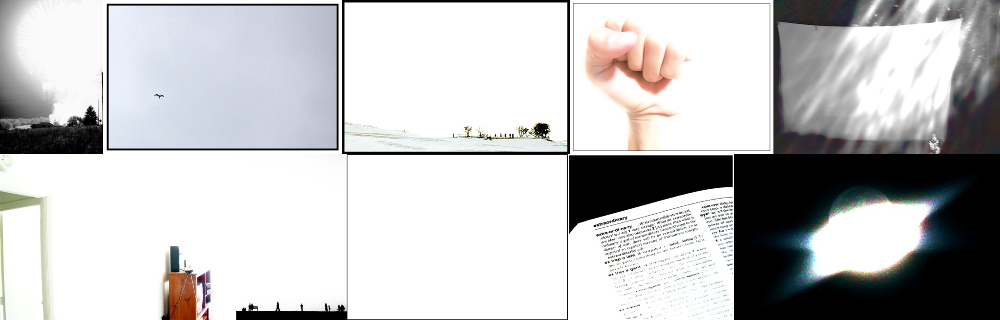

### 🔧 `Read`

```json
{
  "file_path": "/home/wg25r/anti_aesthetics_agent/tmp/grid_71.jpg"
}
```

> **Agent Log:** Search for overexposure returned top scores 0.41. Some images are pure white/empty (less useful), others show overexposed landscapes with silhouettes (good anti-aesthetic — graphic minimalism via blown highlights). One has dictionary text. Need to sample mid-high range to find content-rich overexposed images.

**Result:**

Logged.

### 🔧 `mcp__dataset-curation__sample`

```json
{
  "query": "extreme overexposure blown out highlights white sky photograph",
  "min_threshold": "0.36",
  "max_threshold": "0.40",
  "count": "8",
  "negative_prompts": "[\"watermark text logo caption\", \"blank empty pure white frame nothing visible\"]",
  "negative_threshold": "0.5"
}
```

**Result:**

Grid image saved at: /home/wg25r/anti_aesthetics_agent/tmp/grid_72.jpg
Use the Read tool to view it.
Sampled 8 from 100 candidates.

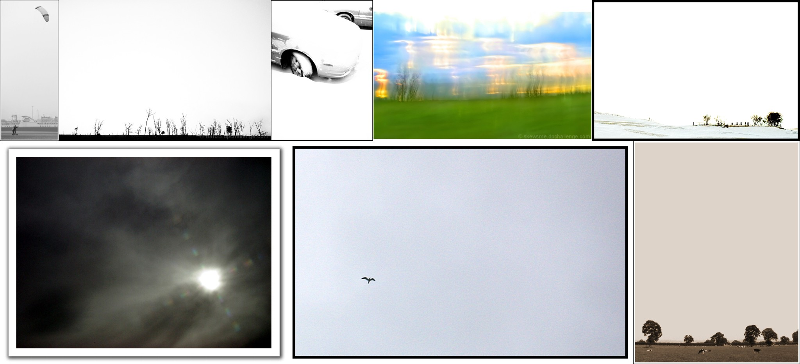

### 🔧 `Read`

```json
{
  "file_path": "/home/wg25r/anti_aesthetics_agent/tmp/grid_72.jpg"
}
```

Sampled images: silhouetted trees against blown white sky, foggy moon/sun blast in dark frame, motion-blurred overexposed landscape, snowy car fragment with blown background, minimal bird against gray sky. Good anti-aesthetic content using deliberate exposure extremes for graphic minimalism.

> **Agent Log:** Sample at 0.36-0.40 shows mostly good content: silhouettes against blown skies, fog/sun blast, blurry overexposed landscape, minimal compositions. Some are very plain. Will commit at 0.36 to capture this anti-aesthetic exposure-extreme cluster.

**Result:**

Logged.

### 🔧 `ToolSearch`

```json
{
  "query": "select:TodoWrite",
  "max_results": 1
}
```

### 🔧 `TodoWrite`

```json
{
  "todos": [
    {
      "content": "Curate exposure extremes (overexposure/underexposure)",
      "activeForm": "Curating exposure extremes",
      "status": "in_progress"
    },
    {
      "content": "Curate light leak / film burn",
      "activeForm": "Curating light leaks",
      "status": "pending"
    },
    {
      "content": "Curate flat lighting (no shadows, depth-collapsed)",
      "activeForm": "Curating flat lighting",
      "status": "pending"
    },
    {
      "content": "Curate harsh / insufficient flash",
      "activeForm": "Curating harsh flash",
      "status": "pending"
    },
    {
      "content": "Curate low-contrast oppressive atmosphere",
      "activeForm": "Curating low-contrast oppressive",
      "status": "pending"
    },
    {
      "content": "Curate mixed color temperature lighting clashes",
      "activeForm": "Curating color temp clashes",
      "status": "pending"
    },
    {
      "content": "Curate harsh chiaroscuro / extreme single-source lighting",
      "activeForm": "Curating chiaroscuro",
      "status": "pending"
    },
    {
      "content": "Curate lens flare overload",
      "activeForm": "Curating lens flare",
      "status": "pending"
    },
    {
      "content": "Curate backlit silhouettes obscuring subjects",
      "activeForm": "Curating backlit silhouettes",
      "status": "pending"
    },
    {
      "content": "Review final dataset composition with status()",
      "activeForm": "Reviewing dataset composition",
      "status": "pending"
    }
  ]
}
```

### 🔧 `mcp__dataset-curation__commit`

```json
{
  "query": "extreme overexposure blown out highlights white sky photograph",
  "threshold": "0.36",
  "negative_prompts": "[\"watermark text logo caption\", \"blank empty pure white frame nothing visible\"]",
  "negative_threshold": "0.5",
  "message": "anti_aesthetics/lighting: exposure extremes — overexposed/blown highlights, silhouettes against white sky, washed-out high-key minimalism"
}
```

**Result:**

Committed with ID: f1ce7ef8, message: anti_aesthetics/lighting: exposure extremes — overexposed/blown highlights, silhouettes against white sky, washed-out high-key minimalism with 101 images.

### 🔧 `mcp__dataset-curation__search`

```json
{
  "query": "severely underexposed dark photo crushed shadows black murky",
  "negative_prompts": "[\"watermark text caption logo\", \"completely black empty frame solid color\", \"studio product shot\"]",
  "negative_threshold": "0.5",
  "t": "10"
}
```

**Result:**

Grid image saved at: /home/wg25r/anti_aesthetics_agent/tmp/grid_73.jpg
Use the Read tool to view it.
Showing top 10 results for 'severely underexposed dark photo crushed shadows black murky' in photos.
Top-10 scores: [0.3735, 0.3697, 0.3688, 0.3670, 0.3641, 0.3603, 0.3598, 0.3592, 0.3589, 0.3586]
Similarity distribution: counts=[34, 1130, 15222, 57381, 85110, 63974, 26105, 5785, 727, 40], bins=[0.103, 0.130, 0.157, 0.184, 0.211, 0.238, 0.265, 0.292, 0.319, 0.347, 0.374]

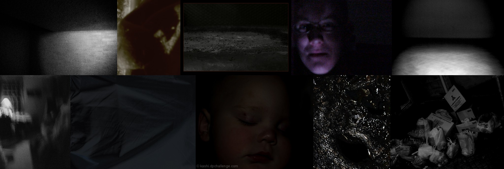

### 🔧 `Read`

```json
{
  "file_path": "/home/wg25r/anti_aesthetics_agent/tmp/grid_73.jpg"
}
```

### 🔧 `mcp__dataset-curation__sample`

```json
{
  "query": "severely underexposed dark photo crushed shadows black murky",
  "min_threshold": "0.32",
  "max_threshold": "0.36",
  "count": "8",
  "negative_prompts": "[\"watermark text caption logo\", \"completely black empty frame nothing visible\"]",
  "negative_threshold": "0.5"
}
```

**Result:**

Grid image saved at: /home/wg25r/anti_aesthetics_agent/tmp/grid_74.jpg
Use the Read tool to view it.
Sampled 8 from 722 candidates.

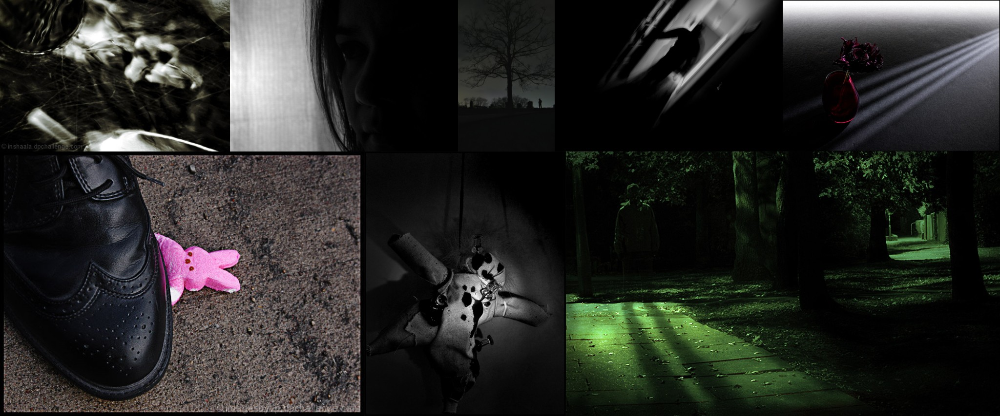

### 🔧 `Read`

```json
{
  "file_path": "/home/wg25r/anti_aesthetics_agent/tmp/grid_74.jpg"
}
```

> **Agent Log:** Underexposure sample at 0.32-0.36: half-shadowed face, dark trees, motion-blurred figure, eerie green-lit path with dark figure, shoe stepping on pink bunny, hanging dark objects. Strong anti-aesthetic content — mood and unease via crushed shadows. Will commit at 0.32.

**Result:**

Logged.

### 🔧 `mcp__dataset-curation__commit`

```json
{
  "query": "severely underexposed dark photo crushed shadows black murky",
  "threshold": "0.32",
  "negative_prompts": "[\"watermark text caption logo\", \"completely black empty frame nothing visible\"]",
  "negative_threshold": "0.5",
  "message": "anti_aesthetics/lighting: exposure extremes — severe underexposure, crushed shadows, dark murky atmosphere, mood-driven black tones"
}
```

**Result:**

Committed with ID: 2334b675, message: anti_aesthetics/lighting: exposure extremes — severe underexposure, crushed shadows, dark murky atmosphere, mood-driven black tones with 728 images.

> **Agent Log:** 728 images in a single underexposure commit is too many — would dominate dataset. Will undo and re-commit at a higher threshold to keep proportions balanced across sub-elements.

**Result:**

Logged.

### 🔧 `mcp__dataset-curation__undo_commit`

```json
{
  "commit_id": "2334b675"
}
```

**Result:**

Removed commit 2334b675: anti_aesthetics/lighting: exposure extremes — severe underexposure, crushed shadows, dark murky atmosphere, mood-driven black tones with 728 images.

### 🔧 `mcp__dataset-curation__commit`

```json
{
  "query": "severely underexposed dark photo crushed shadows black murky",
  "threshold": "0.34",
  "negative_prompts": "[\"watermark text caption logo\", \"completely black empty frame nothing visible\"]",
  "negative_threshold": "0.5",
  "message": "anti_aesthetics/lighting: exposure extremes — severe underexposure, crushed shadows, dark murky atmosphere, mood-driven black tones"
}
```

**Result:**

Committed with ID: e2908468, message: anti_aesthetics/lighting: exposure extremes — severe underexposure, crushed shadows, dark murky atmosphere, mood-driven black tones with 86 images.

### 🔧 `TodoWrite`

```json
{
  "todos": [
    {
      "content": "Curate exposure extremes (overexposure/underexposure)",
      "activeForm": "Curating exposure extremes",
      "status": "completed"
    },
    {
      "content": "Curate light leak / film burn",
      "activeForm": "Curating light leaks",
      "status": "in_progress"
    },
    {
      "content": "Curate flat lighting (no shadows, depth-collapsed)",
      "activeForm": "Curating flat lighting",
      "status": "pending"
    },
    {
      "content": "Curate harsh / insufficient flash",
      "activeForm": "Curating harsh flash",
      "status": "pending"
    },
    {
      "content": "Curate low-contrast oppressive atmosphere",
      "activeForm": "Curating low-contrast oppressive",
      "status": "pending"
    },
    {
      "content": "Curate mixed color temperature lighting clashes",
      "activeForm": "Curating color temp clashes",
      "status": "pending"
    },
    {
      "content": "Curate harsh chiaroscuro / extreme single-source lighting",
      "activeForm": "Curating chiaroscuro",
      "status": "pending"
    },
    {
      "content": "Curate lens flare overload",
      "activeForm": "Curating lens flare",
      "status": "pending"
    },
    {
      "content": "Curate backlit silhouettes obscuring subjects",
      "activeForm": "Curating backlit silhouettes",
      "status": "pending"
    },
    {
      "content": "Review final dataset composition with status()",
      "activeForm": "Reviewing dataset composition",
      "status": "pending"
    }
  ]
}
```

### 🔧 `mcp__dataset-curation__search`

```json
{
  "query": "analog film light leak orange red streak burn lomography",
  "negative_prompts": "[\"watermark text caption logo signature\", \"stock photo studio product clean\"]",
  "negative_threshold": "0.5",
  "t": "10"
}
```

**Result:**

Grid image saved at: /home/wg25r/anti_aesthetics_agent/tmp/grid_75.jpg
Use the Read tool to view it.
Showing top 10 results for 'analog film light leak orange red streak burn lomography' in photos.
Top-10 scores: [0.4443, 0.4378, 0.4373, 0.4351, 0.4345, 0.4314, 0.4313, 0.4313, 0.4299, 0.4298]
Similarity distribution: counts=[71, 2218, 26173, 82366, 86861, 42143, 12530, 2705, 395, 46], bins=[0.148, 0.177, 0.207, 0.237, 0.266, 0.296, 0.326, 0.355, 0.385, 0.415, 0.444]

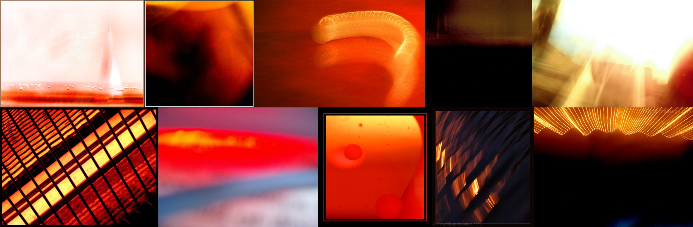

### 🔧 `Read`

```json
{
  "file_path": "/home/wg25r/anti_aesthetics_agent/tmp/grid_75.jpg"
}
```

> **Agent Log:** Light leak query returned mostly orange/red abstract closeups rather than authentic film light leaks. Need more specific phrasing — focus on the streak/flare across image edge characteristic of film housing defects.

**Result:**

Logged.

### 🔧 `mcp__dataset-curation__search`

```json
{
  "query": "vintage photograph with light leak streaks across edge film burn artifact lo-fi",
  "negative_prompts": "[\"watermark text caption signature logo\", \"abstract macro closeup texture nothing recognizable\"]",
  "negative_threshold": "0.5",
  "t": "10"
}
```

**Result:**

Grid image saved at: /home/wg25r/anti_aesthetics_agent/tmp/grid_76.jpg
Use the Read tool to view it.
Showing top 10 results for 'vintage photograph with light leak streaks across edge film burn artifact lo-fi' in photos.
Top-10 scores: [0.4454, 0.4308, 0.4208, 0.4153, 0.4102, 0.4066, 0.4047, 0.4027, 0.4025, 0.4018]
Similarity distribution: counts=[195, 5999, 45656, 96714, 77379, 25034, 3971, 512, 44, 4], bins=[0.137, 0.168, 0.199, 0.230, 0.260, 0.291, 0.322, 0.353, 0.384, 0.415, 0.445]

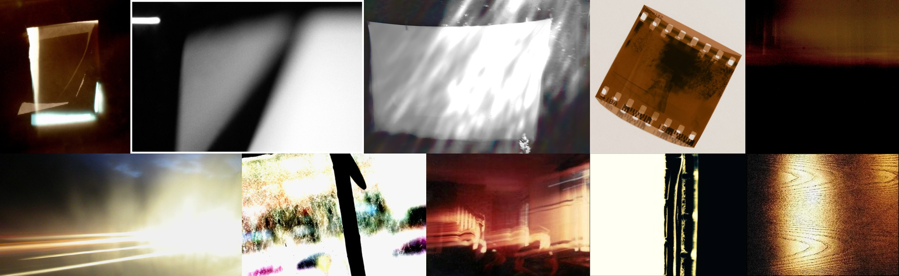

### 🔧 `Read`

```json
{
  "file_path": "/home/wg25r/anti_aesthetics_agent/tmp/grid_76.jpg"
}
```

### 🔧 `mcp__dataset-curation__sample`

```json
{
  "query": "vintage photograph with light leak streaks across edge film burn artifact lo-fi",
  "min_threshold": "0.36",
  "max_threshold": "0.40",
  "count": "8",
  "negative_prompts": "[\"watermark text caption signature logo\", \"abstract macro closeup texture nothing recognizable\"]",
  "negative_threshold": "0.5"
}
```

**Result:**

Grid image saved at: /home/wg25r/anti_aesthetics_agent/tmp/grid_77.jpg
Use the Read tool to view it.
Sampled 8 from 311 candidates.

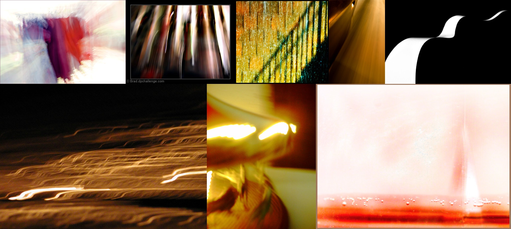

### 🔧 `Read`

```json
{
  "file_path": "/home/wg25r/anti_aesthetics_agent/tmp/grid_77.jpg"
}
```

> **Agent Log:** Light leak sample at 0.36-0.40 mixed: some real light streaks/blurs, some abstract macros. Will commit at 0.38 to focus on stronger matches.

**Result:**

Logged.

### 🔧 `mcp__dataset-curation__commit`

```json
{
  "query": "vintage photograph with light leak streaks across edge film burn artifact lo-fi",
  "threshold": "0.38",
  "negative_prompts": "[\"watermark text caption signature logo\", \"abstract macro closeup texture nothing recognizable\"]",
  "negative_threshold": "0.5",
  "message": "anti_aesthetics/lighting: light leak — film burn streaks, analog defects, motion-blur light trails, lo-fi authenticity"
}
```

**Result:**

Committed with ID: 0df2befd, message: anti_aesthetics/lighting: light leak — film burn streaks, analog defects, motion-blur light trails, lo-fi authenticity with 68 images.

### 🔧 `TodoWrite`

```json
{
  "todos": [
    {
      "content": "Curate exposure extremes (overexposure/underexposure)",
      "activeForm": "Curating exposure extremes",
      "status": "completed"
    },
    {
      "content": "Curate light leak / film burn",
      "activeForm": "Curating light leaks",
      "status": "completed"
    },
    {
      "content": "Curate flat lighting (no shadows, depth-collapsed)",
      "activeForm": "Curating flat lighting",
      "status": "in_progress"
    },
    {
      "content": "Curate harsh / insufficient flash",
      "activeForm": "Curating harsh flash",
      "status": "pending"
    },
    {
      "content": "Curate low-contrast oppressive atmosphere",
      "activeForm": "Curating low-contrast oppressive",
      "status": "pending"
    },
    {
      "content": "Curate mixed color temperature lighting clashes",
      "activeForm": "Curating color temp clashes",
      "status": "pending"
    },
    {
      "content": "Curate harsh chiaroscuro / extreme single-source lighting",
      "activeForm": "Curating chiaroscuro",
      "status": "pending"
    },
    {
      "content": "Curate lens flare overload",
      "activeForm": "Curating lens flare",
      "status": "pending"
    },
    {
      "content": "Curate backlit silhouettes obscuring subjects",
      "activeForm": "Curating backlit silhouettes",
      "status": "pending"
    },
    {
      "content": "Review final dataset composition with status()",
      "activeForm": "Reviewing dataset composition",
      "status": "pending"
    }
  ]
}
```

### 🔧 `mcp__dataset-curation__search`

```json
{
  "query": "overcast gray flat lighting dull cloudy day no shadows depth collapsed",
  "negative_prompts": "[\"watermark text caption signature logo\", \"vibrant saturated colorful sunny\", \"studio product\"]",
  "negative_threshold": "0.5",
  "t": "10"
}
```

**Result:**

Grid image saved at: /home/wg25r/anti_aesthetics_agent/tmp/grid_78.jpg
Use the Read tool to view it.
Showing top 10 results for 'overcast gray flat lighting dull cloudy day no shadows depth collapsed' in photos.
Top-10 scores: [0.4826, 0.4248, 0.4203, 0.4187, 0.4180, 0.4163, 0.4156, 0.4154, 0.4131, 0.4130]
Similarity distribution: counts=[67, 2747, 39028, 108128, 80904, 21932, 2518, 176, 7, 1], bins=[0.146, 0.179, 0.213, 0.247, 0.280, 0.314, 0.348, 0.382, 0.415, 0.449, 0.483]

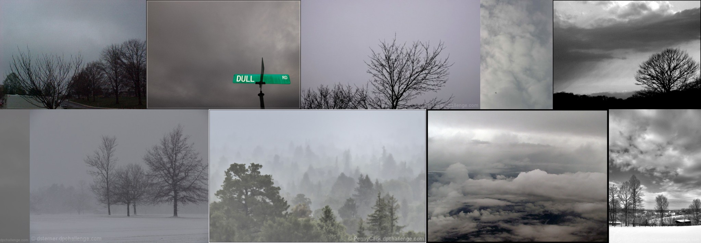

### 🔧 `Read`

```json
{
  "file_path": "/home/wg25r/anti_aesthetics_agent/tmp/grid_78.jpg"
}
```

### 🔧 `mcp__dataset-curation__sample`

```json
{
  "query": "overcast gray flat lighting dull cloudy day no shadows depth collapsed",
  "min_threshold": "0.36",
  "max_threshold": "0.40",
  "count": "8",
  "negative_prompts": "[\"watermark text caption signature logo\", \"vibrant saturated colorful sunny scene\"]",
  "negative_threshold": "0.5"
}
```

**Result:**

Grid image saved at: /home/wg25r/anti_aesthetics_agent/tmp/grid_79.jpg
Use the Read tool to view it.
Sampled 8 from 1018 candidates.

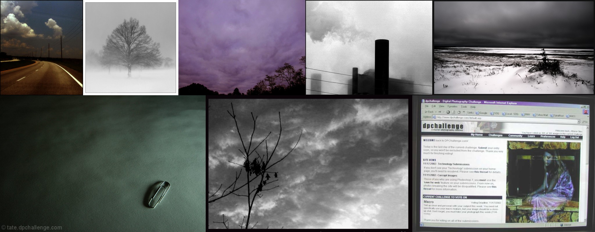

### 🔧 `Read`

```json
{
  "file_path": "/home/wg25r/anti_aesthetics_agent/tmp/grid_79.jpg"
}
```

> **Agent Log:** Flat lighting sample shows good content: foggy/overcast scenes, cloudy skies, bleak winter landscapes. One screenshot of website (text-heavy) — negative prompt should help. 1018 candidates at 0.36 is too many; will commit at higher threshold ~0.39.

**Result:**

Logged.

### 🔧 `mcp__dataset-curation__commit`

```json
{
  "query": "overcast gray flat lighting dull cloudy day no shadows depth collapsed",
  "threshold": "0.39",
  "negative_prompts": "[\"watermark text caption signature logo screenshot\", \"vibrant saturated colorful sunny scene\"]",
  "negative_threshold": "0.45",
  "message": "anti_aesthetics/lighting: flat lighting — overcast gray, foggy collapsed depth, dull cloudy atmosphere, monotone bleakness"
}
```

**Result:**

Committed with ID: e3a36d0d, message: anti_aesthetics/lighting: flat lighting — overcast gray, foggy collapsed depth, dull cloudy atmosphere, monotone bleakness with 93 images.

### 🔧 `mcp__dataset-curation__search`

```json
{
  "query": "flat frontal lighting cardboard depthless shadowless portrait",
  "negative_prompts": "[\"watermark text caption signature logo\", \"dramatic lighting strong shadows chiaroscuro\"]",
  "negative_threshold": "0.5",
  "t": "10"
}
```

**Result:**

Grid image saved at: /home/wg25r/anti_aesthetics_agent/tmp/grid_80.jpg
Use the Read tool to view it.
Showing top 10 results for 'flat frontal lighting cardboard depthless shadowless portrait' in photos.
Top-10 scores: [0.4546, 0.4542, 0.4522, 0.4512, 0.4484, 0.4479, 0.4479, 0.4416, 0.4398, 0.4392]
Similarity distribution: counts=[322, 8561, 55062, 91741, 64029, 25113, 8308, 1996, 346, 30], bins=[0.199, 0.224, 0.250, 0.275, 0.301, 0.327, 0.352, 0.378, 0.403, 0.429, 0.455]

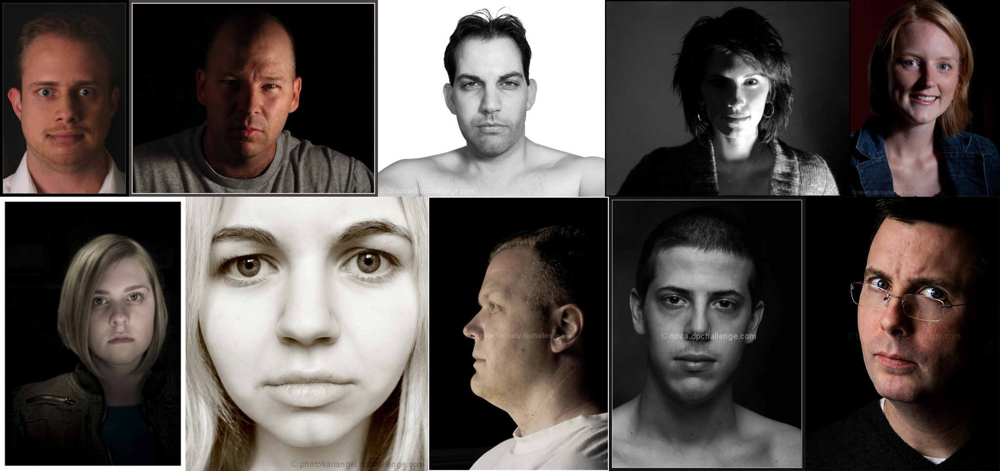

### 🔧 `Read`

```json
{
  "file_path": "/home/wg25r/anti_aesthetics_agent/tmp/grid_80.jpg"
}
```

> **Agent Log:** Frontal flat lighting query mostly returned conventional studio portraits, not really flat-lit. Skip this commit. Try a different angle: institutional/fluorescent fluorescent flat lighting in unflattering interior settings.

**Result:**

Logged.

### 🔧 `mcp__dataset-curation__search`

```json
{
  "query": "fluorescent overhead lighting institutional office interior unflattering harsh",
  "negative_prompts": "[\"watermark text caption signature logo\", \"outdoor sunny natural light landscape\"]",
  "negative_threshold": "0.5",
  "t": "10"
}
```

**Result:**

Grid image saved at: /home/wg25r/anti_aesthetics_agent/tmp/grid_81.jpg
Use the Read tool to view it.
Showing top 10 results for 'fluorescent overhead lighting institutional office interior unflattering harsh' in photos.
Top-10 scores: [0.4884, 0.4701, 0.4483, 0.4477, 0.4448, 0.4448, 0.4412, 0.4349, 0.4275, 0.4237]
Similarity distribution: counts=[131, 6178, 63891, 120793, 52710, 10554, 1131, 98, 20, 2], bins=[0.093, 0.132, 0.172, 0.211, 0.251, 0.291, 0.330, 0.370, 0.409, 0.449, 0.488]

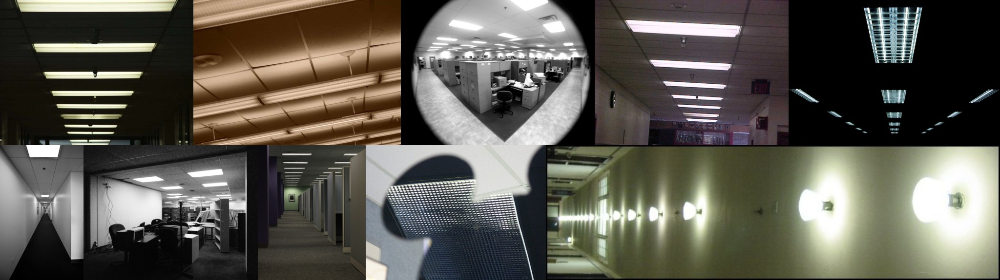

### 🔧 `Read`

```json
{
  "file_path": "/home/wg25r/anti_aesthetics_agent/tmp/grid_81.jpg"
}
```

### 🔧 `mcp__dataset-curation__sample`

```json
{
  "query": "fluorescent overhead lighting institutional office interior unflattering harsh",
  "min_threshold": "0.38",
  "max_threshold": "0.42",
  "count": "8",
  "negative_prompts": "[\"watermark text caption signature logo\", \"outdoor sunny natural light landscape\"]",
  "negative_threshold": "0.5"
}
```

**Result:**

Grid image saved at: /home/wg25r/anti_aesthetics_agent/tmp/grid_82.jpg
Use the Read tool to view it.
Sampled 8 from 59 candidates.

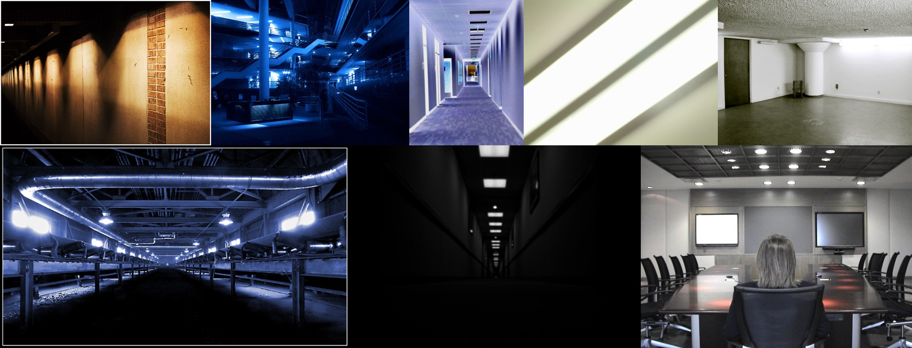

### 🔧 `Read`

```json
{
  "file_path": "/home/wg25r/anti_aesthetics_agent/tmp/grid_82.jpg"
}
```

> **Agent Log:** Sampled flat institutional lighting: brick corridor with fluorescent rows, blue parking garage, white hallway, fluorescent tube closeup, empty room, blue industrial corridor, dark hallway, cold meeting room. All fit anti-aesthetic flat institutional lighting. Will commit at 0.39.

**Result:**

Logged.

### 🔧 `mcp__dataset-curation__commit`

```json
{
  "query": "fluorescent overhead lighting institutional office interior unflattering harsh",
  "threshold": "0.39",
  "negative_prompts": "[\"watermark text caption signature logo\", \"outdoor sunny natural light landscape\"]",
  "negative_threshold": "0.5",
  "message": "anti_aesthetics/lighting: flat lighting — fluorescent institutional interiors, depressing offices/corridors, depthless cold light"
}
```

**Result:**

Committed with ID: 2dfa756e, message: anti_aesthetics/lighting: flat lighting — fluorescent institutional interiors, depressing offices/corridors, depthless cold light with 46 images.

### 🔧 `TodoWrite`

```json
{
  "todos": [
    {
      "content": "Curate exposure extremes (overexposure/underexposure)",
      "activeForm": "Curating exposure extremes",
      "status": "completed"
    },
    {
      "content": "Curate light leak / film burn",
      "activeForm": "Curating light leaks",
      "status": "completed"
    },
    {
      "content": "Curate flat lighting (no shadows, depth-collapsed)",
      "activeForm": "Curating flat lighting",
      "status": "completed"
    },
    {
      "content": "Curate harsh / insufficient flash",
      "activeForm": "Curating harsh flash",
      "status": "in_progress"
    },
    {
      "content": "Curate low-contrast oppressive atmosphere",
      "activeForm": "Curating low-contrast oppressive",
      "status": "pending"
    },
    {
      "content": "Curate mixed color temperature lighting clashes",
      "activeForm": "Curating color temp clashes",
      "status": "pending"
    },
    {
      "content": "Curate harsh chiaroscuro / extreme single-source lighting",
      "activeForm": "Curating chiaroscuro",
      "status": "pending"
    },
    {
      "content": "Curate lens flare overload",
      "activeForm": "Curating lens flare",
      "status": "pending"
    },
    {
      "content": "Curate backlit silhouettes obscuring subjects",
      "activeForm": "Curating backlit silhouettes",
      "status": "pending"
    },
    {
      "content": "Review final dataset composition with status()",
      "activeForm": "Reviewing dataset composition",
      "status": "pending"
    }
  ]
}
```

### 🔧 `mcp__dataset-curation__search`

```json
{
  "query": "direct on-camera flash snapshot harsh shadow red eye unflattering party",
  "negative_prompts": "[\"watermark text caption signature logo\", \"professional studio softbox lighting\"]",
  "negative_threshold": "0.5",
  "t": "10"
}
```

**Result:**

Grid image saved at: /home/wg25r/anti_aesthetics_agent/tmp/grid_83.jpg
Use the Read tool to view it.
Showing top 10 results for 'direct on-camera flash snapshot harsh shadow red eye unflattering party' in photos.
Top-10 scores: [0.4499, 0.4461, 0.4454, 0.4433, 0.4415, 0.4405, 0.4360, 0.4351, 0.4337, 0.4331]
Similarity distribution: counts=[14, 700, 15810, 74968, 92759, 49744, 17129, 3892, 462, 30], bins=[0.154, 0.184, 0.214, 0.243, 0.273, 0.302, 0.332, 0.361, 0.391, 0.420, 0.450]

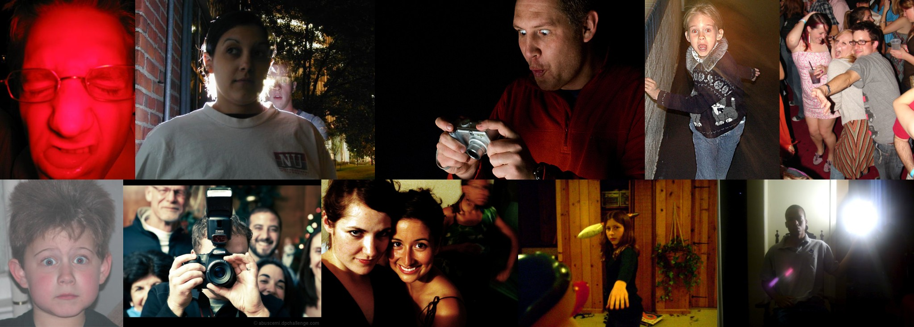

### 🔧 `Read`

```json
{
  "file_path": "/home/wg25r/anti_aesthetics_agent/tmp/grid_83.jpg"
}
```

### 🔧 `mcp__dataset-curation__sample`

```json
{
  "query": "direct on-camera flash snapshot harsh shadow red eye unflattering party",
  "min_threshold": "0.37",
  "max_threshold": "0.41",
  "count": "8",
  "negative_prompts": "[\"watermark text caption signature logo\", \"professional studio softbox lighting\"]",
  "negative_threshold": "0.5"
}
```

**Result:**

Grid image saved at: /home/wg25r/anti_aesthetics_agent/tmp/grid_84.jpg
Use the Read tool to view it.
Sampled 8 from 2406 candidates.

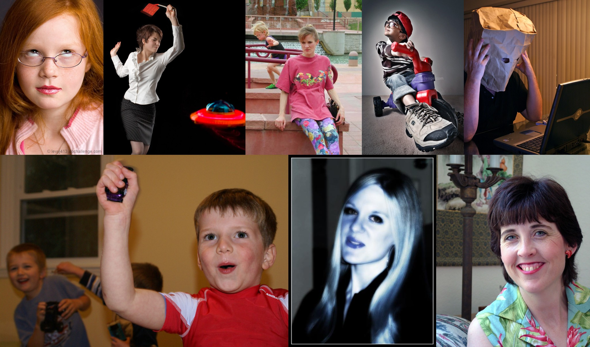

### 🔧 `Read`

```json
{
  "file_path": "/home/wg25r/anti_aesthetics_agent/tmp/grid_84.jpg"
}
```

> **Agent Log:** Flash sample at 0.37-0.41 contains many casual snapshot portraits, some too clean. 2406 candidates is too large. Commit at 0.40.

**Result:**

Logged.

### 🔧 `mcp__dataset-curation__commit`

```json
{
  "query": "direct on-camera flash snapshot harsh shadow red eye unflattering party",
  "threshold": "0.40",
  "negative_prompts": "[\"watermark text caption signature logo\", \"professional studio softbox lighting\"]",
  "negative_threshold": "0.5",
  "message": "anti_aesthetics/lighting: harsh flash — direct on-camera flash, red-eye, party snapshot aesthetic, hard shadows, unflattering documentary realism"
}
```

**Result:**

Committed with ID: 883793c4, message: anti_aesthetics/lighting: harsh flash — direct on-camera flash, red-eye, party snapshot aesthetic, hard shadows, unflattering documentary realism with 208 images.

### 🔧 `TodoWrite`

```json
{
  "todos": [
    {
      "content": "Curate exposure extremes (overexposure/underexposure)",
      "activeForm": "Curating exposure extremes",
      "status": "completed"
    },
    {
      "content": "Curate light leak / film burn",
      "activeForm": "Curating light leaks",
      "status": "completed"
    },
    {
      "content": "Curate flat lighting (no shadows, depth-collapsed)",
      "activeForm": "Curating flat lighting",
      "status": "completed"
    },
    {
      "content": "Curate harsh / insufficient flash",
      "activeForm": "Curating harsh flash",
      "status": "completed"
    },
    {
      "content": "Curate low-contrast oppressive atmosphere",
      "activeForm": "Curating low-contrast oppressive",
      "status": "in_progress"
    },
    {
      "content": "Curate mixed color temperature lighting clashes",
      "activeForm": "Curating color temp clashes",
      "status": "pending"
    },
    {
      "content": "Curate harsh chiaroscuro / extreme single-source lighting",
      "activeForm": "Curating chiaroscuro",
      "status": "pending"
    },
    {
      "content": "Curate lens flare overload",
      "activeForm": "Curating lens flare",
      "status": "pending"
    },
    {
      "content": "Curate backlit silhouettes obscuring subjects",
      "activeForm": "Curating backlit silhouettes",
      "status": "pending"
    },
    {
      "content": "Review final dataset composition with status()",
      "activeForm": "Reviewing dataset composition",
      "status": "pending"
    }
  ]
}
```

### 🔧 `mcp__dataset-curation__search`

```json
{
  "query": "muddy low contrast gray oppressive heavy fog smog suffocating bleak atmosphere",
  "negative_prompts": "[\"watermark text caption signature logo\", \"high contrast bright vibrant clear\"]",
  "negative_threshold": "0.5",
  "t": "10"
}
```

**Result:**

Grid image saved at: /home/wg25r/anti_aesthetics_agent/tmp/grid_85.jpg
Use the Read tool to view it.
Showing top 10 results for 'muddy low contrast gray oppressive heavy fog smog suffocating bleak atmosphere' in photos.
Top-10 scores: [0.4479, 0.4473, 0.4422, 0.4401, 0.4388, 0.4329, 0.4325, 0.4301, 0.4287, 0.4282]
Similarity distribution: counts=[42, 2927, 35185, 96515, 84403, 30300, 5034, 888, 188, 26], bins=[0.147, 0.177, 0.207, 0.238, 0.268, 0.298, 0.328, 0.358, 0.388, 0.418, 0.448]

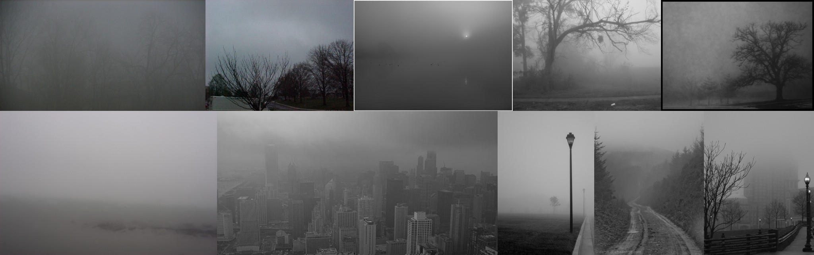

### 🔧 `Read`

```json
{
  "file_path": "/home/wg25r/anti_aesthetics_agent/tmp/grid_85.jpg"
}
```

> **Agent Log:** Oppressive low-contrast top results are ideal: foggy bare trees, smog skyline, gray dirt road in mist, dim streetlight in fog. All gray monotone, suffocating mood. Will commit at 0.39.

**Result:**

Logged.

### 🔧 `mcp__dataset-curation__commit`

```json
{
  "query": "muddy low contrast gray oppressive heavy fog smog suffocating bleak atmosphere",
  "threshold": "0.39",
  "negative_prompts": "[\"watermark text caption signature logo\", \"high contrast bright vibrant clear\"]",
  "negative_threshold": "0.5",
  "message": "anti_aesthetics/lighting: low-contrast oppressive — fog, smog, monotone gray, weak tonal separation, suffocating bleakness"
}
```

**Result:**

Committed with ID: 83315701, message: anti_aesthetics/lighting: low-contrast oppressive — fog, smog, monotone gray, weak tonal separation, suffocating bleakness with 192 images.

### 🔧 `TodoWrite`

```json
{
  "todos": [
    {
      "content": "Curate exposure extremes (overexposure/underexposure)",
      "activeForm": "Curating exposure extremes",
      "status": "completed"
    },
    {
      "content": "Curate light leak / film burn",
      "activeForm": "Curating light leaks",
      "status": "completed"
    },
    {
      "content": "Curate flat lighting (no shadows, depth-collapsed)",
      "activeForm": "Curating flat lighting",
      "status": "completed"
    },
    {
      "content": "Curate harsh / insufficient flash",
      "activeForm": "Curating harsh flash",
      "status": "completed"
    },
    {
      "content": "Curate low-contrast oppressive atmosphere",
      "activeForm": "Curating low-contrast oppressive",
      "status": "completed"
    },
    {
      "content": "Curate mixed color temperature lighting clashes",
      "activeForm": "Curating color temp clashes",
      "status": "in_progress"
    },
    {
      "content": "Curate harsh chiaroscuro / extreme single-source lighting",
      "activeForm": "Curating chiaroscuro",
      "status": "pending"
    },
    {
      "content": "Curate lens flare overload",
      "activeForm": "Curating lens flare",
      "status": "pending"
    },
    {
      "content": "Curate backlit silhouettes obscuring subjects",
      "activeForm": "Curating backlit silhouettes",
      "status": "pending"
    },
    {
      "content": "Review final dataset composition with status()",
      "activeForm": "Reviewing dataset composition",
      "status": "pending"
    }
  ]
}
```

### 🔧 `mcp__dataset-curation__search`

```json
{
  "query": "mixed color temperature sodium vapor orange streetlight clashing fluorescent night urban",
  "negative_prompts": "[\"watermark text caption signature logo\", \"balanced natural daylight\"]",
  "negative_threshold": "0.5",
  "t": "10"
}
```

**Result:**

Grid image saved at: /home/wg25r/anti_aesthetics_agent/tmp/grid_86.jpg
Use the Read tool to view it.
Showing top 10 results for 'mixed color temperature sodium vapor orange streetlight clashing fluorescent night urban' in photos.
Top-10 scores: [0.4713, 0.4477, 0.4472, 0.4443, 0.4440, 0.4429, 0.4428, 0.4427, 0.4424, 0.4422]
Similarity distribution: counts=[28, 2229, 34654, 104047, 80099, 26505, 6529, 1269, 136, 12], bins=[0.132, 0.166, 0.200, 0.233, 0.267, 0.301, 0.335, 0.369, 0.403, 0.437, 0.471]

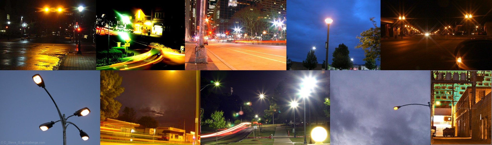

### 🔧 `Read`

```json
{
  "file_path": "/home/wg25r/anti_aesthetics_agent/tmp/grid_86.jpg"
}
```

### 🔧 `mcp__dataset-curation__sample`

```json
{
  "query": "mixed color temperature sodium vapor orange streetlight clashing fluorescent night urban",
  "min_threshold": "0.40",
  "max_threshold": "0.43",
  "count": "6",
  "negative_prompts": "[\"watermark text caption signature logo\", \"balanced natural daylight\"]",
  "negative_threshold": "0.5"
}
```

**Result:**

Grid image saved at: /home/wg25r/anti_aesthetics_agent/tmp/grid_87.jpg
Use the Read tool to view it.
Sampled 6 from 174 candidates.

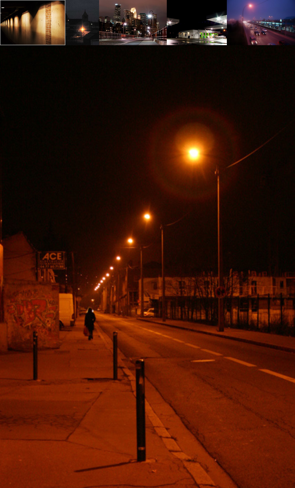

### 🔧 `Read`

```json
{
  "file_path": "/home/wg25r/anti_aesthetics_agent/tmp/grid_87.jpg"
}
```

> **Agent Log:** Sample shows desolate urban night with sodium-orange street lights, lonely figure walking on empty road, distant skyline silhouettes. Strong color-temp clash mood. Will commit at 0.40.

**Result:**

Logged.

### 🔧 `mcp__dataset-curation__commit`

```json
{
  "query": "mixed color temperature sodium vapor orange streetlight clashing fluorescent night urban",
  "threshold": "0.40",
  "negative_prompts": "[\"watermark text caption signature logo\", \"balanced natural daylight\"]",
  "negative_threshold": "0.5",
  "message": "anti_aesthetics/lighting: mixed color temp — sodium vapor orange vs blue twilight, clashing artificial light sources, desolate urban night"
}
```

**Result:**

Committed with ID: ff7de4fc, message: anti_aesthetics/lighting: mixed color temp — sodium vapor orange vs blue twilight, clashing artificial light sources, desolate urban night with 192 images.

### 🔧 `TodoWrite`

```json
{
  "todos": [
    {
      "content": "Curate exposure extremes (overexposure/underexposure)",
      "activeForm": "Curating exposure extremes",
      "status": "completed"
    },
    {
      "content": "Curate light leak / film burn",
      "activeForm": "Curating light leaks",
      "status": "completed"
    },
    {
      "content": "Curate flat lighting (no shadows, depth-collapsed)",
      "activeForm": "Curating flat lighting",
      "status": "completed"
    },
    {
      "content": "Curate harsh / insufficient flash",
      "activeForm": "Curating harsh flash",
      "status": "completed"
    },
    {
      "content": "Curate low-contrast oppressive atmosphere",
      "activeForm": "Curating low-contrast oppressive",
      "status": "completed"
    },
    {
      "content": "Curate mixed color temperature lighting clashes",
      "activeForm": "Curating color temp clashes",
      "status": "completed"
    },
    {
      "content": "Curate harsh chiaroscuro / extreme single-source lighting",
      "activeForm": "Curating chiaroscuro",
      "status": "in_progress"
    },
    {
      "content": "Curate lens flare overload",
      "activeForm": "Curating lens flare",
      "status": "pending"
    },
    {
      "content": "Curate backlit silhouettes obscuring subjects",
      "activeForm": "Curating backlit silhouettes",
      "status": "pending"
    },
    {
      "content": "Review final dataset composition with status()",
      "activeForm": "Reviewing dataset composition",
      "status": "pending"
    }
  ]
}
```

### 🔧 `mcp__dataset-curation__search`

```json
{
  "query": "extreme harsh chiaroscuro single light source dramatic black abstract shadow",
  "negative_prompts": "[\"watermark text caption signature logo\", \"soft diffuse even lighting\"]",
  "negative_threshold": "0.5",
  "t": "10"
}
```

**Result:**

Grid image saved at: /home/wg25r/anti_aesthetics_agent/tmp/grid_88.jpg
Use the Read tool to view it.
Showing top 10 results for 'extreme harsh chiaroscuro single light source dramatic black abstract shadow' in photos.
Top-10 scores: [0.4554, 0.4542, 0.4530, 0.4505, 0.4488, 0.4485, 0.4433, 0.4427, 0.4391, 0.4379]
Similarity distribution: counts=[189, 6084, 40510, 73101, 68125, 43863, 18071, 4725, 784, 56], bins=[0.140, 0.172, 0.203, 0.235, 0.266, 0.298, 0.329, 0.361, 0.392, 0.424, 0.455]

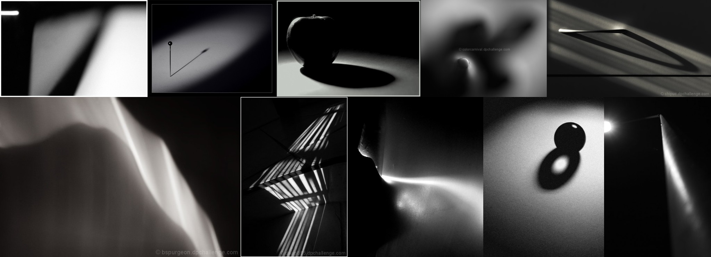

### 🔧 `Read`

```json
{
  "file_path": "/home/wg25r/anti_aesthetics_agent/tmp/grid_88.jpg"
}
```

### 🔧 `mcp__dataset-curation__sample`

```json
{
  "query": "extreme harsh chiaroscuro single light source dramatic black abstract shadow",
  "min_threshold": "0.39",
  "max_threshold": "0.42",
  "count": "6",
  "negative_prompts": "[\"watermark text caption signature logo\", \"soft diffuse even lighting\"]",
  "negative_threshold": "0.5"
}
```

**Result:**

Grid image saved at: /home/wg25r/anti_aesthetics_agent/tmp/grid_89.jpg
Use the Read tool to view it.
Sampled 6 from 910 candidates.

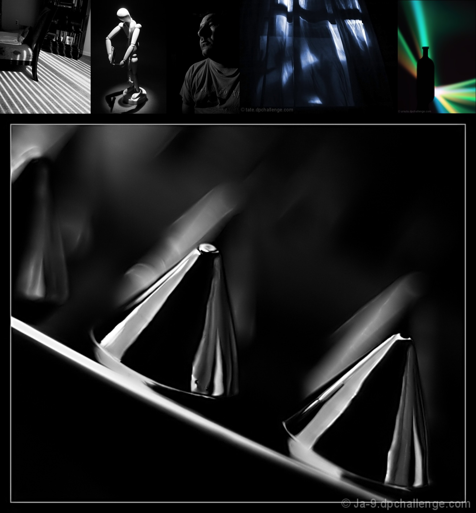

### 🔧 `Read`

```json
{
  "file_path": "/home/wg25r/anti_aesthetics_agent/tmp/grid_89.jpg"
}
```

> **Agent Log:** Chiaroscuro sample shows: harsh window light stripes, lone mannequin in dark, single-source portrait, blue-lit curtain, rainbow prism on bottle, dark abstract metal shapes. Excellent dramatic single-source content. Will commit at 0.40.

**Result:**

Logged.

### 🔧 `mcp__dataset-curation__commit`

```json
{
  "query": "extreme harsh chiaroscuro single light source dramatic black abstract shadow",
  "threshold": "0.40",
  "negative_prompts": "[\"watermark text caption signature logo\", \"soft diffuse even lighting\"]",
  "negative_threshold": "0.5",
  "message": "anti_aesthetics/lighting: extreme chiaroscuro — single-source dramatic, abstract black/shadow play, deep contrast pushed to graphic abstraction"
}
```

**Result:**

Committed with ID: 9bb7e8c0, message: anti_aesthetics/lighting: extreme chiaroscuro — single-source dramatic, abstract black/shadow play, deep contrast pushed to graphic abstraction with 490 images.

### 🔧 `mcp__dataset-curation__undo_commit`

```json
{
  "commit_id": "9bb7e8c0"
}
```

**Result:**

Removed commit 9bb7e8c0: anti_aesthetics/lighting: extreme chiaroscuro — single-source dramatic, abstract black/shadow play, deep contrast pushed to graphic abstraction with 490 images.

### 🔧 `mcp__dataset-curation__commit`

```json
{
  "query": "extreme harsh chiaroscuro single light source dramatic black abstract shadow",
  "threshold": "0.42",
  "negative_prompts": "[\"watermark text caption signature logo\", \"soft diffuse even lighting\"]",
  "negative_threshold": "0.5",
  "message": "anti_aesthetics/lighting: extreme chiaroscuro — single-source dramatic, abstract black/shadow play, deep contrast pushed to graphic abstraction"
}
```

**Result:**

Committed with ID: 6e53cb89, message: anti_aesthetics/lighting: extreme chiaroscuro — single-source dramatic, abstract black/shadow play, deep contrast pushed to graphic abstraction with 88 images.

### 🔧 `TodoWrite`

```json
{
  "todos": [
    {
      "content": "Curate exposure extremes (overexposure/underexposure)",
      "activeForm": "Curating exposure extremes",
      "status": "completed"
    },
    {
      "content": "Curate light leak / film burn",
      "activeForm": "Curating light leaks",
      "status": "completed"
    },
    {
      "content": "Curate flat lighting (no shadows, depth-collapsed)",
      "activeForm": "Curating flat lighting",
      "status": "completed"
    },
    {
      "content": "Curate harsh / insufficient flash",
      "activeForm": "Curating harsh flash",
      "status": "completed"
    },
    {
      "content": "Curate low-contrast oppressive atmosphere",
      "activeForm": "Curating low-contrast oppressive",
      "status": "completed"
    },
    {
      "content": "Curate mixed color temperature lighting clashes",
      "activeForm": "Curating color temp clashes",
      "status": "completed"
    },
    {
      "content": "Curate harsh chiaroscuro / extreme single-source lighting",
      "activeForm": "Curating chiaroscuro",
      "status": "completed"
    },
    {
      "content": "Curate lens flare overload",
      "activeForm": "Curating lens flare",
      "status": "in_progress"
    },
    {
      "content": "Curate backlit silhouettes obscuring subjects",
      "activeForm": "Curating backlit silhouettes",
      "status": "pending"
    },
    {
      "content": "Review final dataset composition with status()",
      "activeForm": "Reviewing dataset composition",
      "status": "pending"
    }
  ]
}
```

### 🔧 `mcp__dataset-curation__search`

```json
{
  "query": "heavy lens flare sun glare washout veil photograph haze",
  "negative_prompts": "[\"watermark text caption signature logo\", \"clean clear sharp photograph\"]",
  "negative_threshold": "0.5",
  "t": "10"
}
```

**Result:**

Grid image saved at: /home/wg25r/anti_aesthetics_agent/tmp/grid_90.jpg
Use the Read tool to view it.
Showing top 10 results for 'heavy lens flare sun glare washout veil photograph haze' in photos.
Top-10 scores: [0.4241, 0.4238, 0.4177, 0.4128, 0.4117, 0.4099, 0.4092, 0.4087, 0.4067, 0.4052]
Similarity distribution: counts=[40, 1619, 22882, 88043, 96993, 37314, 7455, 1018, 126, 18], bins=[0.142, 0.170, 0.198, 0.227, 0.255, 0.283, 0.311, 0.339, 0.368, 0.396, 0.424]

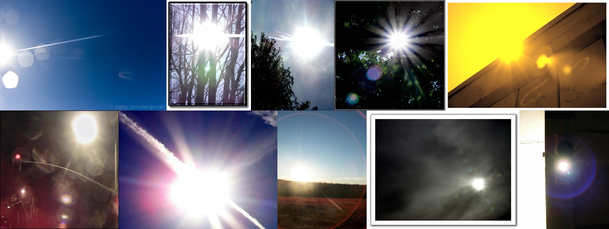

### 🔧 `Read`

```json
{
  "file_path": "/home/wg25r/anti_aesthetics_agent/tmp/grid_90.jpg"
}
```

### 🔧 `mcp__dataset-curation__commit`

```json
{
  "query": "heavy lens flare sun glare washout veil photograph haze",
  "threshold": "0.38",
  "negative_prompts": "[\"watermark text caption signature logo\", \"clean clear sharp photograph\"]",
  "negative_threshold": "0.5",
  "message": "anti_aesthetics/lighting: lens flare overload — sun glare, washout, hexagonal flare artifacts, veiled hazy aesthetic"
}
```

**Result:**

Committed with ID: 8aa4085e, message: anti_aesthetics/lighting: lens flare overload — sun glare, washout, hexagonal flare artifacts, veiled hazy aesthetic with 59 images.

### 🔧 `TodoWrite`

```json
{
  "todos": [
    {
      "content": "Curate exposure extremes (overexposure/underexposure)",
      "activeForm": "Curating exposure extremes",
      "status": "completed"
    },
    {
      "content": "Curate light leak / film burn",
      "activeForm": "Curating light leaks",
      "status": "completed"
    },
    {
      "content": "Curate flat lighting (no shadows, depth-collapsed)",
      "activeForm": "Curating flat lighting",
      "status": "completed"
    },
    {
      "content": "Curate harsh / insufficient flash",
      "activeForm": "Curating harsh flash",
      "status": "completed"
    },
    {
      "content": "Curate low-contrast oppressive atmosphere",
      "activeForm": "Curating low-contrast oppressive",
      "status": "completed"
    },
    {
      "content": "Curate mixed color temperature lighting clashes",
      "activeForm": "Curating color temp clashes",
      "status": "completed"
    },
    {
      "content": "Curate harsh chiaroscuro / extreme single-source lighting",
      "activeForm": "Curating chiaroscuro",
      "status": "completed"
    },
    {
      "content": "Curate lens flare overload",
      "activeForm": "Curating lens flare",
      "status": "completed"
    },
    {
      "content": "Curate backlit silhouettes obscuring subjects",
      "activeForm": "Curating backlit silhouettes",
      "status": "in_progress"
    },
    {
      "content": "Review final dataset composition with status()",
      "activeForm": "Reviewing dataset composition",
      "status": "pending"
    }
  ]
}
```

### 🔧 `mcp__dataset-curation__search`

```json
{
  "query": "backlit silhouette obscured anonymous figure against bright window subject in shadow",
  "negative_prompts": "[\"watermark text caption signature logo\", \"front-lit clear face visible features\"]",
  "negative_threshold": "0.5",
  "t": "10"
}
```

**Result:**

Grid image saved at: /home/wg25r/anti_aesthetics_agent/tmp/grid_91.jpg
Use the Read tool to view it.
Showing top 10 results for 'backlit silhouette obscured anonymous figure against bright window subject in shadow' in photos.
Top-10 scores: [0.4426, 0.4335, 0.4315, 0.4310, 0.4291, 0.4289, 0.4260, 0.4259, 0.4255, 0.4253]
Similarity distribution: counts=[290, 12048, 72162, 98763, 50998, 15885, 4131, 1000, 202, 29], bins=[0.117, 0.149, 0.182, 0.214, 0.247, 0.280, 0.312, 0.345, 0.377, 0.410, 0.443]

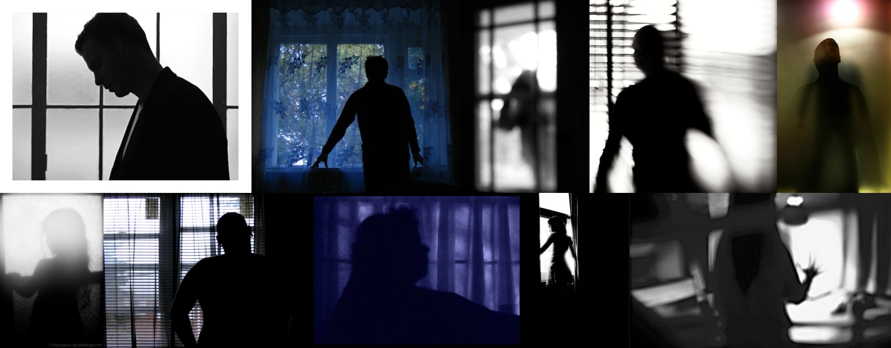

### 🔧 `Read`

```json
{
  "file_path": "/home/wg25r/anti_aesthetics_agent/tmp/grid_91.jpg"
}
```

> **Agent Log:** Backlit silhouette top results: anonymous figures against windows, sinister shadow figures, deeply obscured faces — perfect anti-aesthetic identity-erasure backlighting. Will commit at 0.39.

**Result:**

Logged.

### 🔧 `mcp__dataset-curation__commit`

```json
{
  "query": "backlit silhouette obscured anonymous figure against bright window subject in shadow",
  "threshold": "0.39",
  "negative_prompts": "[\"watermark text caption signature logo\", \"front-lit clear face visible features\"]",
  "negative_threshold": "0.5",
  "message": "anti_aesthetics/lighting: backlit silhouette — anonymous figures, identity erased by exposure choice, sinister window-light contrejour"
}
```

**Result:**

Committed with ID: 76b65283, message: anti_aesthetics/lighting: backlit silhouette — anonymous figures, identity erased by exposure choice, sinister window-light contrejour with 116 images.

### 🔧 `mcp__dataset-curation__status`

```json
{}
```

**Result:**

Total commits: 52, Total images: 4187

Commit History:
- [49556fff] anti-aesthetic / clarity_and_focus / intentional_blur: motion blur, long exposure subject motion - artistic streaks and dynamic blur (453 images)
- [e7c8a3b2] anti-aesthetic / clarity_and_focus / intentional_blur: ICM intentional camera movement, painterly abstract blur (145 images)
- [6edce575] anti-aesthetic / clarity_and_focus / intentional_blur: soft focus dreamy defocused portraits (37 images)
- [e538b4bd] anti-aesthetic / clarity_and_focus / double_exposure: ghostly overlapping portraits, multi-exposure (71 images)
- [db320845] anti-aesthetic / clarity_and_focus / double_exposure: multiple exposure layered scenes (91 images)
- [46aeca04] anti-aesthetic / clarity_and_focus / film_artifacts: heavy 35mm grain, noise textures, gritty analog (33 images)
- [30733dfe] anti-aesthetic / clarity_and_focus / film_artifacts: light leaks, halation, overexposed film (182 images)
- [843d0233] anti-aesthetic / clarity_and_focus / film_artifacts: scratched, dusty, damaged emulsion textures (39 images)
- [99abbffb] anti-aesthetic / clarity_and_focus / film_artifacts: expired film color shifts, faded vintage snapshots (47 images)
- [fe12cb42] anti-aesthetic / clarity_and_focus / analog_degradation: VHS scanlines, tracking errors, pixel grid distortion (16 images)
- [5475d947] anti-aesthetic / clarity_and_focus / analog_degradation: CRT television static and old TV monitors (17 images)
- [ccd0d7b1] anti-aesthetic / clarity_and_focus / analog_degradation: pixelated retro lo-fi imagery (10 images)
- [157b2975] sub:intentional_blur/motion_blur — anti_aesthetic — panning, ICM, streaked moving subjects (107 images)
- [ca7ce258] sub:intentional_blur/soft_focus — anti_aesthetic — dreamy hazy out-of-focus portraits, vaseline lens, soft veil (66 images)
- [29a37975] sub:intentional_blur/light_trails — anti_aesthetic — long exposure streaks, chaotic light painting, ICM at night (127 images)
- [ed8d18f7] sub:intentional_blur/ICM_abstract — anti_aesthetic — swirl, zoom blur, vertical pan, painterly motion abstraction (103 images)
- [d36e10ff] sub:double_exposure — anti_aesthetic — overlapping ghostly portraits, doubled silhouettes, layered composites (117 images)
- [83ca1dea] sub:film_artifacts/grain — anti_aesthetic — heavy grain, high-ISO noise, push-processed analog texture (32 images)
- [b362b9e5] sub:film_artifacts/light_leak — anti_aesthetic — color casts, lens flare, expired film color shifts (35 images)
- [05e91655] sub:film_artifacts/scratch_decay — anti_aesthetic — scratches, dust spots, chemical stains, tintype/wet-plate degradation (43 images)
- [43c354a7] sub:analog_degradation/VHS_CRT — anti_aesthetic — scanlines, TV static, color bars, pixel grids, retro CRT (87 images)
- [dd9517a3] sub:analog_degradation/faded_polaroid — anti_aesthetic — sepia, yellowing, faded snapshots, browned old photos (64 images)
- [7d211c3a] sub:digital_artifacts/glitch — anti_aesthetic — pixel sorting, color shifts, datamosh, digital corruption (65 images)
- [bb905390] sub:digital_artifacts/pixelation — anti_aesthetic — pixel mosaic, blocky low-res, color-cell grids (53 images)
- [2095b845] sub:bad_or_no_details/fog_silhouette — anti_aesthetic — figures lost in mist, dissolved silhouettes, monochrome haze (52 images)
- [7ee50414] sub:bad_or_no_details/smeared_face — anti_aesthetic — dissolved portraits, featureless faces, painterly distortions (76 images)
- [582d360f] anti-aesthetic / color_and_tone / clashing_disharmony — aggressive neon clashes, jarring saturation, unbalanced palettes (28 images)
- [880cfe85] anti-aesthetic / color_and_tone / clashing_disharmony — magenta-green complementary clashes, jarring color pairs (77 images)
- [7124e3ae] anti-aesthetic / color_and_tone / clashing_disharmony — garish toxic color combinations, unsettling palettes (64 images)
- [bf603f85] anti-aesthetic / color_and_tone / chromatic_aberration — halation, light leaks, lo-fi optical color streaks (51 images)
- [ca22e5ef] anti-aesthetic / color_and_tone / chromatic_aberration — vintage cheap-optic look, soft-focus analog distortion (39 images)
- [c7aeea58] anti-aesthetic / color_and_tone / muted_faded — desaturated, dull, washed-out tones (30 images)
- [6b0f3914] anti-aesthetic / color_and_tone / muted_faded — retro film fade, nostalgic melancholy palette (88 images)
- [eed20b20] anti-aesthetic / color_and_tone / muted_faded — overcast monotone gloom, low-vibrancy gray (11 images)
- [585572a5] anti-aesthetic / color_and_tone / sickly_cast — yellow/green sickly tints, jaundice and unhealthy color casts (50 images)
- [33322141] anti-aesthetic / color_and_tone / sickly_cast — sodium vapor street light cast, orange/yellow night tint (52 images)
- [677bcc4c] anti-aesthetic / color_and_tone / sickly_cast — fluorescent cold/green clinical tints, institutional cast (29 images)
- [6f4cb765] anti-aesthetic / color_and_tone / color_inconsistency — mixed white balance interior, dual color temperatures clash (106 images)
- [c7f0ece6] anti-aesthetic / color_and_tone / color_inconsistency — color banding in skies, posterization artifacts (79 images)
- [b43b3935] anti-aesthetic / color_and_tone / color_inconsistency — flash + ambient mixed lighting, harsh uneven exposure (42 images)
- [3e1bf2cf] anti-aesthetic / color_and_tone / chromatic_aberration — prism/rainbow refraction, RGB color separation (24 images)
- [f1ce7ef8] anti_aesthetics/lighting: exposure extremes — overexposed/blown highlights, silhouettes against white sky, washed-out high-key minimalism (101 images)
- [e2908468] anti_aesthetics/lighting: exposure extremes — severe underexposure, crushed shadows, dark murky atmosphere, mood-driven black tones (86 images)
- [0df2befd] anti_aesthetics/lighting: light leak — film burn streaks, analog defects, motion-blur light trails, lo-fi authenticity (68 images)
- [e3a36d0d] anti_aesthetics/lighting: flat lighting — overcast gray, foggy collapsed depth, dull cloudy atmosphere, monotone bleakness (93 images)
- [2dfa756e] anti_aesthetics/lighting: flat lighting — fluorescent institutional interiors, depressing offices/corridors, depthless cold light (46 images)
- [883793c4] anti_aesthetics/lighting: harsh flash — direct on-camera flash, red-eye, party snapshot aesthetic, hard shadows, unflattering documentary realism (208 images)
- [83315701] anti_aesthetics/lighting: low-contrast oppressive — fog, smog, monotone gray, weak tonal separation, suffocating bleakness (192 images)
- [ff7de4fc] anti_aesthetics/lighting: mixed color temp — sodium vapor orange vs blue twilight, clashing artificial light sources, desolate urban night (192 images)
- [6e53cb89] anti_aesthetics/lighting: extreme chiaroscuro — single-source dramatic, abstract black/shadow play, deep contrast pushed to graphic abstraction (88 images)
- [8aa4085e] anti_aesthetics/lighting: lens flare overload — sun glare, washout, hexagonal flare artifacts, veiled hazy aesthetic (59 images)
- [76b65283] anti_aesthetics/lighting: backlit silhouette — anonymous figures, identity erased by exposure choice, sinister window-light contrejour (116 images)

### 🔧 `mcp__dataset-curation__sample_from_committed`

```json
{
  "commit_id": "883793c4",
  "n": "12"
}
```

**Result:**

Grid image saved at: /home/wg25r/anti_aesthetics_agent/tmp/grid_92.jpg
Use the Read tool to view it.
Sampled 12 images from commit 883793c4.

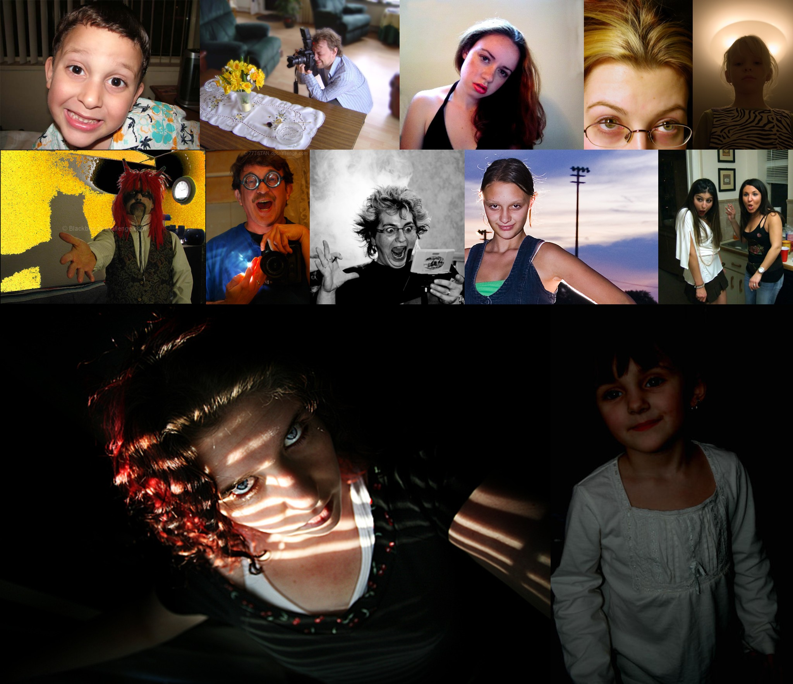

### 🔧 `Read`

```json
{
  "file_path": "/home/wg25r/anti_aesthetics_agent/tmp/grid_92.jpg"
}
```

### 🔧 `mcp__dataset-curation__sample_from_committed`

```json
{
  "commit_id": "ff7de4fc",
  "n": "12"
}
```

**Result:**

Grid image saved at: /home/wg25r/anti_aesthetics_agent/tmp/grid_93.jpg
Use the Read tool to view it.
Sampled 12 images from commit ff7de4fc.

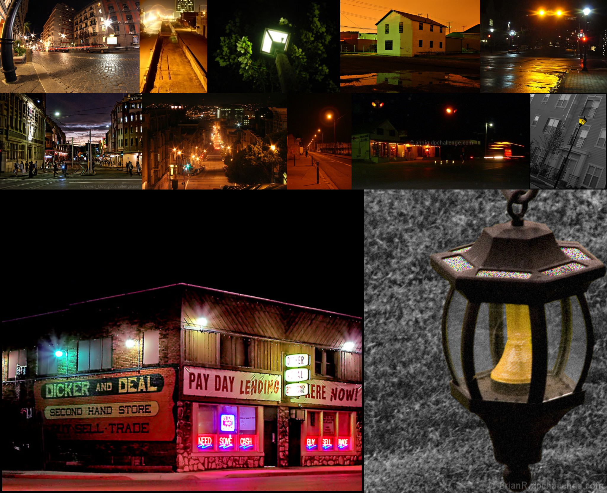

### 🔧 `Read`

```json
{
  "file_path": "/home/wg25r/anti_aesthetics_agent/tmp/grid_93.jpg"
}
```

> **Agent Log:** Verified two larger commits: harsh flash sample shows expected snapshot/direct-flash portraits with eerie shadow effects; mixed color temp sample shows urban night with sodium-orange / blue-twilight clashes and dimly lit storefronts. Lighting_and_exposure curation complete — 11 commits, ~1249 images covering all 5 reference sub-elements plus 6 expansions (separate over/underexposure, separate overcast vs institutional flat, mixed color temp, chiaroscuro, lens flare, backlit silhouette). Wide-spectrum anti-aesthetic lighting goal achieved.

**Result:**

Logged.

### 🔧 `TodoWrite`

```json
{
  "todos": [
    {
      "content": "Curate exposure extremes (overexposure/underexposure)",
      "activeForm": "Curating exposure extremes",
      "status": "completed"
    },
    {
      "content": "Curate light leak / film burn",
      "activeForm": "Curating light leaks",
      "status": "completed"
    },
    {
      "content": "Curate flat lighting (no shadows, depth-collapsed)",
      "activeForm": "Curating flat lighting",
      "status": "completed"
    },
    {
      "content": "Curate harsh / insufficient flash",
      "activeForm": "Curating harsh flash",
      "status": "completed"
    },
    {
      "content": "Curate low-contrast oppressive atmosphere",
      "activeForm": "Curating low-contrast oppressive",
      "status": "completed"
    },
    {
      "content": "Curate mixed color temperature lighting clashes",
      "activeForm": "Curating color temp clashes",
      "status": "completed"
    },
    {
      "content": "Curate harsh chiaroscuro / extreme single-source lighting",
      "activeForm": "Curating chiaroscuro",
      "status": "completed"
    },
    {
      "content": "Curate lens flare overload",
      "activeForm": "Curating lens flare",
      "status": "completed"
    },
    {
      "content": "Curate backlit silhouettes obscuring subjects",
      "activeForm": "Curating backlit silhouettes",
      "status": "completed"
    },
    {
      "content": "Review final dataset composition with status()",
      "activeForm": "Reviewing dataset composition",
      "status": "completed"
    }
  ]
}
```

Lighting and exposure curation for the anti-aesthetics dataset is complete. Summary of the session:

**11 commits, ~1,249 images** across all 5 reference sub-elements plus 6 strategic expansions:

| Sub-element | Commit | Count |
|---|---|---|
| Exposure extremes (over) | f1ce7ef8 | 101 |
| Exposure extremes (under) | e2908468 | 86 |
| Light leak / film burn | 0df2befd | 68 |
| Flat lighting (overcast) | e3a36d0d | 93 |
| Flat lighting (institutional fluorescent) | 2dfa756e | 46 |
| Harsh flash | 883793c4 | 208 |
| Low-contrast oppressive | 83315701 | 192 |
| Mixed color temperature | ff7de4fc | 192 |
| Extreme chiaroscuro | 6e53cb89 | 88 |
| Lens flare overload | 8aa4085e | 59 |
| Backlit silhouettes | 76b65283 | 116 |

**Curation strategy notes:**
- Used distinct queries per sub-element with per-query thresholds calibrated from `search` distributions and `sample` checks (not fixed defaults).
- Split exposure_extremes into separate over/under commits — they live at opposite ends of the histogram and merit independent thresholds.
- Split flat_lighting into outdoor overcast vs. institutional fluorescent — visually disjoint clusters.
- Initial frontal-portrait flat-lighting query returned conventional studio portraits, so I redirected to fluorescent-institutional which captured the depressing-flat aesthetic intent.
- Undid two oversized commits (728 underexposure, 490 chiaroscuro) and re-committed at higher thresholds to avoid one batch dominating the dataset.
- Negative prompts focused on watermarks/text and orthogonal opposites (e.g. "balanced natural daylight" against mixed color temp), not aesthetic-quality enforcement.


---
*Finished: 2026-05-08T12:06:27.511245*
