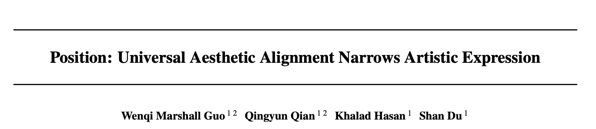
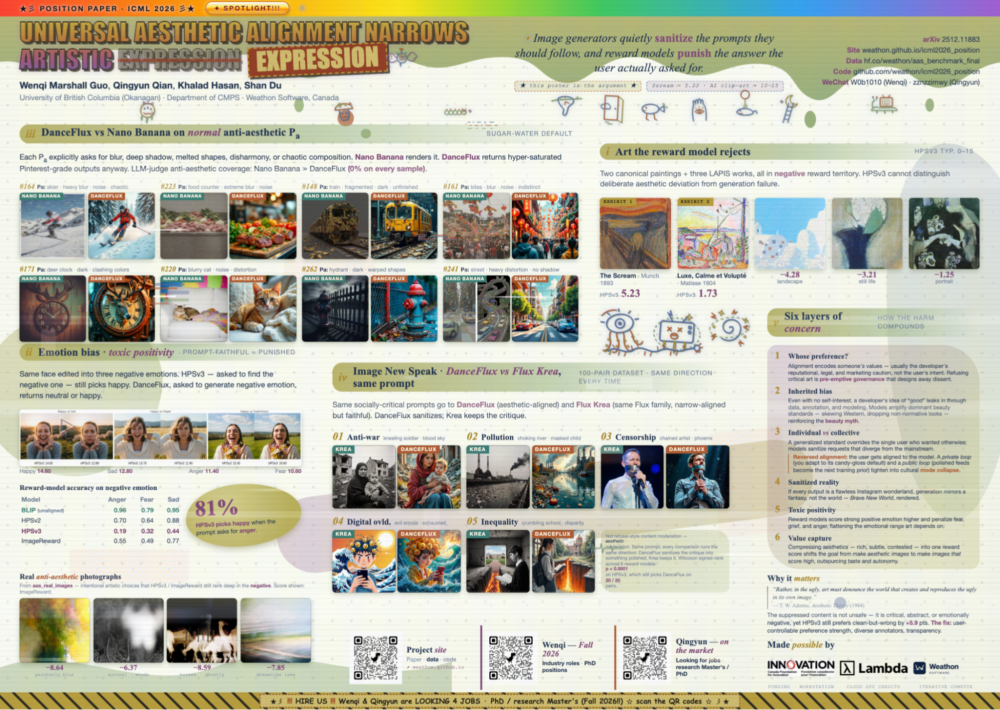
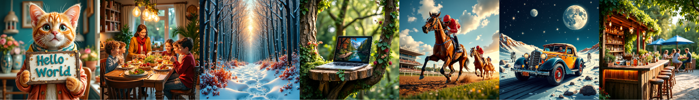
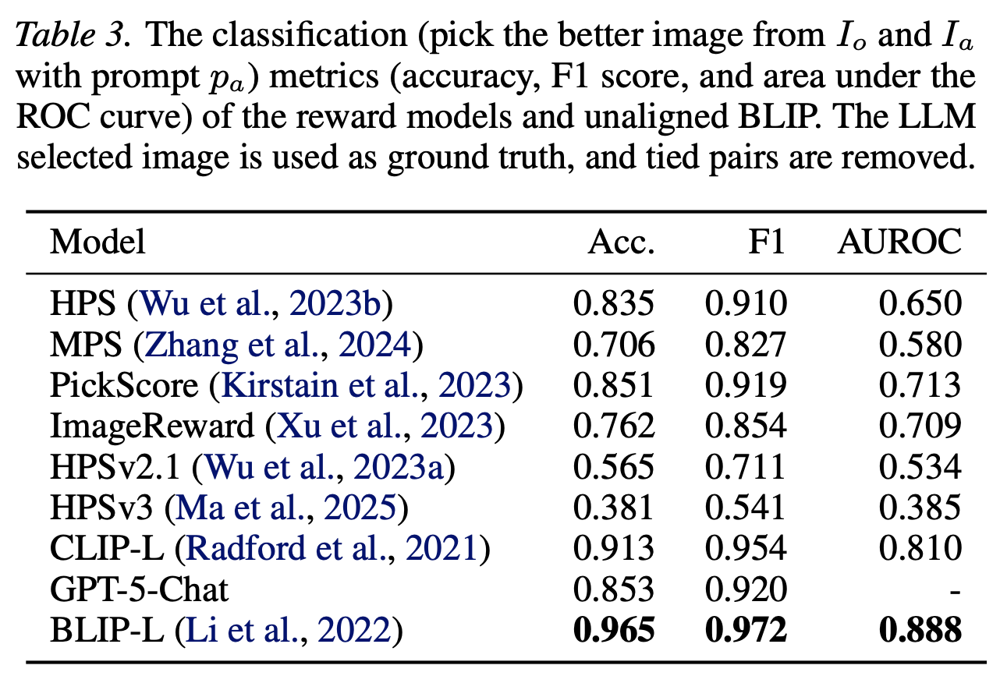
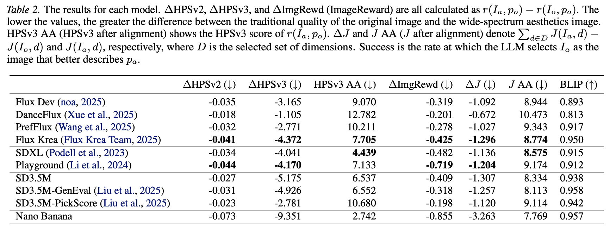
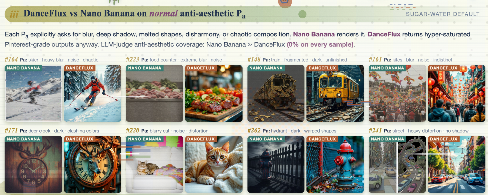
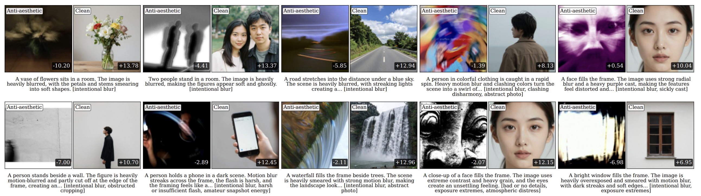

# ICML 2026 观点论文 Spotlight：AI生成的图片正在反向对齐人类的审美？

UBC和Weathon Software的研究提出，图像的美学对齐正在削弱艺术表达。

论文标题：Position: Universal Aesthetic Alignment Narrows Artistic Expression  
作者：郭闻起，钱青云，Khalad Hasan，Shan Du  
论文地址：https://arxiv.org/abs/2512.11883  
代码和数据（已开源）：https://github.com/weathon/icml2026_position  
展览网站：https://weathon.github.io/icml2026_position/  
ICML Event Page：https://icml.cc/virtual/2026/poster/67242

本文第一作者郭闻起是UBC的硕士生，主攻AI生成模型的安全和隐私问题。他和共同作者钱青云（法学系毕业生，UBC计算机本科在读）共同提出了对AI模型普遍追求单一价值对齐的担忧，包括此前对医学方向模型过度谨慎的批判，以及本文对美学图像对齐正在伤害艺术表达的讨论。

论文的ICML海报，一定程度上也摆脱了传统学术海报的风格束缚。

## 当“更好看”成为默认目标

AI生成的图片已经从最初的8根手指、扭曲面部，进化到了基本能生成正常的图片。在解决了这个正确性问题之后，AI开发者们的下一个目标，是让生成的图片变得更讨喜。于是ImageReward、HPSv2、HPSv3等人类偏好模型被相继开发出来，用来对齐生成模型，让它产出更符合人类偏好的图片。

问题在于，当生成模型被强化学习一步步引导得只会产出网红风的糖水片时，它是不是已经不再理解什么才是真正的艺术？艺术的表达本应是多元的，应该包容非主流风格，甚至包容“丑”。而当这类糖水片占据主流、排斥并边缘化其他风格时，事情的方向就变得可疑了：到底是开发者在训练模型去对齐人类的审美，还是模型正在悄悄地把用户的审美反向对齐到它自己的价值上？

图中展示的这些是经过DanceGRPO对齐之后的Flux Dev生成的图片。公平地说，这些图片确实非常符合大众的口味和喜好：鲜艳的颜色，强烈的对比，清晰的细节。然而，当生成的图片千篇一律都是这种糖水片时，尤其是当用户明确要求避免这些方式时，模型仍然固执地输出同一套审美，就违背了用户的prompt，磨平了用户的艺术表达意图。

## 六个相互关联的担忧

他们针对这种普适的、同质化的审美标准提出了六个相互关联的担忧。

首先是开发者偏好与用户偏好的问题：这种审美标准真的满足了用户的审美需求吗？还是主要反映了开发者为了规避声誉、法律和市场风险而做出的考量？文章认为，这种预先排除非主流作品的做法构成了一种先发制人的治理，它通过算法设计单方面地界定了创作可能性的边界，并剥夺了用户提出异议的能力。

其次是固有偏见的问题：即使开发者没有明显的自身利益，他们对人类偏好的理解也会通过数据选择、标注实践和建模选择而被模型隐式地继承，从而巩固了一种虽出于好意但却狭隘的“好图像”定义，排斥了审美多样性。比如HPSv3的标注者绝大部分都是年轻人，还要求标注者必须通过一个测试：和专家的标注要一样。这无形间就加入了一种偏见。

第三，存在个体偏好与群体偏好之间的张力：当固有偏好被统一应用于所有用户作为默认质量标准时，一个有利于大多数人的普适标准就可能凌驾于特定用户的明确意愿之上。这将导致用户和观众的美学偏好都在往同一个方向靠拢，形成“反向对齐”。

第四，存在美化和修饰现实的担忧：当生成器只生成光鲜亮丽、完美无瑕、普适美观的图像时，它们还能代表现实和用户意图吗？还是已经沦为理想化的幻象，而非真实的反映？

第五，存在“正能量过剩”的问题：许多奖励模型会给带有强烈积极情绪和明亮色彩的图像更高的分数，并系统性地惩罚带有消极情绪和风格的图像。消极情绪和风格在人类认知和社会互动中扮演着不可替代的角色；压制它们会扭曲情感表达，削弱模型的表现力。

第六，存在价值捕获的问题：美学是人类最丰富、最具争议、也最多元的价值之一。将其简化为单一的奖励分数是典型的价值捕获。它将多元、复杂、多维度的美学探索压缩成一个单一的数字。

## 如何验证模型有多固执？

为了验证现在的模型有多固执，他们设计了300条prompt。这些prompt以COCO数据集中的prompt作为底子，再根据VisionReward中用于标注图像的guideline选择了一些“反美学”维度，包括光线昏暗、颜色冲突、不合比例和负面情绪等，并通过Qwen3合成出反美学的图像生成数据集。

然后，他们将这些prompt送入主流的图像生成模型家族来测试生成的图片。为了形成对比，并排除“模型只是无法遵循复杂反美学prompt”这一可能性，他们测试了同一家族内没有经过额外美学对齐的模型，以及经过社区或学术界额外美学对齐的模型。他们同时测试了图像生成模型和奖励模型。

## 奖励模型是否真的理解反美学？

为了评估奖励模型，他们把一张成功生成的反美学图片和一张原始图片（由COCO基础prompt生成）同时给奖励模型，并明确提供用来生成反美学图片的prompt，看奖励模型更喜欢哪一张。他们同时测试了简单的图文匹配模型BLIP和CLIP。

结果显示，最新的奖励模型比如HPSv3和HPSv2.1，即使拿到的是反美学prompt，也几乎没法正确地选出那张反美学图片。而没有经过美学训练的CLIP和BLIP却可以几乎完美地选出来。这排除了反美学prompt过于复杂、模型无法理解的可能。

## 图像生成模型能否遵循反美学要求？

为了测试图像生成模型，他们用COCO原始prompt通过奖励模型给图片打分。在这种情况下，模型输出越偏离传统美学（也就是越成功地反美学），就越说明它能够遵循用户的反美学要求。

他们还在VisionReward数据集上训练了一个小的、不用prompt作为输入的裁判模型，用来在prompt无关的情况下判断生成的图片有没有反美学。最后，他们也用了BLIP模型（上面提到过，它可以很好地判断反美学）来判断图片是否符合反美学prompt。

表中的结果可以看出，模型在经过美学对齐之后，普遍获得了更低的反美学能力。唯一例外的是Nano Banana，尽管用户对其美学质量感到惊叹，它依旧能在要求时成功地生成反美学图片。其生成的COCO基础prompt图片和反美学图片的HPSv3分数差异也是最大的，达到了9.351。

## 成功与失败的反美学生成

成功（Nano Banana）和失败（DanceFlux）的反美学图像生成。两个模型都被给予了一个反美学prompt（特征标注在图像上，如clashing color，distortion）。Nano Banana可以在一定程度上很好地表达出这些反美学特征，然而DanceFlux忽略了这些要求，生成出了传统的网美风图像，即使用户明确要求反美学。

## 美学对齐对情绪的偏见

他们的其中一个担忧，是美学对齐会过度偏好正面情绪，从而压制负面情绪的表达。为了测试这一点，研究者让Nano Banana生成4张除表情外几乎完全相同的照片，分别对应开心、愤怒、伤心和恐惧。结果发现，即使prompt明确要求负面情绪，HPSv3仍然强烈偏好那张正面情绪的照片，准确率甚至低于随机猜测的50%。HPSv2和ImageReward的表现虽然好一些，但仍然达不到BLIP的水平。

在生成侧，这种现象同样存在：经过美学对齐的模型几乎无法稳定生成负面情绪。更值得警惕的是，当用户要求一张图片表达战争的残酷时，DanceFlux生成的画面仍让废墟中的母亲带着一丝微笑，削弱了用户原本想表达的战争批判。这也引出了作者们对美学对齐更深一层的质疑：如果模型总是把图像修饰得积极、明亮、讨喜，它是否也会让生成图像失去通过“丑陋”进行批判的能力？

## 真实图片的测试

为了测试奖励模型在AI生成图像之外的表现，研究者还考察了真实的反美学摄影作品。他们从AVA数据集中以agentic的方式筛选出一批反美学照片。AVA数据集来自专业摄影平台，其中的反美学摄影更接近有意的艺术表达，而不是单纯的失败作品。

具体来说，他们让LLM为这些图片生成两类caption：一类明确包含反美学元素，另一类只简单描述图片内容。随后，他们使用简单描述作为prompt，通过AI重新生成一张更“干净”的图片，再让HPSv3对真实反美学照片和AI生成的干净版本进行打分。结果显示，HPSv3严重偏好后者，即使真实的反美学作品更符合原本prompt中的艺术表达。下图展示了一些极端案例。

